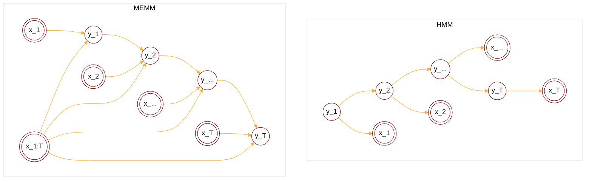
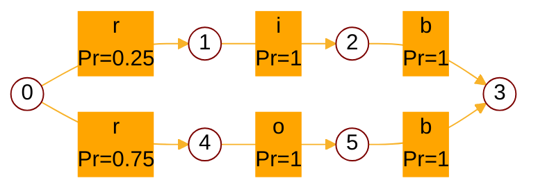
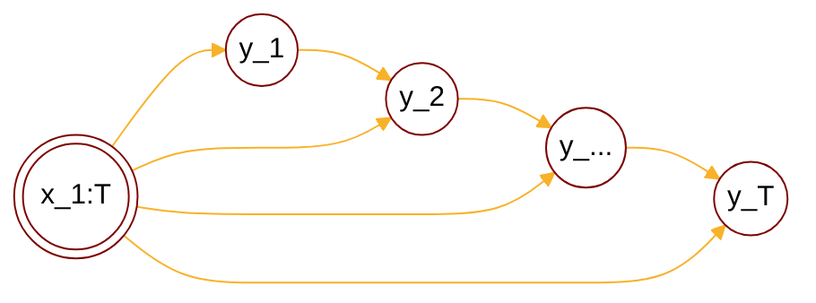
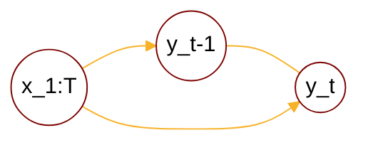

:                                                         


{{ if or .Page.Params.math .Site.Params.math }}

<link rel="stylesheet" href="https://cdn.jsdelivr.net/npm/katex@0.16.8/dist/katex.min.css" integrity="sha384-GvrOXuhMATgEsSwCs4smul74iXGOixntILdUW9XmUC6+HX0sLNAK3q71HotJqlAn" crossorigin="anonymous">

<!-- The loading of KaTeX is deferred to speed up page rendering -->

<!-- To automatically render math in text elements, include the auto-render extension: -->

{{ end }}

{{ if .Page.Store.Get "hasMermaid" }}
  
{{ end }}


## Overview of classification problem

<cite>[^1]</cite>

$$
\text{Classification}: \begin{cases}
    \text{Hard:} \begin{cases}
        \text{SVM}: \begin{cases}
            \min_{w,b} \frac{1}{2}w^Tw \\\
            \text{subject to } y_i(w^Tx_i+b) \geq 1
        \end{cases} \\\
        \text{PLA}: \begin{cases} 
            f(x) = \operatorname{sign}(w^Tx) \\\
            w^{t+1} \larr w^{t} + \lambda y_ix_i
            \end{cases} \\\
        \text{LDA}: \begin{cases}
            \max \text{inter-class}, \min \text{inner-class} \\\
            \argmax_w \frac{(\bar{z_{C1}}-\bar{z_{C2}})^2}{ \sigma_{z_{C1}}^2 + \sigma_{z_{C2}}^2 }
        \end{cases}
    \end{cases} \\\
    \text{Soft:} \begin{cases}
        \text{Discriminant model, modeling on $p(y|x)$}\\\ 
            \quad\text{Logistic regression: $p(y|x) = {\frac{1}{1+\mathrm{e}^{-w^Tx}}}^y \cdot {\frac{\mathrm{e}^{-w^Tx}}{1+\mathrm{e}^{-w^Tx}}}^{1-y}$} \\\
            \quad\text{Max Entropy Model:} \begin{cases}
                \text{Exponential, if $\min \sum_{i=1}^N p(x_i)\log p(x_i)$} \\\
                \text{Gaussian, if $\mu,\Sigma$ are given}
            \end{cases} \\\
            \quad\underset{MEMM}{\text{Max Entropy Markov Model:}} \begin{cases}
                p(y_t|y_{t-1}) \\\
                p(y_t|x_{1:T},x_t) \\\
                \text{locally normalized$\rarr$label biased}
            \end{cases} \\\
            \quad \text{Conditional random field(CRF):} \begin{cases}
                p(y_t|y_{t-1}) \\\
                p(y_{t-1}|y_t) \\\
                p(y_t|x_{1:T},x_t) \\\
                \text{$p(Y|X)$ is globally normalized}
            \end{cases} \\\ \\\
        \text{Generative model, modeling on $p(x,y)$} \\\
            \quad \text{Naive Bayes:} \begin{cases}
                p(x_i|y) = \prod_{j=1}^p p(x_i^j|y) \\\
                \argmax \prod_{i=1}^N \left(\prod_{j=1}^p p(x_i^j|y_i)\right) p(y_i)
            \end{cases} \\\
            \quad \text{HMM: $y(0|1)\rarr y(Seq)$}
    \end{cases}
\end{cases}
$$

## HMM vs MEMM

For HMM we have:

$$
\text{given $y_t\implies$ $y_{t-1}\perp x_t$}
$$

$$
\begin{align*}
p(X,Y|\lambda) &= \prod_{t=1}^T p(x_t,y_t|\lambda,y_{t-1}) \\\
&= \prod_{t=1}^T p(x_t|y_t,y_{t-1},\lambda)p(y_t|y_{t-1},\lambda) \\\
&= \prod_{t=1}^T p(x_t|y_t,\lambda)p(y_t|y_{t-1},\lambda) \\\
\end{align*}
$$



For MEMM we have:



$$
\text{given $y_t\implies$ $y_{t-1} \cancel{\perp} x_t$}
$$

$$
p(x_t|x_{1:t},y_{1:t}) \neq p(x_t|y_t)
$$

$$
\begin{align*}
p(Y|X,\lambda) &= \prod_{t=1}^T p(y_t|x_{1:T},\lambda,y_{t-1})
\end{align*}
$$

Advantages of MEMM:
1. Modeling p(Y|X), which simplifies the learning process.
2. Relaxing the independence assumption of observations, providing a more realistic model.

## MEMM vs CRF

Consider a local structure in MEMM, we have:

$$
p(y_t|y_{t-1},x_t) = f(y_t,y_{t-1},x_t)
$$



\( p(y_t|y_{t-1},x_t) \) is a function of \( y_t,y_{t-1},x_t \) and needs to be locally normalized to a probabiltiy density function. It brings us the <b>label bias problem</b>.





e.g. Suppose we have 4 samples: 3*rob + 1*rib, we train a MEMM based on these 4 samples then we have the graph:





The <b>local normalized</b> pdfs of \( p(y_t|y_{t-1},x_t) \) are:



$$
\begin{cases}
p(y_1=1|y_0=0,x_1=r)=0.25 \\\
p(y_1=4|y_0=0,x_1=r)=0.75 \\\
p(y_2=2|y_1=1,x_2=i)=1 \\\
p(y_2=5|y_1=4,x_2=o)=1 \\\
p(y_3=3|y_2=2,x_3=b)=1 \\\
p(y_3=3|y_2=5,x_3=b)=1
\end{cases}
$$

Suppose we have a new incoming word 'rib', the decoding result is:

$$
\begin{align*}
\hat{Y} &= \argmax_{y_1,y_2,y_3} p(y_1,y_2,y_3|x_1=r,x_2=i,x_3=b) \\\
&= 0.75 \times 1 \times 1 \\\
(\hat{y_1},\hat{y_2},\hat{y_3}) &= (4,5,3)
\end{align*}
$$

Given a sample 'rib', the inference label is 'rob', the label is biased, then we can backtrack:

$$
\text{Label Bias} \\\
\dArr \\\
\text{Observations not working} \\\
\dArr \\\
\text{Low entropy of transition $y_{t-1}\rarr y_t$} \\\
\dArr \\\
\text{$p(y_t|y_{t-1},x_t)$ is locally normalized} \\\
\dArr \\\
\text{Limitation of MEMM's structure}
$$

Conditional Random Field(CRF) overcomes this drawback:

1. Acyclic graph of states brings more options and increases the entropy for state transitions.
2. Global normalization of transition probability helps balancing the influence of different states.

## CRF

### CRF structure

### CRF pdf parametric modeling

Recall that for a acyclic graph Markov random network(MRF) we have the pdf by [factorization](https://tirmisula.github.io/posts/probabilistic-graphical-model/#factorization-of-mrf):

$$
\begin{align*}
p(x) &= \frac{1}{z} \prod_{i=1}^K \psi_i(x_{C_i}) \\\
&= \frac{1}{z}\exp(-\sum_{i=1}^K E_i(x_{C_i})) \\\
C_i &: \text{i-th maximum clique} \\\
x_{C_i} &: \text{variable nodes in $C_i$} \\\
\psi(x) &: \text{potential function, $>0$} \\\
z &: \text{nomalize factor,$z=\sum_{x_1\cdots x_p}\prod_{i=1}^K \psi(x_{C_i})$} \\\
E(x) &: \text{energy function}
\end{align*}
$$



For a chained acyclic graph \( y_1,\cdots,y_T \), it has \( T-1 \) maximum cliques, the local maximum clique is shown as:



For chained CRF we have factorization:

$$
\begin{align*}
p(Y|X) &= \frac{1}{z}\exp\left( \sum_{t=1}^T -E_t(y_{t-1},y_t,x_{1:T}) \right) \\\
&\text{assume each potential has the same form} \\\
&= \frac{1}{z}\exp\left( \sum_{t=1}^T -E(y_{t-1},y_t,x_{1:T}) \right) \\\
&\text{consider $-E(y_{t-1},y_t,x_{1:T})$ a function: $f(y_{t-1},y_t,x_{1:T})$} \\\
&= \frac{1}{z}\exp\left( \sum_{t=1}^T f(y_{t-1},y_t,x_{1:T}) \right) \\\
&\text{consider splitting $f(y_{t-1},y_t,x_{1:T})$} \\\
\end{align*}
$$



Assuming \( f(y_{t-1},y_t,x_{1:T}) \) is splitted into \( f_1(y_{t},x_{1:T}), f_2(y_{t-1},x_{1:T}), f_3(y_{t-1},y_t,x_{1:T}) \) three parts:



$$
\begin{cases}
f(y_{t-1},y_t,x_{1:T}) = f_1(y_{t},x_{1:T}) + f_2(y_{t-1},x_{1:T}) + f_3(y_{t-1},y_t,x_{1:T}) \\\
f(y_{t-2},y_{t-1},x_{1:T}) = f_1(y_{t-1},x_{1:T}) + f_2(y_{t-2},x_{1:T}) + f_3(y_{t-2},y_{t-1},x_{1:T}) \\\
\text{$f_2(y_{t-1},x_{1:T})$ repeatly exsists in $f(y_{t-2},y_{t-1},x_{1:T})$, abandoned }
\end{cases} \\\
\dArr \\\
f(y_{t-1},y_t,x_{1:T}) = g(y_{t},x_{1:T}) + h(y_{t-1},y_t,x_{1:T})
$$



For \( g(\cdot) \) and \( h(\cdot) \) we assume it is a summation of indicator functions:



$$
g(y_t,x_{1:T}) = \sum_{k=1}^K \lambda_k g_k(y_t,x_{1:T}) \\\
g_k(y_t,x_{1:T}) = \begin{cases}
1 & y_t\text{ is certain label} \\\
0 & \text{otherwise}
\end{cases}
$$

$$
h(y_{t-1},y_t,x_{1:T}) = \sum_{l=1}^L \eta_l h_l(y_{t-1},y_t,x_{1:T}) \\\
h_l(y_{t-1},y_t,x_{1:T}) = \begin{cases}
1 & y_t,y_{t-1}\text{ are certain labels} \\\
0 & \text{otherwise}
\end{cases}
$$

Overall CRF's pdf can be written as:

$$
\begin{align*}
p(Y|X) &= \frac{1}{z}\exp\left( \sum_{t=1}^T f(y_{t-1},y_t,x_{1:T}) \right) \\\
&= \frac{1}{z}\exp\left( \sum_{t=1}^T \left[ \sum_{k=1}^K \lambda_k g_k(y_t,x_{1:T}) \\\
g_k(y_t,x_{1:T})+\sum_{l=1}^L \eta_l h_l(y_{t-1},y_t,x_{1:T}) \right] \right) \\\
\end{align*} \\\
\theta=(\lambda_1,\cdots,\lambda_K,\eta_1,\cdots,\eta_L) \text{ are parameters}
$$

## Summary

<!-- If you found any mistakes, please contact me via email. -->

## Reference

[^1]: - [video](https://www.bilibili.com/video/BV1aE411o7qd?p=97).
[^3]: From [The Matrix Cookbook](https://www.math.uwaterloo.ca/~hwolkowi/matrixcookbook.pdf).
[^5]: From [Mean field variational inference](https://mbernste.github.io/files/notes/MeanFieldVariationalInference.pdf).
[^4]: From [Ross, Sheldon M. (2019). Introduction to probability models](https://doi.org/10.1016%2FC2017-0-01324-1).
[^2]: - [A Tutorial on Particle Filtering and Smoothing: Fifteen years later](https://www.stats.ox.ac.uk/~doucet/doucet_johansen_tutorialPF2011.pdf).
