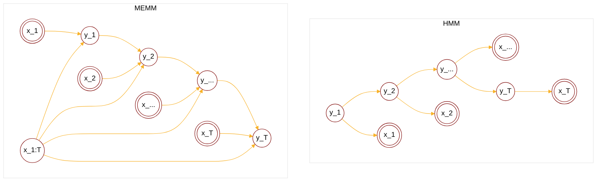

:                                                         


{{ if or .Page.Params.math .Site.Params.math }}

<link rel="stylesheet" href="https://cdn.jsdelivr.net/npm/katex@0.16.8/dist/katex.min.css" integrity="sha384-GvrOXuhMATgEsSwCs4smul74iXGOixntILdUW9XmUC6+HX0sLNAK3q71HotJqlAn" crossorigin="anonymous">

<!-- The loading of KaTeX is deferred to speed up page rendering -->

<!-- To automatically render math in text elements, include the auto-render extension: -->

{{ end }}

{{ if .Page.Store.Get "hasMermaid" }}
  
{{ end }}


## Overview of classification problem

<cite>[^1]</cite>

$$
\text{Classification}: \begin{cases}
    \text{Hard:} \begin{cases}
        \text{SVM}: \begin{cases}
            \min_{w,b} \frac{1}{2}w^Tw \\\
            \text{subject to } y_i(w^Tx_i+b) \geq 1
        \end{cases} \\\
        \text{PLA}: \begin{cases} 
            f(x) = \operatorname{sign}(w^Tx) \\\
            w^{t+1} \larr w^{t} + \lambda y_ix_i
            \end{cases} \\\
        \text{LDA}: \begin{cases}
            \max \text{inter-class}, \min \text{inner-class} \\\
            \argmax_w \frac{(\bar{z_{C1}}-\bar{z_{C2}})^2}{ \sigma_{z_{C1}}^2 + \sigma_{z_{C2}}^2 }
        \end{cases}
    \end{cases} \\\
    \text{Soft:} \begin{cases}
        \text{Discriminant model, modeling on $p(y|x)$}\\\ 
            \quad\text{Logistic regression: $p(y|x) = {\frac{1}{1+\mathrm{e}^{-w^Tx}}}^y \cdot {\frac{\mathrm{e}^{-w^Tx}}{1+\mathrm{e}^{-w^Tx}}}^{1-y}$} \\\
            \quad\text{Max Entropy Model:} \begin{cases}
                \text{Exponential, if $\min \sum_{i=1}^N p(x_i)\log p(x_i)$} \\\
                \text{Gaussian, if $\mu,\Sigma$ are given}
            \end{cases} \\\
            \quad\underset{MEMM}{\text{Max Entropy Markov Model:}} \begin{cases}
                p(y_t|y_{t-1}) \\\
                p(y_t|x_{1:T},x_t) \\\
                \text{locally normalized$\rarr$label biased}
            \end{cases} \\\
            \quad \text{Conditional random field(CRF):} \begin{cases}
                p(y_t|y_{t-1}) \\\
                p(y_{t-1}|y_t) \\\
                p(y_t|x_{1:T},x_t) \\\
                \text{$p(Y|X)$ is globally normalized}
            \end{cases} \\\ \\\
        \text{Generative model, modeling on $p(x,y)$} \\\
            \quad \text{Naive Bayes:} \begin{cases}
                p(x_i|y) = \prod_{j=1}^p p(x_i^j|y) \\\
                \argmax \prod_{i=1}^N \left(\prod_{j=1}^p p(x_i^j|y_i)\right) p(y_i)
            \end{cases} \\\
            \quad \text{HMM: $y(0|1)\rarr y(Seq)$}
    \end{cases}
\end{cases}
$$

## HMM vs MEMM

For HMM we have:

$$
\text{given $y_t\implies$ $y_{t-1}\perp x_t$}
$$

$$
\begin{align*}
p(X,Y|\lambda) &= \prod_{t=1}^T p(x_t,y_t|\lambda,y_{t-1}) \\\
&= \prod_{t=1}^T p(x_t|y_t,y_{t-1},\lambda)p(y_t|y_{t-1},\lambda) \\\
&= \prod_{t=1}^T p(x_t|y_t,\lambda)p(y_t|y_{t-1},\lambda) \\\
\end{align*}
$$



For MEMM we have:



$$
\text{given $y_t\implies$ $y_{t-1} \cancel{\perp} x_t$}
$$

$$
p(x_t|x_{1:t},y_{1:t}) \neq p(x_t|y_t)
$$

$$
\begin{align*}
p(Y|X,\lambda) &= \prod_{t=1}^T p(y_t|x_{1:T},\lambda,y_{t-1})
\end{align*}
$$

Advantages of MEMM:
1. Modeling p(Y|X), which simplifies the learning process.
2. Relaxing the independence assumption of observations, providing a more realistic model.

## Summary

<!-- If you found any mistakes, please contact me via email. -->

## Reference

[^1]: - [video](https://www.bilibili.com/video/BV1aE411o7qd?p=97).
[^3]: From [The Matrix Cookbook](https://www.math.uwaterloo.ca/~hwolkowi/matrixcookbook.pdf).
[^5]: From [Mean field variational inference](https://mbernste.github.io/files/notes/MeanFieldVariationalInference.pdf).
[^4]: From [Ross, Sheldon M. (2019). Introduction to probability models](https://doi.org/10.1016%2FC2017-0-01324-1).
[^2]: - [A Tutorial on Particle Filtering and Smoothing: Fifteen years later](https://www.stats.ox.ac.uk/~doucet/doucet_johansen_tutorialPF2011.pdf).
