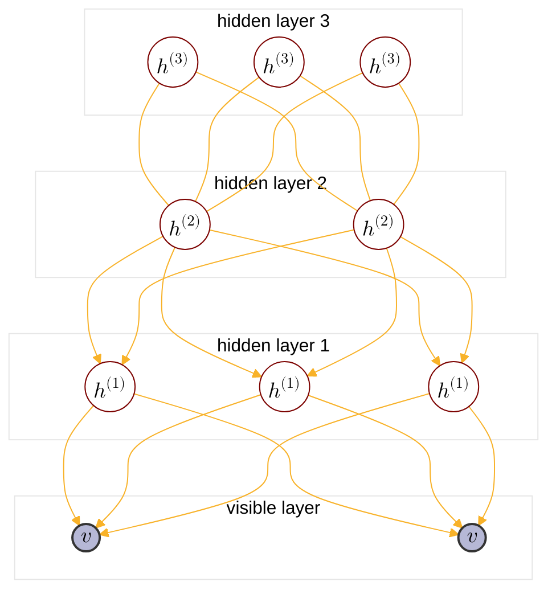

:                                                         


{{ if or .Page.Params.math .Site.Params.math }}

<link rel="stylesheet" href="https://cdn.jsdelivr.net/npm/katex@0.16.8/dist/katex.min.css" integrity="sha384-GvrOXuhMATgEsSwCs4smul74iXGOixntILdUW9XmUC6+HX0sLNAK3q71HotJqlAn" crossorigin="anonymous">

<!-- The loading of KaTeX is deferred to speed up page rendering -->

<!-- To automatically render math in text elements, include the auto-render extension: -->

{{ end }}

{{ if .Page.Store.Get "hasMermaid" }}
  
{{ end }}


## Overview of PGM

<cite>[^1]</cite>

$$
\text{PGM}: \begin{cases}
    \text{Representation} \begin{cases}
        \text{directed graph}\rarr \begin{cases} 
            \text{Naive Bayes:} \begin{cases}
            p(x_i|y) = \prod_{j=1}^p p(x_i^j|y) \\\
            \argmax \prod_{i=1}^N \left(\prod_{j=1}^p p(x_i^j|y_i)\right) p(y_i)
            \end{cases} \\\
            \text{Gaussian Mixture} \\\
            {\text{MEMM: }} \begin{cases}
                p(y_t|y_{t-1}) \\\
                p(y_t|x_{1:T},x_t)
            \end{cases} \\\
            \text{Sigmoid Belief Network} : \text{BM}+\text{directed graph} \\\
            \text{Bayesian network} 
        \end{cases} \\\
        \text{undirected graph}\rarr \begin{cases}
            \text{CRF}\rarr\text{Linear Chain CRF: } \begin{cases}
                p(y_t|y_{t-1}) \\\
                p(y_{t-1}|y_t) \\\
                p(y_t|x_{1:T},x_t)
            \end{cases} \\\
            \text{Boltzman Machine(BM): } \begin{cases}
                \text{visible nodes} \\\
                \text{hidden nodes}
            \end{cases} \\\
            \text{{Restricted Boltzman Machine(RBM)}} : \text{Bipartite BM} \\\
            \text{Markov network(MRF)}
        \end{cases} \\\
        \text{continous variable}\rarr \text{{Gaussian BN/Gaussian MRF}} \\\
        \text{time$\rarr$} \underset{\text{$x_i$ not i.i.d.}}{\text{ Dynamic model}} \begin{cases}
            \text{discrete state$\rarr$Hidden Markov Model} \\\
            \text{continous state} \begin{cases}
                \text{Linear model$\rarr$Karman Filter} \\\
                \text{Nonlinear model$\rarr$Particle Filter}
            \end{cases}
        \end{cases} \\\
        \text{\color{red}{Deep Belief Network(DBN)}} : \text{RBM}+\text{SBN}
    \end{cases} \\\
    \text{Inference} \begin{cases}
        \text{MAP inference$\rarr \hat{x_A}=\argmax_{x_A}p(x_A|x_B)\propto\argmax p(x_A,x_B)$} \\\
        \text{exact inference} \begin{cases}
          \text{Variable elimination(VE)} \\\
          \text{Belief propagation(BP)$\rarr$sum-product algorithm(Tree)} \\\
          \text{Junction tree algorithm(Normal graph)}
        \end{cases} \\\
        \text{approximate inference} \begin{cases}
            \text{Loop belief propagation(Cyclic graph)} \\\
            \text{Variational inference} \\\
            \text{MCMC: importance sampling}
        \end{cases} 
    \end{cases} \\\
    \text{Learning} \begin{cases}
        \text{parameter learning} \begin{cases}
            \text{complete data: $(x,z)$} \\\
            \text{hidden variable: $z$}
        \end{cases} \\\
        \text{structure learning}
    \end{cases}
\end{cases}
$$

## DBN Intro

Deep Belief Network(DBN) is a bayesian network and a hybrid model proposed by Hinton<cite>[^3]</cite>. The top two layers of DBN have undirected connections while the lower layers have directed top-down connections. DBN can be considered as a stack of restricted boltzman machines(RBMs), and the directed layers is considered as sigmoid belief network(SBN) with tied parameters.



For each layer in DBN, we have:



$$
k = 1\cdots \infty \\\
\text{hidden layer k} : \begin{cases}
h^{(k)} &: \text{nodes}, h^{(k)} \sim \text{Bernoulli}
\\\
w^{(k)} &: \text{weights of edges} \\\
b^{(k)} &: \text{bias}
\end{cases}
$$

$$
\text{visible layer} : \begin{cases}
v &: \text{nodes}, v \sim \text{Bernoulli} \\\
b^{(0)} &: \text{bias}
\end{cases}
$$

Then we get all the parameters that need to be learned:

$$
\theta = ( w^{(1)},\cdots,w^{(\infty)},b^{(0)},b^{(1)},\cdots,b^{(\infty)} )
$$

Suppose DBN contains L layers, the joint distribution of DBN can be given by [factorization of Bayesian network](https://tirmisula.github.io/posts/probabilistic-graphical-model/#conclusion):

$$
\begin{align*}
p(v,h^{(1)},\cdots,h^{(L)}) &= p(v|h^{(1)},\cdots,h^{(L)})p(h^{(1)},\cdots,h^{(L)}) \\\
&= p(v|h^{(1)})p(h^{(1)}|h^{(2)})\cdots p(h^{(L-2)}|h^{(L-1)})p(h^{(L-1)},h^{(L)}) \\\
&\because \text{tail to tail structure, nodes in same layer are mutually conditional independent} \\\
&= \prod_{i}p(v_i|h^{(1)})\prod_{j_1}p(h_{j}^{(1)}|h^{(2)})\cdots \prod_{j_{\ast}}p(h_{j}^{(L-2)}|h^{(L-1)})p(h^{(L-1)},h^{(L)})
\end{align*}
$$

We have given the [RBM's conditional probability](https://tirmisula.github.io/posts/restricted-boltzman-machine/#posterier-inference) and [SBN's conditional probability](https://tirmisula.github.io/posts/sigmoid-belief-network/#sigmoid-belief-network-definition):

$$
\begin{align*}
p(o_k=1|h) &= \sigma(\sum_{i=1}^mh_iw_{ik}+\alpha_k) \\\
p(o_k=0|h) &= 1-\sigma(\sum_{i=1}^mh_iw_{ik}+\alpha_k)
\end{align*}
$$

$$
\begin{align*}
p(s_i=1 | \lbrace s_j \rbrace\in\text{parents}(x_i)) &= \sigma(\sum_jw_{ji}s_j) \\\
p(s_i=0 | \lbrace s_j \rbrace\in\text{parents}(x_i)) &= \sigma(-\sum_jw_{ji}s_j)
\end{align*}
$$

Thus we can conclude:

$$
\begin{align*}
p(h_{j}^{(k)}=1|h^{(k+1)}) &= \sigma( w_{j}^{T(k+1)}h^{(k+1)}+b_{j}^{(k)}) \\\
p(v_i=1|h^{(1)}) &= \sigma( w_{i}^{T(1)}h^{(1)}+b_{i}^{(0)})
\end{align*}
$$

On the other hand, the joint probabilty of [restricted Boltzaman machine](https://tirmisula.github.io/posts/restricted-boltzman-machine/#rbm-model-definition) is given by:

$$
\begin{align*}
p(o,h) &= \frac{1}{z}\exp(h^Two+\alpha^To+\beta^Th) \\\
&= \frac{1}{z} \prod_{i=1}^m\prod_{j=1}^n\exp(h_iw_{ij}o_j) \prod_{i=1}^m\exp(\beta_i h_i) \prod_{j=1}^n\exp(\alpha_j o_j)
\end{align*}
$$

So we have the joint distribution of top two layers:

$$
p(h^{(L-1)},h^{(L)}) = \frac{1}{z}\exp\left(h^{T(L)}w^{(L)}h^{(L-1)}+h^{T(L-1)}b^{(L-1)}+h^{T(L)}b^{(L)} \right) \\\
$$

## Motivation of Stacking RBM
### Maximize p(h)

In a single RBM model, we have observation's probability equals:

$$
\begin{align*}
p(v|w^{(1)}) &= \sum_{h^{(1)}} p(v,h^{(1)}|w^{(1)}) \\\
&= \sum_{h^{(1)}} p(h^{(1)}|w^{(1)})p(v|h^{(1)},w^{(1)})
\end{align*}
$$



In doublel RBMs model, \( p(h^{(1)}) \) is no longer a prior, similarly we can write:



$$
\begin{align*}
p(h^{(1)}|w^{(2)}) &= \sum_{h^{(2)}}p(h^{(1)},h^{(2)}|w^{(2)})
\end{align*}
$$



Since \( p(h^{(1)}) \) is derived from \( w^{(2)} \), replace \( p(h^{(1)}|w^{(1)}) \) with \( p(h^{(1)}|w^{(2)}) \), we can rewrite observation's probability:



$$
\begin{align*}
p(v|w^{(1)}) &= \sum_{h^{(1)}} p(h^{(1)}|w^{(1)})p(v|h^{(1)},w^{(1)}) \\\
&\dArr \\\
p(v|w^{(1)},w^{(2)}) &= \sum_{h^{(1)}} p(h^{(1)}|w^{(2)})p(v|h^{(1)},w^{(1)}) \\\
&= \sum_{h^{(1)}} \sum_{h^{(2)}}p(h^{(1)},h^{(2)}|w^{(2)})p(v|h^{(1)},w^{(1)}) \\\
\end{align*}
$$

In [HMM chapter](https://tirmisula.github.io/posts/hidden-markov-model/#learning) we introduced that learning problem is equivalent to solving maximum likelihood estimation:

$$
\hat{\lambda} = \argmax p(O|\lambda) \\\
\because p(h^{(1)}|w^{(2)}) = \prod_i p(h\_{i}^{(1)}|w^{(2)}) \text{ is tractable} \\\
\therefore p(h^{(1)}|\hat{w^{(2)}}) = \max p(h^{(1)}) \geq p(h^{(1)}|w^{(1)})
$$



So \( p(h) \) derived from double layer RBM is maximized, it is greater than \( p(h) \) derived from single layer so does \( p(v) \):



$$
\begin{align*}
\sum_{h^{(2)}}p(h^{(1)},h^{(2)}|w^{(2)}) &\geq p(h^{(1)}|w^{(1)}) \\\
\sum_{h^{(1)}} \sum_{h^{(2)}}p(h^{(1)},h^{(2)}|w^{(2)})p(v|h^{(1)},w^{(1)}) &\geq \sum_{h^{(1)}} p(h^{(1)}|w^{(1)})p(v|h^{(1)},w^{(1)}) \\\
p(v|w^{(1)},w^{(2)}) &\geq p(v|w^{(1)})
\end{align*}
$$

<!-- 

To improve \( p(v) \) we can improve the prior \( p(h^{(1)}) \) and leave p(v|h^{(1)}) fixed. This is done by adding a layer \( h^{(2)} \) on top of \( h^{(1)} \), remove top-down connections from \( h^{(1)} \) to \( v \), and learn \(w^{(1)},w^{(2)}\) in bottom-up manner:

 -->



A notable thing for above inequality is to fix \( p(v|h^{(1)}) \). This is done by removing bottom-up(\( v \) to \( h^{(1)} \)) connections from first RBM layer:



$$
\begin{align*}
\text{improve $p(v)$} &\hArr \text{improve $p(h^{(1)})$, fix $p(v|h^{(1)})$} \\\
\text{$p(v|h^{(1)})$} &\hArr \text{learn $w^{(1)}$ from first layer RBM inference} \\\
\text{$\hat{p}(h^{(1)})$} &\hArr \text{learn $w^{(2)}$ from second layer RBM inference}
\end{align*} \\\
\text{Thus $w=(w^{(1)},w^{(2)}\cdots)$ is learned in bottom-up manner} \\\
$$

### Improve ELBO of p(v)

From [ELBO](https://tirmisula.github.io/posts/expectation-maximization/#generalized-em-algorithm) perspective, we know that:

$$
\begin{align*}
\log p(v) &= \log \sum_{h^{(1)}} p(v,h^{(1)}) \\\
&\geq \text{ELBO} \\\
\text{ELBO} &= \sum_{h^{(1)}}q(h^{(1)}|v)\log\frac{p(v,h^{(1)})}{q(h^{(1)}|v)} \\\
% &\geq \mathbb{E}\_{h^{(1)}\sim q(h^{(1)}|v)}\left[\log\frac{p(v,h^{(1)})}{q(h^{(1)}|v)}\right] \\\
&= \sum_{h^{(1)}}q(h^{(1)}|v)\left[\log p(h^{(1)})+\log p(v|h^{(1)})-\log q(h^{(1)}|v)\right] \\\
&\because w^{(1)} \text{ is determined during RBM learning} \\\
&\therefore \text{posterier }p(v|h^{(1)}),q(h^{(1)}|v) \text{ is fixed} \\\
&= \sum_{h^{(1)}}q(h^{(1)}|v)\log p(h^{(1)})+C \\\
&\text{Let } p(h^{(1)}) = \max p(h^{(1)}) \\\
&\leq \sum_{h^{(1)}}q(h^{(1)}|v)\log \max p(h^{(1)})+C \\\ 
&\therefore\text{ELBO is improved by $\hat{p}(h^{(1)})$}
\end{align*}
$$

In conslusion,

$$
\text{stacking RBM} \hArr \text{maximize likelihood of $p(h^{(1)})$} \hArr \text{maximize $p(v)$'s ELBO}
$$

## Pre-training

Pre-training is the first stage of DBN tranining which is used to initialize weights. 

+ Perform bottom-up greedy training layer by layer

+ Treat each layer as RBM model, trained with [CD-k algorithm](https://tirmisula.github.io/posts/partition-function/#cd-k-for-rbm-design)

The tranining process roughly looks like:

$$
\begin{align*}
&\text{$v$ is known, learn $w^{(1)},b^{(0)}$ by CD-k} \\\
&\text{sample $h^{(1)}\sim p(h^{(1)}|v,w^{(1)})$} \\\
&\text{$h^{(1)}$ is known, learn $w^{(2)},b^{(1)}$ by CD-k} \\\
&\text{sample $h^{(2)}\sim p(h^{(2)}|h^{(1)},w^{(2)})$}
\end{align*} \\\
\cdots
$$



However, posterier \( p(h|v) \) in SBN is intractable because of head to head structure. Instead of directly solving \( p(h|v) \), \( q(h|v) \) is computed to approximate \( p(h|v) \), \( q(h|v) \) is assumed to be factorable like posterier in RBM, so we have:



$$
\begin{cases}
p(v|h^{(1)}) = \prod_{i}\sigma( w_{:,i}^{T(1)}h^{(1)}+b_{i}^{(0)}) \\\
\because\text{complementary} \text{ prior}\text{, inference is reversible with $w^T$} \\\
q(h^{(1)}|v) = \prod_{j}\sigma( w_{j,:}^{(1)}v+b_{j}^{(0)}) \\\
w_{:,i}^{T(1)}, w_{j,:}^{(1)} \in w^{(1)}
\end{cases}
$$

The trainining process becomes:

$$
\begin{align*}
&\text{$v$ is known, learn $w^{(1)},b^{(0)}$ by CD-k} \\\
&\text{sample $h^{(1)}\sim q(h^{(1)}|v,w^{(1)})$} \\\
&\text{$h^{(1)}$ is known, learn $w^{(2)},b^{(1)}$ by CD-k} \\\
&\text{sample $h^{(2)}\sim q(h^{(2)}|h^{(1)},w^{(2)})$}
\end{align*} \\\
\cdots
$$

Drawback:

$$
\because \text{$q(h|v)$ is factorable but $p(h|v)$ is not factorable} \\\
\therefore \text{KL}(q||p) \gg 0 \rArr \text{ELBO of $p(v)$ is relatively loose in DBN}
$$

## Fine-tuning

Fine-tuning is the second stage of DBN tranining which is used to improve model performance.

+ Supervised method: Treat DBN as feed forward nerual network, use existed labeled data to fine tune weights (back propagation algorithm)

+ Unsupervised method: Fine-tunes the weights using a contrastive version of the wake-sleep algorithm<cite>[^2]</cite>

## Reference

[^1]: - [video](https://www.bilibili.com/video/BV1aE411o7qd?p=146).
[^4]: From [Higham, Nicholas (2002). Accuracy and Stability of Numerical Algorithms](https://archive.org/details/accuracystabilit00high_878).
[^5]: From [The Multivariate Gaussian. Michael I. Jordan](https://people.eecs.berkeley.edu/~jordan/courses/260-spring10/other-readings/chapter13.pdf).
[^3]: - [Deep belief networks. Geoffrey E. Hinton (2009)](http://scholarpedia.org/article/Deep_belief_networks).
[^7]: - [GAUSS-MARKOV MODELS, JONATHAN HUANG AND J. ANDREW BAGNELL](https://www.cs.cmu.edu/~16831-f14/notes/F14/gaussmarkov.pdf).
[^6]: - [Gaussian Processes and Gaussian Markov Random Fields](https://folk.ntnu.no/joeid/MA8702/jan16.pdf)
[^2]: - [A fast learning algorithm for deep belief nets. Geoffrey E. Hinton, Simon Osindero, Yee-Whye Teh](https://www.cs.toronto.edu/~hinton/absps/fastnc.pdf).
