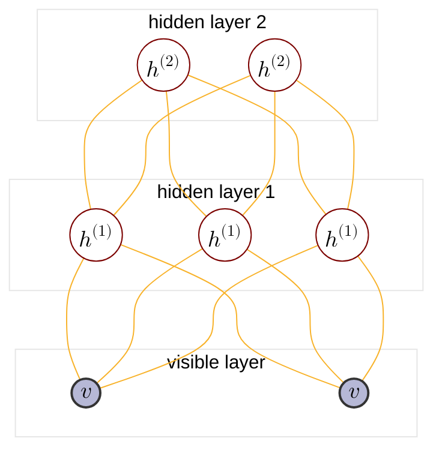

:                                                         


{{ if or .Page.Params.math .Site.Params.math }}

<link rel="stylesheet" href="https://cdn.jsdelivr.net/npm/katex@0.16.8/dist/katex.min.css" integrity="sha384-GvrOXuhMATgEsSwCs4smul74iXGOixntILdUW9XmUC6+HX0sLNAK3q71HotJqlAn" crossorigin="anonymous">

<!-- The loading of KaTeX is deferred to speed up page rendering -->

<!-- To automatically render math in text elements, include the auto-render extension: -->

{{ end }}

{{ if .Page.Store.Get "hasMermaid" }}
  
{{ end }}


## Overview of PGM

<cite>[^1]</cite>

$$
\text{PGM}: \begin{cases}
    \text{Representation} \begin{cases}
        \text{directed graph}\rarr \begin{cases} 
            \text{Naive Bayes:} \begin{cases}
            p(x_i|y) = \prod_{j=1}^p p(x_i^j|y) \\\
            \argmax \prod_{i=1}^N \left(\prod_{j=1}^p p(x_i^j|y_i)\right) p(y_i)
            \end{cases} \\\
            \text{Gaussian Mixture} \\\
            {\text{MEMM: }} \begin{cases}
                p(y_t|y_{t-1}) \\\
                p(y_t|x_{1:T},x_t)
            \end{cases} \\\
            \text{Sigmoid Belief Network} : \text{BM}+\text{directed graph} \\\
            \text{Bayesian network} 
        \end{cases} \\\
        \text{undirected graph}\rarr \begin{cases}
            \text{CRF}\rarr\text{Linear Chain CRF: } \begin{cases}
                p(y_t|y_{t-1}) \\\
                p(y_{t-1}|y_t) \\\
                p(y_t|x_{1:T},x_t)
            \end{cases} \\\
            \text{Boltzman Machine(BM): } \begin{cases}
                \text{visible nodes} \\\
                \text{hidden nodes}
            \end{cases} \\\
            \text{{Restricted Boltzman Machine(RBM)}} : \text{Bipartite BM} \\\
            \text{{Boltzman Machine}} : \text{Fully connected graph} \\\
            \text{\color{red}{Deep Boltzman Machine}} : \text{stacked BM} \\\
            \text{Markov network(MRF)}
        \end{cases} \\\
        \text{continous variable}\rarr \text{{Gaussian BN/Gaussian MRF}} \\\
        \text{time$\rarr$} \underset{\text{$x_i$ not i.i.d.}}{\text{ Dynamic model}} \begin{cases}
            \text{discrete state$\rarr$Hidden Markov Model} \\\
            \text{continous state} \begin{cases}
                \text{Linear model$\rarr$Karman Filter} \\\
                \text{Nonlinear model$\rarr$Particle Filter}
            \end{cases}
        \end{cases} \\\
        \text{{Deep Belief Network(DBN)}} : \text{RBM}+\text{SBN}
    \end{cases} \\\
    \text{Inference} \begin{cases}
        \text{MAP inference$\rarr \hat{x_A}=\argmax_{x_A}p(x_A|x_B)\propto\argmax p(x_A,x_B)$} \\\
        \text{exact inference} \begin{cases}
          \text{Variable elimination(VE)} \\\
          \text{Belief propagation(BP)$\rarr$sum-product algorithm(Tree)} \\\
          \text{Junction tree algorithm(Normal graph)}
        \end{cases} \\\
        \text{approximate inference} \begin{cases}
            \text{Loop belief propagation(Cyclic graph)} \\\
            \text{Variational inference} \\\
            \text{MCMC: importance sampling}
        \end{cases} 
    \end{cases} \\\
    \text{Learning} \begin{cases}
        \text{parameter learning} \begin{cases}
            \text{complete data: $(x,z)$} \\\
            \text{hidden variable: $z$}
        \end{cases} \\\
        \text{structure learning}
    \end{cases}
\end{cases}
$$

## Commonality of BM RBM DBM

BM([Boltzamn Machine](https://tirmisula.github.io/posts/boltzman-machine/#conclusion-of-general-solution-of-bm)), RBM([Restricted Boltzman Machine](https://tirmisula.github.io/posts/partition-function/#the-log-likelihood-gradient-of-rbm)), DBM(Deep Boltzman Machine) are Boltzman machine series and undirected probabilistic graphical model. So they share the same form of log-likelihood gradient and general learning method:

$$
\triangle W = \eta(\mathbb{E}\_{P_{\text{data}}[vh^T]}- \mathbb{E}\_{P_{\text{model}}[vh^T]}) \text{ by SGD}
$$

$$
\begin{cases}
    P_{\text{data}} = P_{\text{data}}(v)P_{\text{model}}(h|v) \\\
    P_{\text{model}} = P_{\text{model}}(v,h)
\end{cases}
$$

## Review DBN

DBN([Deep Belief Network](https://tirmisula.github.io/posts/deep-belief-network/#dbn-intro)) on the other hand is not a Boltzman series model. It is a hybird model so we don't have a closed form of it's log-likelihood. During pre-tranining stage, RBM learning method is referenced for each layer:

$$
\begin{cases}
    \text{Pre-training} : \begin{cases}
        h^{(i)} \sim q(h^{(i)}|v,w^{(i)}) \\\
        \text{Learn $w^{(i+1)}$ by CD-k}
    \end{cases} \\\
    \text{Fine-tuning} : \begin{cases}
        \text{Wake Sleep} \\\
        \text{Back Propagation}
    \end{cases}
\end{cases}
$$

## DBM intro

Consider a DBM with 3 layers, it's graph structure is similar to DBN:

DBM is proposed by Salakhutdinov and Hinton<cite>[^2]</cite>. The joint distribution of DBM (referenced in [RBM](https://tirmisula.github.io/posts/restricted-boltzman-machine/#rbm-model-definition)) is given by:

$$
\begin{align*}
p(v,h^{(1)},h^{(2)}) &= \frac{1}{z}\exp(-E(v,h^{(1)},h^{(2)})) \\\
&= \frac{1}{z}\exp(v^Tw^{(1)}h^{(1)}+h^{T(1)}W^{(2)}h^{(2)})
\end{align*}
$$

And the conditonal distribution (referenced in [RBM](https://tirmisula.github.io/posts/restricted-boltzman-machine/#posterier-inference)) is given by:

$$
\begin{align*}
p(v_i=1|h^{(1)}) &= \sigma(\sum_j w\_{ij}^{(1)}h\_{j}^{(1)}) \\\
p(h^{(2)}\_{k}=1|h^{(1)}) &= \sigma(\sum_j w\_{jk}^{(2)}h\_{j}^{(1)}) \\\
p(h^{(1)}\_{j}=1|v,h^{(2)}) &= \sigma(\sum_i w\_{ij}^{(1)}v_{i} + \sum_k w\_{jk}^{(2)}h\_{k}^{(2)}) \\\
w_{ij} &: \text{weight from bottom node $\langle i \rangle$ to top node $\langle j \rangle$} \\\
w_{jk} &: \text{weight from bottom node $\langle j \rangle$ to top node $\langle k \rangle$} 
\end{align*}
$$

We can use the general BM learning methods for DBM, However a combination of pre-training (find initial weights) and SGD (sthochastic gradient descent) is applicable to accelerate the learning process due to computation efficiency and similarity to DBN.

## Pre-tranining in DBM
### Intuition
Recall that in [Deep Belief Network](https://tirmisula.github.io/posts/deep-belief-network/#maximize-ph) chapter, we show p(h) is determined by:

$$
p(h^{(1)}) = \begin{cases}
    p(h^{(1)}|w^{(1)}) \text{ in RBM} \\\
    p(h^{(1)}|w^{(2)}) \text{ in DBN}
\end{cases}
$$



DBM's definition shows \(p(h^{(1)})\) is determined by both \( w^{(1)} \) and \( w^{(2)} \). An intuition for DBM pre-training is to perform greedy layerwise pre-training introduced in DBN:



$$
\begin{align*}
p(h^{(1)}|w^{(1)},w^{(2)}) \text{ is a composed model of $p(h^{(1)}|w^{(1)})$ and $p(h^{(1)}|w^{(1)})$}
\end{align*}
$$



\( p(h^{(1)}|w^{(1)}) \) is given by:



$$
\begin{align*}
p(h^{(1)}|w^{(1)}) &= \sum_{v} p(v,h^{(1)}|w^{(1)}) \\\
&= \sum_{v}p(v|w^{(1)})p(h^{(1)}|v,w^{(1)}) \\\
&\approx \frac{1}{N}\sum_{v\in V}p(h^{(1)}|v,w^{(1)}) = \frac{1}{N}\sum_{v\in V}\prod_{j}\sigma(\sum_i w\_{ij}^{(1)}v_{i})
\end{align*} \\\
\frac{1}{N}\sum_{v\in V}p(v,h^{(1)}|w^{(1)}) \text{ is aggregate posterier}, v \sim p(v)=p(v|w^{(1)})
$$



\( p(h^{(1)}|w^{(2)}) \) is given by:



$$
\begin{align*}
p(h^{(1)}|w^{(2)}) &= \sum_{h^{(2)}} p(h^{(1)},h^{(2)}|w^{(2)}) \\\
&= \sum_{h^{(2)}}p(h^{(2)}|w^{(2)})p(h^{(1)}|h^{(2)},w^{(2)}) \\\
&\approx \frac{1}{N}\sum_{h^{(2)}\in H}p(h^{(1)}|h^{(2)},w^{(2)}) = \frac{1}{N}\sum_{h^{(2)}\in H}\prod_{j}\sigma(\sum_k w^{(2)}\_{jk}h^{(2)}\_{k})
\end{align*}
$$

$$
\begin{align*}
&h^{(2)} \sim p(h^{(2)}|h^{(1)},w^{(2)}), h^{(1)} \sim p(h^{(1)}|v,w^{(1)}), v\sim p(v)
\end{align*}
$$



Notice that \( h^{(2)} \) depends on sampling from observation distribution \( p(v) \). Directly using \( p(h^{(1)}|w^{(1)}) \) and \( p(h^{(1)}|w^{(2)}) \) would amount to double-counting the evidence, which causes represented approximation distribution \( p(h^{(1)}|w^{(1)},w^{(2)}) \) concentrated. The intuition is to average two models \( p(h^{(1)}|\frac{1}{2}w^{(1)},\frac{1}{2}w^{(2)}) \), this is done by duplicate connections between layers except marginal layers (the top and bottom layers).



### Pre-tranining procedure



Suppose DBM contains \( L+1 \) layers, learn \( w^{(1)},\cdots,w^{(L)} \) in bottom-up manner, pre-train each two layers as RBM (CD-k).



1. For bottom two layers, the conditonal probability is given by:

$$
\begin{align*}
    p(h^{(1)}\_{j}=1|v) &= \sigma(\sum_i w\_{ij}^{(1)}v_{i}+\sum_i w\_{ij}^{(1)}v_{i}) \\\ 
    p(v_i=1|h^{(1)}) &= \sigma(\sum_j w\_{ij}^{(1)}h^{(1)}\_{j})
\end{align*}
$$

2. For any intermediate layer, the conditonal probability is given by:

$$
\begin{align*}
    p(h^{(l)}\_{j}=1|h^{(l-1)},h^{(l+1)}) &= \sigma(\sum_i w\_{ij}^{(l)}h^{(l-1)}\_{i} + \sum_k w\_{jk}^{(l+1)}h^{(l+1)}\_{k})
\end{align*}
$$

3. For top two layers, the conditonal probability is given by:

$$
\begin{align*}
    p(h^{(L)}\_{k}=1|h^{(L-1)}) &= \sigma(\sum_j w\_{jk}^{(L)}h^{(L)}\_{j}) \\\
    p(h^{(L-1)}\_{j}=1|h^{(L)}) &= \sigma(\sum_k w\_{jk}^{(L)}h^{(L)}\_{k} + \sum_k w\_{jk}^{(L)}h^{(L)}\_{k}) 
\end{align*}
$$

## DBM's ELBO of p(v)

Salakhutdinov and Hinton<cite>[^2]</cite> proved that DBM's ELBO is further improved on the basis of DBN's ELBO.

## Reference

[^1]: - [video](https://www.bilibili.com/video/BV1aE411o7qd?p=157).
[^4]: From [Higham, Nicholas (2002). Accuracy and Stability of Numerical Algorithms](https://archive.org/details/accuracystabilit00high_878).
[^5]: From [The Multivariate Gaussian. Michael I. Jordan](https://people.eecs.berkeley.edu/~jordan/courses/260-spring10/other-readings/chapter13.pdf).
[^2]: - [Deep Boltzmann Machines. Ruslan Salakhutdinov, Geoffrey Hinton](http://www.cs.toronto.edu/~hinton/absps/dbm.pdf).
[^7]: - [GAUSS-MARKOV MODELS, JONATHAN HUANG AND J. ANDREW BAGNELL](https://www.cs.cmu.edu/~16831-f14/notes/F14/gaussmarkov.pdf).
[^6]: - [Gaussian Processes and Gaussian Markov Random Fields](https://folk.ntnu.no/joeid/MA8702/jan16.pdf)
[^3]: - [A fast learning algorithm for deep belief nets. Geoffrey E. Hinton, Simon Osindero, Yee-Whye Teh](https://www.cs.toronto.edu/~hinton/absps/fastnc.pdf).
