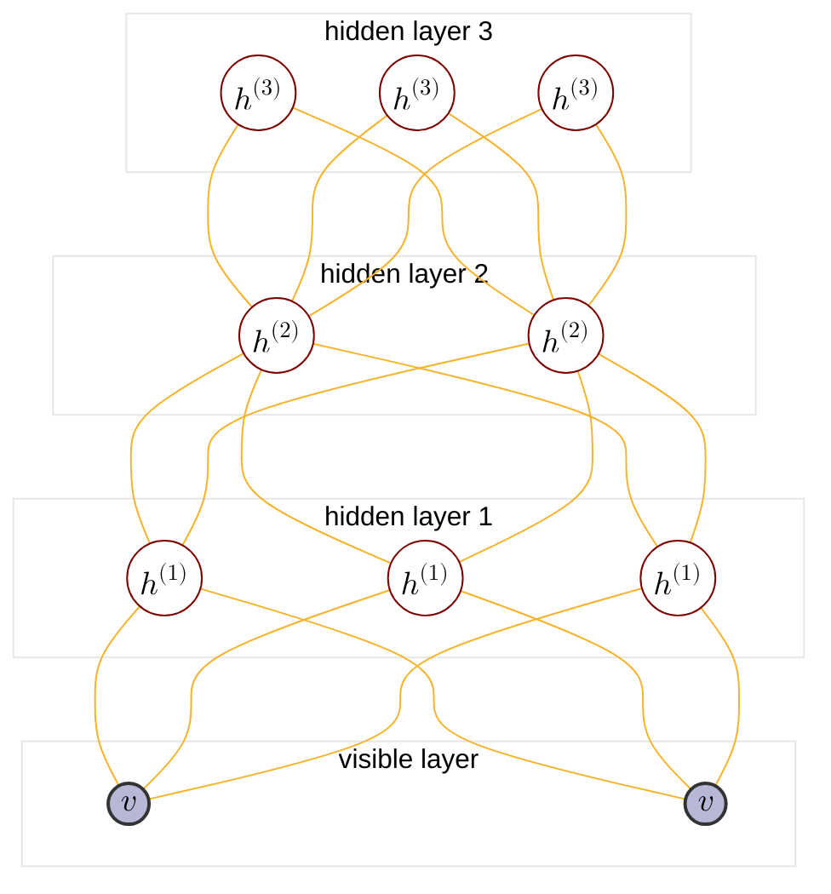

:                                                         


{{ if or .Page.Params.math .Site.Params.math }}

<link rel="stylesheet" href="https://cdn.jsdelivr.net/npm/katex@0.16.8/dist/katex.min.css" integrity="sha384-GvrOXuhMATgEsSwCs4smul74iXGOixntILdUW9XmUC6+HX0sLNAK3q71HotJqlAn" crossorigin="anonymous">

<!-- The loading of KaTeX is deferred to speed up page rendering -->

<!-- To automatically render math in text elements, include the auto-render extension: -->

{{ end }}

{{ if .Page.Store.Get "hasMermaid" }}
  
{{ end }}


## Overview of PGM

<cite>[^1]</cite>

$$
\text{PGM}: \begin{cases}
    \text{Representation} \begin{cases}
        \text{directed graph}\rarr \begin{cases} 
            \text{Naive Bayes:} \begin{cases}
            p(x_i|y) = \prod_{j=1}^p p(x_i^j|y) \\\
            \argmax \prod_{i=1}^N \left(\prod_{j=1}^p p(x_i^j|y_i)\right) p(y_i)
            \end{cases} \\\
            \text{Gaussian Mixture} \\\
            {\text{MEMM: }} \begin{cases}
                p(y_t|y_{t-1}) \\\
                p(y_t|x_{1:T},x_t)
            \end{cases} \\\
            \text{Sigmoid Belief Network} : \text{BM}+\text{directed graph} \\\
            \text{Bayesian network} 
        \end{cases} \\\
        \text{undirected graph}\rarr \begin{cases}
            \text{CRF}\rarr\text{Linear Chain CRF: } \begin{cases}
                p(y_t|y_{t-1}) \\\
                p(y_{t-1}|y_t) \\\
                p(y_t|x_{1:T},x_t)
            \end{cases} \\\
            \text{Boltzman Machine(BM): } \begin{cases}
                \text{visible nodes} \\\
                \text{hidden nodes}
            \end{cases} \\\
            \text{{Restricted Boltzman Machine(RBM)}} : \text{Bipartite BM} \\\
            \text{{Boltzman Machine}} : \text{Fully connected graph} \\\
            \text{\color{red}{Deep Boltzman Machine}} : \text{stacked BM} \\\
            \text{Markov network(MRF)}
        \end{cases} \\\
        \text{continous variable}\rarr \text{{Gaussian BN/Gaussian MRF}} \\\
        \text{time$\rarr$} \underset{\text{$x_i$ not i.i.d.}}{\text{ Dynamic model}} \begin{cases}
            \text{discrete state$\rarr$Hidden Markov Model} \\\
            \text{continous state} \begin{cases}
                \text{Linear model$\rarr$Karman Filter} \\\
                \text{Nonlinear model$\rarr$Particle Filter}
            \end{cases}
        \end{cases} \\\
        \text{{Deep Belief Network(DBN)}} : \text{RBM}+\text{SBN}
    \end{cases} \\\
    \text{Inference} \begin{cases}
        \text{MAP inference$\rarr \hat{x_A}=\argmax_{x_A}p(x_A|x_B)\propto\argmax p(x_A,x_B)$} \\\
        \text{exact inference} \begin{cases}
          \text{Variable elimination(VE)} \\\
          \text{Belief propagation(BP)$\rarr$sum-product algorithm(Tree)} \\\
          \text{Junction tree algorithm(Normal graph)}
        \end{cases} \\\
        \text{approximate inference} \begin{cases}
            \text{Loop belief propagation(Cyclic graph)} \\\
            \text{Variational inference} \\\
            \text{MCMC: importance sampling}
        \end{cases} 
    \end{cases} \\\
    \text{Learning} \begin{cases}
        \text{parameter learning} \begin{cases}
            \text{complete data: $(x,z)$} \\\
            \text{hidden variable: $z$}
        \end{cases} \\\
        \text{structure learning}
    \end{cases}
\end{cases}
$$

## Commonality of BM RBM DBM

BM([Boltzamn Machine](https://tirmisula.github.io/posts/boltzman-machine/#conclusion-of-general-solution-of-bm)), RBM([Restricted Boltzman Machine](https://tirmisula.github.io/posts/partition-function/#the-log-likelihood-gradient-of-rbm)), DBM(Deep Boltzman Machine) are Boltzman machine series undirected probabilistic graphical model. So they share the same form of log-likelihood gradient and general learning method:

$$
\triangle W = \eta(\mathbb{E}\_{P_{\text{data}}[vh^T]}- \mathbb{E}\_{P_{\text{model}}[vh^T]}) \text{ by SGD}
$$

$$
\begin{cases}
    P_{\text{data}} = P_{\text{data}}(v)P_{\text{model}}(h|v) \\\
    P_{\text{model}} = P_{\text{model}}(v,h)
\end{cases}
$$

## DBM and DBN comparison
### Review DBN

DBN([Deep Belief Network](https://tirmisula.github.io/posts/deep-belief-network/#dbn-intro)) on the other hand is not a Boltzman series model. It is a hybird model so we don't have a closed form of it's log-likelihood. However during pre-tranining stage, RBM learning method is referenced for each layer:

$$
\begin{cases}
    \text{Pre-training} : \begin{cases}
        h^{(i)} \sim q(h^{(i)}|v,w^{(i)}) \\\
        \text{Learn $w^{(i+1)}$ by CD-k}
    \end{cases} \\\
    \text{Fine-tuning} : \begin{cases}
        \text{Wake Sleep} \\\
        \text{Back Propagation}
    \end{cases}
\end{cases}
$$

### DBM structure

The graph structure of DBM is similar to DBN:

Although we can use general BM learning methods for DBM learning, a combination of pre-training (find initial weights) and SGD is proposed to accelerate the learning process due to computation efficiency and similarity to DBN.

## Pre-tranining
### Intuition
Recall that in [Deep Belief Network](https://tirmisula.github.io/posts/deep-belief-network/#maximize-ph) chapter, we show p(h) is determined by:

$$
p(h^{(1)}) = \begin{cases}
    p(h^{(1)}|w^{(1)}) \text{ in RBM} \\\
    p(h^{(1)}|w^{(2)}) \text{ in DBN}
\end{cases}
$$



However, DBM tells us \(p(h^{(1)})\) is determined by both \( w^{(1)} \) and \( w^{(2)} \), an intuition is to combine \( p(h^{(1)}|w^{(1)}),p(h^{(1)}|w^{(2)}) \) together to approximate \( p(h^{(1)}) \):



$$
\begin{align*}
p(h^{(1)}|w^{(1)},w^{(2)}) \approx \alpha p(h^{(1)}|w^{(1)})+\beta p(h^{(1)}|w^{(2)})
\end{align*}
$$

### Double counting problem



\( p(h^{(1)}|w^{(1)}) \) is given by:



$$
\begin{align*}
p(h^{(1)}|w^{(1)}) &= \sum_{v} p(v,h^{(1)}|w^{(1)}) \\\
&= \sum_{v}p(v|w^{(1)})p(h^{(1)}|v,w^{(1)}) \\\
&\approx \frac{1}{N}\sum_{v\in V}p(h^{(1)}|v,w^{(1)})
\end{align*} \\\
\frac{1}{N}\sum_{v\in V}p(v,h^{(1)}|w^{(1)}) \text{ is called aggregate posterier}, v \sim p(v)=p(v|w^{(1)})
$$



\( p(h^{(1)}|w^{(2)}) \) is given by:



$$
\begin{align*}
p(h^{(1)}|w^{(2)}) &= \sum_{h^{(2)}} p(h^{(1)},h^{(2)}|w^{(2)}) \\\
&= \sum_{h^{(2)}}p(h^{(2)}|w^{(2)})p(h^{(1)}|h^{(2)},w^{(2)}) \\\
&\approx \frac{1}{N}\sum_{h^{(2)}\in H}p(h^{(1)}|h^{(2)},w^{(2)})
\end{align*}
$$

$$
\begin{align*}
&v\sim p(v), \text{ then learn $w^{(1)}$ by CD-k} \\\
&h^{(1)} \sim p(h^{(1)}|v,w^{(1)}), \text{ then learn $w^{(2)}$ by CD-k} \\\
&h^{(2)} \sim p(h^{(2)}|h^{(1)},w^{(2)})
\end{align*}
$$



Apparently, \( p(h^{(1)}|w^{(1)}) \), \( p(h^{(1)}|w^{(2)}) \) both depend on sampling observation distribution \( p(v) \). when combining two items, the represented approximation distribution \( p(h^{(1)}|w^{(1)},w^{(2)}) \) could be too concentrated, or called double-counting problem.



## Gradient of BM's Log-likelihood



Let \(V,H\) be the whole set of visible and hidden nodes from dataset:



$$
V,H \in P_{\text{data}} \\\
|V|,|H| = N
$$

For any [energy-based model](https://tirmisula.github.io/posts/partition-function/#the-log-likelihood-gradient-of-energy-based-model) we have the conclusion for log-likelihood gradient:

$$
\begin{align*}
\nabla_{\theta}\mathcal{L}(\theta) &= \frac{1}{N}\sum_{i=1}^N\left( \sum_{o,h}p(o,h)\nabla_{\theta}E(o,h)-\sum_{h}p(h^{(i)}|o^{(i)})\nabla_{\theta}E(o^{(i)},h^{(i)}) \right)
\end{align*}
$$

The derivation of log-likelihood gradient of BM is pretty much the same:

$$
\begin{align*}
    \mathcal{L}(\theta) &= \frac{1}{N}\log\prod_{i=1}^N p(v^{(i)}) \\\
    &= \frac{1}{N}\sum_{v\in V}\log p(v) \\\
    &= \frac{1}{N} \sum_{v\in V} \log \sum_h\frac{1}{z}\exp\left(-E(v,h)\right) \\\
    \nabla_{\theta}\mathcal{L} &= \frac{1}{N}\sum_{v\in V} \left( \sum_{v,h}p(v,h)\nabla_{\theta}E(v,h)-\sum_{h}p(h|v)\nabla_{\theta}E(v,h) \right)
\end{align*}
$$



Take the partial derivative of \( W \), we have:



$$
\begin{align*}
\frac{\partial}{\partial W}E(v,h) &= -\frac{\partial}{\partial W} v^TWh \\\
&= -vh^T \\\
\\\
\frac{\partial}{\partial W}\mathcal{L} &= \frac{1}{N}\sum_{v\in V} \sum_{h}p(h|v)vh^T - \frac{1}{N}\sum_{v\in V}\sum_{v,h}p(v,h)vh^T \\\
&= \frac{1}{N}\sum_{v\in V} \mathbb{E}\_{h\sim P_{\text{model}}(h|v)}[vh^T] - \frac{1}{N}\sum_{v\in V}\mathbb{E}\_{v,h\sim P_{\text{model}}(v,h)}[vh^T] \\\
&= \mathbb{E}\_{\begin{subarray}{c}
    v \sim P_{\text{data}}(v) \\\
    h|v \sim P_{\text{model}}(h|v)
    \end{subarray}}[vh^T] - \mathbb{E}\_{v,h\sim P_{\text{model}}(v,h)}[vh^T] \\\
\end{align*}
$$
 


Similarly, the partial derivative of \( L \) and \( J \) is given by:



$$
\begin{align*}
\frac{\partial}{\partial L}E(v,h) &= -\frac{\partial}{\partial L} v^TLv \\\
&= -vv^T \\\
\frac{\partial}{\partial L}\mathcal{L} &= \mathbb{E}\_{\begin{subarray}{c}
    v \sim P_{\text{data}}(v) \\\
    h|v \sim P_{\text{model}}(h|v)
    \end{subarray}}[vv^T] - \mathbb{E}\_{v,h\sim P_{\text{model}}(v,h)}[vv^T] \\\
\end{align*}
$$

$$
\begin{align*}
\frac{\partial}{\partial J}E(v,h) &= -\frac{\partial}{\partial J} v^TLv \\\
&= -hh^T \\\
\frac{\partial}{\partial J}\mathcal{L} &= \mathbb{E}\_{\begin{subarray}{c}
    v \sim P_{\text{data}}(v) \\\
    h|v \sim P_{\text{model}}(h|v)
    \end{subarray}}[hh^T] - \mathbb{E}\_{v,h\sim P_{\text{model}}(v,h)}[hh^T] \\\
\end{align*}
$$

In conslusion the gradient is given by,

$$
\begin{align*}
\frac{\partial}{\partial W}\mathcal{L} &= \mathbb{E}\_{\begin{subarray}{c}
    v \sim P_{\text{data}}(v) \\\
    h|v \sim P_{\text{model}}(h|v)
    \end{subarray}}[vh^T] - \mathbb{E}\_{v,h\sim P_{\text{model}}(v,h)}[vh^T] \\\
\frac{\partial}{\partial L}\mathcal{L} &= \mathbb{E}\_{\begin{subarray}{c}
    v \sim P_{\text{data}}(v) \\\
    h|v \sim P_{\text{model}}(h|v)
    \end{subarray}}[vv^T] - \mathbb{E}\_{v,h\sim P_{\text{model}}(v,h)}[vv^T] \\\
\frac{\partial}{\partial J}\mathcal{L} &= \mathbb{E}\_{\begin{subarray}{c}
    v \sim P_{\text{data}}(v) \\\
    h|v \sim P_{\text{model}}(h|v)
    \end{subarray}}[hh^T] - \mathbb{E}\_{v,h\sim P_{\text{model}}(v,h)}[hh^T]
\end{align*}
$$

In [RBM learning](https://tirmisula.github.io/posts/partition-function/#rbm-learning) we know that:

$$
\text{RBM }\begin{cases}
P_{\text{model}}(h|v) \text{ has closed form} \\\
P_{\text{model}}(v,h) \text{ is intractable, sampled by CD-k}
\end{cases}
$$

However, BM's posterier and joint distribution are both intractable due to graph structure:

$$
\text{BM }\begin{cases}
P_{\text{model}}(h|v) \text{ is intractable} \\\
P_{\text{model}}(v,h) \text{ is intractable}
\end{cases} 
$$

## Gradient Ascent Based on MCMC
### Gibbs sampling for BM

Recall from [RBM learning chapter](https://tirmisula.github.io/posts/partition-function/#rbm-learning) that the stochastic gradient ascent is performed by Gibbs sampling. Suppose we sample M particles to approximate BM's posterier and joint distribution, it  looks like:

$$
\mathbb{E}\_{\begin{subarray}{c}
    v \sim P_{\text{data}}(v) \\\
    h|v \sim P_{\text{model}}(h|v)
    \end{subarray}}[vh^T] \approx \frac{1}{M}\sum_{a=1}^M v^{(a)}h^{(a)T} \\\
\begin{array}{c}
    v^{(1)} \\\
    \cdots \\\
    v^{(M)}
\end{array} \sim P_{\text{data}}(v), h_{j}^{(a)} \sim P_{\text{model}}(h_j|h_{\neg j},v)
$$

$$
\mathbb{E}\_{\begin{subarray}{c}
    v,h \sim P_{\text{model}}(v,h)
    \end{subarray}}[vh^T] \approx \frac{1}{M}\sum_{a=1}^M v^{(a)}h^{(a)T} \\\
x^{(a)}=(v^{(a)},h^{(a)}), x_i^{(a)} \sim P_{\text{model}}(x_i|x_{\neg i}) \\\
v_{i}^{(a)} \sim P_{\text{model}}(v_i|v_{\neg i},h)\text{ or } h_{j}^{(a)} \sim P_{\text{model}}(h_j|h_{\neg j},v)
$$

The effectiveness of MCMC approximation is limited to graph's size. The conditional probability wiil be derived in next section, it has closed form.

$$
P_{\text{model}}(x_i|x_{\neg i}) = \begin{cases}
    P_{\text{model}}(v_i|v_{\neg i},h) \\\
    P_{\text{model}}(h_j|h_{\neg j},v)
\end{cases}
$$

### Conditional probability of BM

$$
\begin{align*}
p(v_i=1|v_{\neg i},h) &= \frac{p(v,h)}{p(v_{\neg i},h)} \\\
&= \frac{\frac{1}{z}\exp(v^TWh+\frac{1}{2}v^TLv+\frac{1}{2}h^TJh)}{\sum_{v_i}\frac{1}{z}\exp(v^TWh+\frac{1}{2}v^TLv+\frac{1}{2}h^TJh)} \\\
&= \frac{\exp(v^TWh+\frac{1}{2}v^TLv+\frac{1}{2}h^TJh)}{\exp(\frac{1}{2}h^TJh)\sum_{v_i}\exp(v^TWh+\frac{1}{2}v^TLv)} \\\
&= \frac{\exp(v^TWh+\frac{1}{2}v^TLv)}{\sum_{v_i}\exp(v^TWh+\frac{1}{2}v^TLv)}
\end{align*}
$$



We can expand the exponential term \( \exp(v^TWh+\frac{1}{2}v^TLv) \):



$$
\begin{align*}
\exp(v^TWh+\frac{1}{2}v^TLv) &= \exp(\sum_{k=1}^n\sum_{j=1}^mv_kw_{kj}h_j+\frac{1}{2}\sum_{k=1}^n\sum_{j=1}^nv_kL_{kj}v_j)
\end{align*}
$$



\( \sum_{k=1}^n\sum_{j=1}^mv_kw_{kj}h_j \) and \( \frac{1}{2}\sum_{k=1}^n\sum_{j=1}^nv_kL_{kj}v_j \) can both be seperated to \( v_i \) part and non-\( v_i \) part:



$$
\begin{align*}
\sum_{k=1}^n\sum_{j=1}^mv_kw_{kj}h_j &= \sum_{j=1}^mv_iw_{ij}h_j+\sum_{k=1,\neq i}^n\sum_{j=1}^mv_kw_{kj}h_j \\\
\\\
\frac{1}{2}\sum_{k=1}^n\sum_{j=1}^nv_kL_{kj}v_j &= \frac{1}{2}\left(\sum_{k=1,\neq i}^n\sum_{j=1,\neq i}^nv_kL_{kj}v_j+v_iL_{ii}v_i+\sum_{k=1,\neq i}^nv_kL_{ki}v_i+\sum_{j=1,\neq i}^nv_iL_{ij}v_j\right) \\\
&\because \text{diagonal element $L_{ii}=0$} \\\
&= \frac{1}{2}\left(\sum_{k=1,\neq i}^n\sum_{j=1,\neq i}^nv_kL_{kj}v_j+2\sum_{j=1,\neq i}^nv_iL_{ij}v_j\right) \\\
\end{align*}
$$



When \( v_i=1 \), the exponential term is given by:



$$
\exp(v^TWh+\frac{1}{2}v^TLv)|\_{v_i=1} = \exp(\sum_{j=1}^mw_{ij}h_j+\sum_{k=1,\neq i}^n\sum_{j=1}^mv_kw_{kj}h_j+\sum_{j=1,\neq i}^nL_{ij}v_j+\frac{1}{2}\sum_{k=1,\neq i}^n\sum_{j=1,\neq i}^nv_kL_{kj}v_j)
$$



When \( v_i=0 \), the exponential term is given by:



$$
\exp(v^TWh+\frac{1}{2}v^TLv)|\_{v_i=0} = \exp(\sum_{k=1,\neq i}^n\sum_{j=1}^mv_kw_{kj}h_j+\frac{1}{2}\sum_{k=1,\neq i}^n\sum_{j=1,\neq i}^nv_kL_{kj}v_j)
$$

So we have:

$$
\begin{align*}
p(v_i=1|v_{\neg i},h) &= \frac{\exp(v^TWh+\frac{1}{2}v^TLv)}{\sum_{v_i}\exp(v^TWh+\frac{1}{2}v^TLv)} \\\
&= \frac{\exp(v^TWh+\frac{1}{2}v^TLv)|\_{v_i=1}}{\exp(v^TWh+\frac{1}{2}v^TLv)|\_{v_i=1}+\exp(v^TWh+\frac{1}{2}v^TLv)|\_{v_i=0}} \\\
&= \frac{\frac{\exp(v^TWh+\frac{1}{2}v^TLv)|\_{v_i=1}}{\exp(v^TWh+\frac{1}{2}v^TLv)|\_{v_i=0}}}{1+\frac{\exp(v^TWh+\frac{1}{2}v^TLv)|\_{v_i=1}}{\exp(v^TWh+\frac{1}{2}v^TLv)|\_{v_i=0}}} \\\
&\because \frac{\exp(v^TWh+\frac{1}{2}v^TLv)|\_{v_i=1}}{\exp(v^TWh+\frac{1}{2}v^TLv)|\_{v_i=0}}=\exp(\sum_{j=1}^mw_{ij}h_j+\sum_{j=1,\neq i}^nL_{ij}v_j) \\\
&= \frac{\exp(\sum_{j=1}^mw_{ij}h_j+\sum_{j=1,\neq i}^nL_{ij}v_j)}{1+\exp(\sum_{j=1}^mw_{ij}h_j+\sum_{j=1,\neq i}^nL_{ij}v_j)} \\\
&= \sigma(\sum_{j=1}^mw_{ij}h_j+\sum_{j=1,\neq i}^nL_{ij}v_j) \\\
&= \sigma(\sum_{j=1}^mw_{ij}h_j+\sum_{k=1,\neq i}^nL_{ik}v_k) \\\
&\text{Similarly} \\\
p(h_j=1|h_{\neg j},v) &= \sigma(\sum_{i=1}^nw_{ij}v_i+\sum_{k=1,\neq j}^mJ_{jk}h_k)
\end{align*}
$$

In conclusion, the conditional probability of BM is a Sigmoid function. Addtionally the [conditional probability of RBM](https://tirmisula.github.io/posts/restricted-boltzman-machine/#posterier-inference) is considered to be a special case of BM:

$$
\text{BM} : \begin{cases}
    p(v_i=1|v_{\neg i},h) &= \sigma(\sum_{j=1}^mw_{ij}h_j+\sum_{k=1,\neq i}^nL_{ik}v_k) \\\
    p(v_i=0|v_{\neg i},h) &= 1-\sigma(\sum_{j=1}^mw_{ij}h_j+\sum_{k=1,\neq i}^nL_{ik}v_k) \\\
    p(h_j=1|h_{\neg j},v) &= \sigma(\sum_{i=1}^nw_{ij}v_i+\sum_{k=1,\neq j}^mJ_{jk}h_k) \\\
    p(h_j=0|h_{\neg j},v) &= 1-\sigma(\sum_{i=1}^nw_{ij}v_i+\sum_{k=1,\neq j}^mJ_{jk}h_k)
\end{cases}
$$

$$
\text{RBM} : 
\begin{cases}
p(h_j=1|v) &= \sigma(\sum_{i=1}^nw_{ij}v_i+\sum_{k=1,\neq j}^mJ_{jk}h_k) \\\
&\because \text{$h_j$ is not connected to $h_k$ in RBM, $J_{jk}=0$} \\\
&= \sigma(\sum_{j=1}^nw_{ij}v_i+\beta_k)
\end{cases}
$$

## Variational Inference on BM's posterier
### Derive ELBO


From previous sections, we know that BM's posterier \( p(h|v) \) is intractable and is approximated by MCMC method(Gibbs sampling). Variational inference based on mean field theory is proposed to be another method.



The derivation on BM's posterier is slightly different from [Mean Field VI Derivation](https://tirmisula.github.io/posts/variational-inference/#mean-field-vi-derivation) introduced before, since it contains discrete distribution



The evidence lower bound of \( p(v|\theta) \) is given by:



$$
\begin{align*}
\text{ELBO}(p(v|\theta)) &= \log p(v|\theta) - \text{KL}(q(h|v)||p(h|v,\theta)) \\\
&= E_{h\sim q(h|v)}[\log p(v,h|\theta)] + {H[q]} \\\
&= \sum_{h}q(h|v,\phi)\log p(v,h|\theta) + H[q] \\\
&= \sum_{h}q(h|v,\phi)\left[\log\exp(-E(v,h))-\log z\right] + H[q] \\\
&= \sum_{h}q(h|v,\phi)\left[v^TWh+\frac{1}{2}v^TLv+\frac{1}{2}h^TJh-\log z\right] + H[q] \\\
&= \sum_{h}q(h|v,\phi)\left[\frac{1}{2}v^TLv-\log z\right]+ \sum_{h}q(h|v,\phi)\left[v^TWh+\frac{1}{2}h^TJh\right] + H[q] \\\
&\because \sum_{h}q(h|v,\phi) = 1 \\\
&= \frac{1}{2}v^TLv-\log z + \sum_{h}q(h|v,\phi)\left[v^TWh+\frac{1}{2}h^TJh\right] + H[q] \\\
\end{align*}
$$

### Maximize ELBO
#### Simplify ELBO by mean field theory


The optimization problem is maximizing ELBO, notice that \( \log z(\theta) \) is not affected by \( \phi \):



$$
\begin{align*}
\argmax_{q_\phi} \text{ELBO} &= \argmax_{q_\phi} \sum_{h}q(h|v,\phi)\left[v^TWh+\frac{1}{2}h^TJh\right] + H[q] \\\
&\because q(h|v,\phi) = \prod_{j=1}^m q(h_j|v,\phi_{j}) \text{ by mean field theory} \\\
&= \argmax_{q_\phi}\sum_{h}\prod_{j=1}^m q(h_j|v,\phi_{j})v^TWh + \frac{1}{2}\sum_{h}\prod_{j=1}^m q(h_j|v,\phi_{j})h^TJh + H[q]
\end{align*}
$$

$$
\text{Let } \begin{cases}
    A = \sum_{h}\prod_{j=1}^m q(h_j|v,\phi_{j})v^TWh \\\
    B = \frac{1}{2}\sum_{h}\prod_{j=1}^m q(h_j|v,\phi_{j})h^TJh \\\
    C = H[q]
\end{cases}
$$

The A part is given by:

$$
\begin{align*}
A &= \sum_{h}\prod_{j=1}^m q(h_j|v,\phi_{j})v^TWh \\\
&= \sum_{h}\prod_{j=1}^m q(h_j|v,\phi_{j})\sum_{i=1}^n\sum_{k=1}^mv_iw_{ik}h_k \\\
&\text{for each summation item, e.g. the first one} \\\
\sum_{h}\prod_{j=1}^mq(h_j|v,\phi_{j})v_1w_{11}h_1 &= \sum_{h_1}q(h_1|v,\phi_1)v_1w_{11}h_1\sum_{h_2\cdots h_m}\prod_{j=2}^mq(h_j|v,\phi_j) \\\
&= \sum_{h_1}q(h_1|v,\phi_1)v_1w_{11}h_1 \\\
&= q(h_1=1|v,\phi_1)v_1w_{11} + q(h_1=0|v,\phi_1)\cdot 0 \\\
&= q(h_1=1|v,\phi_1)v_1w_{11} \\\
\\\
\therefore A &= \sum_{i=1}^n\sum_{k=1}^mq(h_k=1|v,\phi_k)v_iw_{ik}
\end{align*}
$$

Similarly the B part is given by:

$$
\begin{align*}
2B &= \sum_{h}\prod_{j=1}^m q(h_j|v,\phi_{j})h^TJh \\\
&= \sum_{h}\prod_{j=1}^m q(h_j|v,\phi_{j})\sum_{i=1}^m\sum_{k=1}^mh_iJ_{ik}h_k \\\
&\text{for each summation item, e.g. $i=a,k=b$} \\\
\sum_{h}\prod_{j=1}^m q(h_j|v,\phi_{j})h_aJ_{ab}h_b &= \sum_{h_a,h_b}q(h_a|v,\phi_a)q(h_b|v,\phi_b)h_aJ_{ab}h_b\sum_{h\neq h_a,h_b}\prod_{j=1,\neq a,b}^mq(h_j|v,\phi_j) \\\
&= \sum_{h_a,h_b}q(h_a|v,\phi_a)q(h_b|v,\phi_b)h_aJ_{ab}h_b \\\
&= \sum_{h_b}q(h_b|v,\phi_b)h_b\sum_{h_a}q(h_a|v,\phi_a)h_aJ_{ab} \\\
&= \sum_{h_b}q(h_b|v,\phi_b)q(h_a=1|v,\phi_a)J_{ab} \\\
&= q(h_b=1|v,\phi_b)q(h_a=1|v,\phi_a)J_{ab} \\\
\\\
\therefore B &= \frac{1}{2}\sum_{i=1}^m\sum_{k=1}^mq(h_i=1|v,\phi_i)q(h_k=1|v,\phi_k)J_{ik}
\end{align*}
$$

The C part is given by:

$$
\begin{align*}
C &= H[q(h|v,\phi)] \\\
&\because H[q(z)] = -\int_z q(z)\log q(z) \space dz \\\
&= -\sum_{h} \prod_{j=1}^m q(h_j|v,\phi_{j})\log \prod_{i=1}^m q(h_i|v,\phi_{i}) \\\
&= -\sum_{h} \prod_{j=1}^m q(h_j|v,\phi_{j})\sum_{i=1}^m\log  q(h_i|v,\phi_{i}) \\\
&\text{for each summation item, e.g. $i=1$} \\\
\sum_{h} \prod_{j=1}^m q(h_j|v,\phi_{j})\log  q(h_1|v,\phi_{1}) &= \sum_{h_1}q(h_1|v,\phi_1)\log q(h_1|v,\phi_1)\sum_{h_2\cdots h_m}\prod_{j=2}^mq(h_j|v,\phi_j) \\\
&= \sum_{h_1}q(h_1|v,\phi_1)\log q(h_1|v,\phi_1) \\\
&= q(h_1=1|v,\phi_1)\log q(h_1=1|v,\phi_1) + q(h_1=0|v,\phi_1)\log q(h_1=0|v,\phi_1) \\\
\\\
\therefore C &= -\sum_{i=1}^m q(h_i=1|v,\phi_i)\log q(h_i=1|v,\phi_i) + q(h_i=0|v,\phi_i)\log q(h_i=0|v,\phi_i)
\end{align*}
$$

In conclusion, we have A,B,C part equals:

$$
\begin{align*}
A &= \sum_{i=1}^n\sum_{k=1}^mq(h_k=1|v,\phi_i)v_iw_{ik} \\\
B &= \frac{1}{2}\sum_{i=1}^m\sum_{k=1}^mq(h_i=1|v,\phi_i)q(h_k=1|v,\phi_k)J_{ik} \\\
C &= -\sum_{i=1}^m q(h_i=1|v,\phi_i)\log q(h_i=1|v,\phi_i) + q(h_i=0|v,\phi_i)\log q(h_i=0|v,\phi_i)
\end{align*}
$$

#### Solve q by gradient ascent



Recall that the optimization problem is maxmizing ELBO:



$$
\text{Let } q_j=q(h_j=1|v,\phi_j) \\\
\hat{q_{\phi}} = \argmax_{q_\phi} \text{ELBO} \hArr \frac{\partial}{\partial q_j}\text{ELBO}=0
$$



The partial derivative is given by:



$$
\begin{align*}
 \frac{\partial}{\partial q_j}\text{ELBO} &= \frac{\partial}{\partial q_j} A + \frac{\partial}{\partial q_j} B + \frac{\partial}{\partial q_j} C \\\
 \\\
\frac{\partial}{\partial q_j} A &= \frac{\partial}{\partial q_j}\left(q_j\sum_{i=1}^nv_iw_{ij}+\sum_{i=1}^n\sum_{k=1,\neq j}^mq_kv_iw_{ik}\right) \\\
&= \sum_{i=1}^nv_iw_{ij} \\\
\frac{\partial}{\partial q_j} B &= \frac{1}{2}\frac{\partial}{\partial q_j}\left( \sum_{k=1}^mq_jq_kJ_{jk}+\sum_{i=1}^mq_iq_jJ_{ij}+\sum_{i=1,\neq j}^m\sum_{k=1,\neq j}^mq_iq_kJ_{ik} \right) \\\
&= \frac{1}{2}(\sum_{k=1,\neq j}^mq_kJ_{jk}+\sum_{i=1,\neq j}^mq_iJ_{ij}) \\\
&= \sum_{k=1,\neq j}^mq_kJ_{jk} \\\
\frac{\partial}{\partial q_j} C &= -\frac{\partial}{\partial q_j} \left[q_j\log q_j+(1-q_j)\log(1-q_j)+\sum_{i=1,\neq j}^m(q_i\log q_i+(1-q_i)\log(1-q_i))\right] \\\
&= -\left( \log q_j+q_j\frac{1}{q_j}+\log\frac{1}{1-q_j}+(1-q_j)\frac{-1}{1-q_j} \right) \\\
&= -\log\frac{q_j}{1-q_j} \\\
&\dArr \\\
0 &= \sum_{i=1}^nv_iw_{ij} + \sum_{k=1,\neq j}^mq_kJ_{jk}-\log\frac{q_j}{1-q_j} \\\
\frac{q_j}{1-q_j} &= \exp(\sum_{i=1}^nv_iw_{ij} + \sum_{k=1,\neq j}^mq_kJ_{jk}) \\\
\frac{1}{q_j} &= \frac{1}{\exp(\sum_{i=1}^nv_iw_{ij} + \sum_{k=1,\neq j}^mq_kJ_{jk})}+1 \\\
\hat{q_j} &= \frac{1+\exp(\sum_{i=1}^nv_iw_{ij} + \sum_{k=1,\neq j}^mq_kJ_{jk})}{\exp(\sum_{i=1}^nv_iw_{ij} + \sum_{k=1,\neq j}^mq_kJ_{jk})} \\\
&= \sigma(\sum_{i=1}^nv_iw_{ij} + \sum_{k=1,\neq j}^mq_kJ_{jk})
\end{align*}
$$



Thus we can use gradient ascent (fixed point iteration) to solve each \( q_j \):



$$
\begin{align*}
\hat{q_1} &\lArr \text{fix } q_2,\cdots,q_m \\\
\hat{q_j} &\lArr \text{fix } q_1,\cdots,q_{j-1},q_{j+1},\cdots,q_m \\\
\hat{q_m} &\lArr \text{fix } q_1,\cdots,q_{m-1} \\\
&\text{Loop until $\hat{q_1}\cdots\hat{q_m}$ converge}
\end{align*}
$$

Comparing with [general mean field VI](https://tirmisula.github.io/posts/variational-inference/#mean-field-vi-derivation), it is pretty similar to use fixed point iteration:
$$
q_j(z_j) = \exp(E_{z_{i\neq j}\sim q_{i\neq j}(z_{i\neq j})}\left[\log p(x,z)\right])\exp(-K) \\\
q_1^{(1)} \rarr q_2^{(1)} \rarr \cdots \rarr q_N^{(1)} \rarr q_1^{(2)} \rarr \cdots q_N^{(2)} \rarr \cdots \rarr q_N^{(t)} \cdots \rarr q_N^{(t)} \\\
$$

## Conclusion of general solution of BM

Combining with conlusion from [RBM](https://tirmisula.github.io/posts/partition-function/#rbm-learning), the general solution of BM is given by:

$$
\text{BM} : \begin{cases}
    \mathbb{E}\_{\begin{subarray}{c}
    v \sim P_{\text{data}}(v) \\\
    h|v \sim P_{\text{model}}(h|v)
    \end{subarray}}[vh^T] \text{ solved by} \begin{cases}
        \text{1. MCMC} \\\
        \text{2. Mean field VI}
    \end{cases} \\\
    \mathbb{E}\_{\begin{subarray}{c}
    v,h \sim P_{\text{model}}(v,h)
    \end{subarray}}[vh^T] \text{ solved by} \begin{cases}
        \text{1. MCMC} \\\
        \text{2. CD-k/persistent CD-k}
    \end{cases}
\end{cases}
$$

## Reference

[^1]: - [video](https://www.bilibili.com/video/BV1aE411o7qd?p=157).
[^4]: From [Higham, Nicholas (2002). Accuracy and Stability of Numerical Algorithms](https://archive.org/details/accuracystabilit00high_878).
[^5]: From [The Multivariate Gaussian. Michael I. Jordan](https://people.eecs.berkeley.edu/~jordan/courses/260-spring10/other-readings/chapter13.pdf).
[^3]: - [Deep belief networks. Geoffrey E. Hinton (2009)](http://scholarpedia.org/article/Deep_belief_networks).
[^7]: - [GAUSS-MARKOV MODELS, JONATHAN HUANG AND J. ANDREW BAGNELL](https://www.cs.cmu.edu/~16831-f14/notes/F14/gaussmarkov.pdf).
[^6]: - [Gaussian Processes and Gaussian Markov Random Fields](https://folk.ntnu.no/joeid/MA8702/jan16.pdf)
[^2]: - [A fast learning algorithm for deep belief nets. Geoffrey E. Hinton, Simon Osindero, Yee-Whye Teh](https://www.cs.toronto.edu/~hinton/absps/fastnc.pdf).
