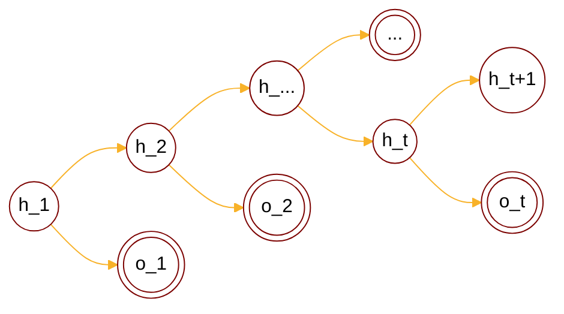

:                                                         


{{ if or .Page.Params.math .Site.Params.math }}

<link rel="stylesheet" href="https://cdn.jsdelivr.net/npm/katex@0.16.8/dist/katex.min.css" integrity="sha384-GvrOXuhMATgEsSwCs4smul74iXGOixntILdUW9XmUC6+HX0sLNAK3q71HotJqlAn" crossorigin="anonymous">

<!-- The loading of KaTeX is deferred to speed up page rendering -->

<!-- To automatically render math in text elements, include the auto-render extension: -->

{{ end }}

{{ if .Page.Store.Get "hasMermaid" }}
  
{{ end }}


## Background

### Overview of PGM

<cite>[^1]</cite>

$$
\text{PGM}: \begin{cases}
    \text{Representation} \begin{cases}
        \text{directed graph}\rarr  \text{Bayesian network} \\\
        \text{undirected graph}\rarr \text{Markov network(MRF)} \\\
        \text{continous variable}\rarr \text{Gaussian BN/Gaussian MRF} \\\
        \text{time$\rarr$} \underset{\text{$x_i$ not i.i.d.}}{\text{ Dynamic model}} \begin{cases}
            \text{discrete state$\rarr$\color{red}{Hidden Markov Model}} \\\
            \text{continous state} \begin{cases}
                \text{Linear model$\rarr$Karman Filter} \\\
                \text{Nonlinear model$\rarr$Particle Filter}
            \end{cases}
        \end{cases}
    \end{cases} \\\
    \text{Inference} \begin{cases}
        \text{MAP inference$\rarr \hat{x_A}=\argmax_{x_A}p(x_A|x_B)\propto\argmax p(x_A,x_B)$} \\\
        \text{exact inference} \begin{cases}
          \text{Variable elimination(VE)} \\\
          \text{Belief propagation(BP)$\rarr$sum-product algorithm(Tree)} \\\
          \text{Junction tree algorithm(Normal graph)}
        \end{cases} \\\
        \text{approximate inference} \begin{cases}
            \text{Loop belief propagation(Cyclic graph)} \\\
            \text{Variational inference} \\\
            \text{MCMC: importance sampling}
        \end{cases} 
    \end{cases} \\\
    \text{Learning} \begin{cases}
        \text{parameter learning} \begin{cases}
            \text{complete data: $(x,z)$} \\\
            \text{hidden variable: $z$}
        \end{cases} \\\
        \text{structure learning}
    \end{cases}
\end{cases}
$$

## HMM Intro

### Basic definition

HMM contains 2 layers: observations and states.

$$
\begin{cases}
 o_1,o_2,\cdots,o_t: \text{observed variable} \\\
 \quad O\in \lbrace v_1,\cdots,v_M \rbrace: \text{observed variable range} \\\
 h_1,h_2,\cdots,h_t: \text{hidden variable} \\\
 \quad H \in \lbrace q_1,\cdots,q_N \rbrace: \text{hidden variable range}
\end{cases}
$$

Parameters in HMM:

$$
\begin{cases}
\lambda = (\pi,A,B):\text{parameters in HMM} \\\
\pi=\pi_1,\cdots,\pi_N : \text{initial state distribution} \\\
\quad \sum_{i=1}^N \pi_i = 1 \\\
A : \text{state transition matrix} \\\
\quad A_{ij}=p(h_{t+1}=q_j|h_{t}=q_i) \\\
B: \text{emission matrix} \\\
 \quad B_{j}(k)=p(o_{t}=v_k|h_{t}=q_j)
\end{cases}
$$

### Two assumptions in HMM

1. homogeneous markov assumption
$$
p(h_{t+1}|h_1,\cdots,h_t,o_1,\cdots,o_t) = p(h_{t+1}|h_t)
$$

2. observation independence assumption
$$
p(o_t|h_1,\cdots,,h_{t-1},h_{t},o_1,\cdots,o_{t-1}) = p(o_t|h_t)
$$

### Three problems to solve

#### Evaluation



Find probability of specific observations if we know \( \lambda \):



$$
p(O=o_1,\cdots,o_t|\lambda) \rarr \text{forward/backward algorithm}
$$

#### Learning



How to solve \( \lambda \):



$$
\lambda = \argmax p(O|\lambda) \rarr \text{Baum-Welch(special EM algorithm)}
$$

#### Decoding

Find maximum likelihood of hidden states given observations:

$$
H = \argmax_{h} p(H|O,\lambda) \rarr \text{Viterbi}
$$



When \(H\) is found, we could solve Kalman filter and Particle filter:



$$
\begin{cases}
\text{prediction}\rarr p(h_{t+1}|o_1,\cdots,o_t) \\\
\text{filtering}\rarr p(h_t|o_1,\cdots,o_t)
\end{cases}
$$

## Evaluation
### General expression

$$
\begin{align*}
p(O|\lambda) &= \sum_{H}p(O,H|\lambda) \\\
&= \sum_{H} p(O|H,\lambda)p(H|\lambda) \\\
&= \sum_{H} p(o_1,\cdots,o_t|H,\lambda)p(H|\lambda) \\\
&= \sum_{H} p(o_t|o_1,\cdots,o_{t-1},H,\lambda)p(o_1,\cdots,o_{t-1}|H,\lambda)p(H|\lambda) \\\
&\text{By observation independence assumption} \\\
&= \sum_{H} p(o_t|h_t)p(o_1,\cdots,o_{t-1}|H,\lambda)p(H|\lambda) \\\
&= \sum_{H}\prod_{i=1}^t p(o_i|h_i)p(H|\lambda) \\\
&= \sum_{H}\prod_{i=1}^t B_{h_i}(o_i)p(H|\lambda) \\\
&= \sum_{H}\prod_{i=1}^t B_{h_i}(o_i)p(h_1,\cdots,h_t|\lambda) \\\
&= \sum_{H}\prod_{i=1}^t B_{h_i}(o_i)p(h_t|h_1,\cdots,h_{t-1},\lambda)p(h_1,\cdots,h_{t-1}|\lambda) \\\
&\text{By homogenous assumption} \\\
&= \sum_{H}\prod_{i=1}^t B_{h_i}(o_i)p(h_t|h_{t-1},\lambda)p(h_1,\cdots,h_{t-1}|\lambda) \\\
&= \sum_{H}\prod_{i=1}^t B_{h_i}(o_i)\prod_{j=2}^t p(h_j|h_{j-1},\lambda)\pi(h_1) \\\
&= \sum_{H}\pi(h_1)\prod_{i=1}^t B_{h_i}(o_i)\prod_{j=2}^t A_{h_{j-1}h_{j}} \\\
&= \sum_{\substack{h_1,h_2,\cdots,h_t \\\ h\in\lbrace q_1,\cdots,q_N \rbrace}}\pi(h_1)\prod_{i=1}^t B_{h_i}(o_i)\prod_{j=2}^t A_{h_{j-1}h_{j}}
\end{align*}
$$



We have N states and t variables, so the complexity of above integration is:



$$
O(N^t)
$$

### Forward algorithm



Consider separating \( \sum_{h_1,\cdots,h_t} \) in the original equation:



$$
\begin{align*}
p(O|\lambda) &= \sum_{q_i}p(o_1,\cdots,o_t,h_t=q_i|\lambda) \\\
&= \sum_{i=1}^Np(o_1,\cdots,o_t,h_t=q_i|\lambda) \\\
&Let \space\alpha_t(i) = p(o_1,\cdots,o_t,h_t=q_i|\lambda) \\\
&= \sum_{i=1}^N \alpha_t(i) \\\
& \alpha_t \text{ is related to } o_1,\cdots,o_t,h_t
\end{align*}
$$



Hopefully if we can solve \( \alpha_t(i) \) by finding a recurrence realtion between \( \alpha_t(i) \) and \( \alpha_{t-1}(i) \):



$$
\begin{align*}
\alpha_t(i) &= p(o_1,\cdots,o_t,h_t=q_i|\lambda) \\\
&= \sum_{j=1}^N p(o_1,\cdots,o_t,h_t=q_i,h_{t-1}=q_j|\lambda) \\\
&= \sum_{j=1}^N p(o_t|o_1,\cdots,o_{t-1},h_t=q_i,h_{t-1}=q_j,\lambda) p(o_1,\cdots,o_{t-1},h_t=q_i,h_{t-1}=q_j|\lambda) \\\
&\text{By observation independence assumption} \\\
&= \sum_{j=1}^N p(o_t|h_t=q_i,\lambda) p(o_1,\cdots,o_{t-1},h_t=q_i,h_{t-1}=q_j|\lambda) \\\
&= \sum_{j=1}^N p(o_t|h_t=q_i,\lambda) p(h_t=q_i|o_1,\cdots,o_{t-1},h_{t-1}=q_j,\lambda)p(o_1,\cdots,o_{t-1},h_{t-1}=q_j|\lambda) \\\
&\text{By homogenous markov assumption} \\\
&= \sum_{j=1}^N p(o_t|h_t=q_i,\lambda) p(h_t=q_i|h_{t-1}=q_j,\lambda)p(o_1,\cdots,o_{t-1},h_{t-1}=q_j|\lambda) \\\
&= \sum_{j=1}^N B_{i}(o_t) A_{ji} p(o_1,\cdots,o_{t-1},h_{t-1}=q_j|\lambda) \\\
&= \sum_{j=1}^N B_{i}(o_t) A_{ji} \alpha_{t-1}(j) \\\
\end{align*}
$$

Solving order:

$$
\alpha_1(i) \rarr \alpha_2(j)\rarr \cdots\rarr \begin{cases}\alpha_t(1)\\\ \vdots \\\ \alpha_t(N)\end{cases}\rarr p(O|\lambda)
$$



The complexity is:



$$
O(N \times tN)=O(N^2t)
$$

### Backward algorithm

$$
\begin{align*}
p(O|\lambda) &= \sum_{q_i}p(o_1,\cdots,o_t,h_1=q_i|\lambda) \\\
&= \sum_{i=1}^Np(o_1,\cdots,o_t,h_1=q_i|\lambda) \\\
&= \sum_{i=1}^Np(o_1,\cdots,o_t|h_1=q_i,\lambda)p(h_1=q_i|\lambda) \\\
&= \sum_{i=1}^Np(o_1,\cdots,o_t|h_1=q_i,\lambda)\pi(q_i) \\\
&= \sum_{i=1}^Np(o_1|o_2,\cdots,o_t,h_1=q_i,\lambda)p(o_2,\cdots,o_t|h_1=q_i,\lambda)\pi(q_i) \\\
&\text{By observation independence assumption} \\\
&= \sum_{i=1}^Np(o_1|h_1=q_i,\lambda)p(o_2,\cdots,o_t|h_1=q_i,\lambda)\pi(q_i) \\\
&= \sum_{i=1}^NB_{i}(o_1) p(o_2,\cdots,o_t|h_1=q_i,\lambda)\pi(q_i) \\\
&Let \space\beta_1(i) = p(o_2,\cdots,o_t|h_1=q_i,\lambda) \\\
&= \sum_{i=1}^NB_{i}(o_1) \beta_{1}(i) \pi(q_i) \\\
& \beta_1 \text{ is related to } o_2,\cdots,o_t,h_1
\end{align*}
$$



We can find a recurrence realtion between \( \beta_{\tau}(i) \) and \( \beta_{\tau+1}(i) \):



$$
\begin{align*}
\beta_{\tau}(i) &= p(o_{\tau+1},\cdots,o_t|h_{\tau}=q_i,\lambda) \\\
&= \sum_{j=1}^N p(o_{\tau+1},\cdots,o_t,h_{\tau+1}=q_j|h_{\tau}=q_i,\lambda) \\\
&= \sum_{j=1}^N p(o_{\tau+1},\cdots,o_t|h_{\tau+1}=q_j,h_{\tau}=q_i,\lambda)p(h_{\tau+1}=q_j|h_{\tau}=q_i,\lambda) \\\
&= \sum_{j=1}^N p(o_{\tau+1},\cdots,o_t|h_{\tau+1}=q_j,h_{\tau}=q_i,\lambda) A_{ij} \\\
&\because h_{\tau+1}=q_j \text{ is observed, $\therefore h_{\tau}=q_i$ is $\perp$ to $o_{\tau+1},\cdots,o_{t}$} \\\
&= \sum_{j=1}^N p(o_{\tau+1},\cdots,o_t|h_{\tau+1}=q_j,\lambda) A_{ij} \\\
&= \sum_{j=1}^N p(o_{\tau+1}|o_{\tau+2},\cdots,o_{t},h_{\tau+1}=q_j,\lambda) p(o_{\tau+2},\cdots,o_{t}|h_{\tau+1}=q_j,\lambda) A_{ij} \\\
&\text{By observation independence assumption} \\\
&= \sum_{j=1}^N p(o_{\tau+1}|h_{\tau+1}=q_j,\lambda) p(o_{\tau+2},\cdots,o_{t}|h_{\tau+1}=q_j,\lambda) A_{ij} \\\
&= \sum_{j=1}^N B_{j}(o_{\tau+1}) p(o_{\tau+2},\cdots,o_{t}|h_{\tau+1}=q_j,\lambda) A_{ij} \\\
&= \sum_{j=1}^N B_{j}(o_{\tau+1}) \beta_{\tau+1}(j) A_{ij}
\end{align*}
$$

Solving order:

$$
\beta_{t}\rarr \beta_{t-1}\rarr \cdots \rarr \begin{cases}\beta_{1}(1)\\\ \vdots \\\ \beta(N)
\end{cases} \rarr p(O|\lambda)
$$

The complexity is:

$$
O(N^2t)
$$

## Learning
### EM review

$$
\begin{align*}
\theta^{(t+1)} &= \argmax_{\theta}\int_z \log p(x,z|\theta)p(z|x,\theta^{(t)})\space dz \\\
x&:\text{observed data} \\\
z&:\text{latent variable} \\\
\theta&:\text{parameters} \\\
\end{align*}
$$

### Baum Welch algorithm
#### Q function

Baum-Welch algorithm is basically EM algorithm, so we can write:

$$
\begin{align*}
\lambda^{(t+1)} &= \argmax_{\lambda} \sum_{H}\log p(O,H|\lambda) p(H|O,\lambda^{(t)}) \\\
&= \argmax_{\lambda} \sum_{H}\log p(O,H|\lambda) \frac{p(O,H|\lambda^{(t)})}{p(O|\lambda^{(t)})} \\\
&= \argmax_{\lambda}\frac{1}{p(O|\lambda^{(t)})}\sum_{H}\log p(O,H|\lambda)p(O,H|\lambda^{(t)}) \\\
&= \argmax_{\lambda} \sum_{H}\log p(O,H|\lambda)p(O,H|\lambda^{(t)}) \\\
Q(\lambda,\lambda^{(t)}) &= \sum_{H}\log p(O,H|\lambda)p(O,H|\lambda^{(t)}) \\\
&\because \sum_{H}p(O,H|\lambda)=\sum_{\substack{h_1,h_2,\cdots,h_t \\\ h\in\lbrace q_1,\cdots,q_N \rbrace}}\pi(h_1)\prod_{i=1}^t B_{h_i}(o_i)\prod_{j=2}^t A_{h_{j-1}h_{j}} \\\
&= \sum_H \log \left[ \pi(h_1)\prod_{i=1}^t B_{h_i}(o_i)\prod_{j=2}^t A_{h_{j-1}h_{j}} \right] p(O,H|\lambda^{(t)}) \\\
&= \sum_H \left[ \log \pi(h_1)+\log \prod_{i=1}^tB_{h_i}(o_i)+\log \prod_{j=2}^tA_{h_{j-1}h{j}} \right] p(O,H|\lambda^{(t)}) \\\
&= \sum_H \left[ \log \pi(h_1)+ \sum_{i=1}^t\log B_{h_i}(o_i)+ \sum_{j=2}^t\log A_{h_{j-1}h{j}} \right] p(O,h_1,\cdots,h_t|\lambda^{(t)}) \\\
&= \sum_{h_1}\cdots\sum_{h_t} \left[ \log \pi(h_1)+ \sum_{i=1}^t\log B_{h_i}(o_i)+ \sum_{j=2}^t\log A_{h_{j-1}h{j}} \right] p(O,h_1,\cdots,h_t|\lambda^{(t)}) \\\
\end{align*}
$$

#### Update PI

$$
\pi^{(t+1)} = \argmax_{\pi} Q(\lambda,\lambda^{(t)}) \\\
\text{subject to }\sum_{i=1}^N \pi(h=q_i)=1 \\\
\dArr
$$

$$
\begin{align*}
\mathcal{L}(\pi,\eta) &= \sum_{H} \left[\left[ \log \pi(h_1)+ \sum_{i=1}^t\log B_{h_i}(o_i)+ \sum_{j=2}^t\log A_{h_{j-1}h{j}} \right] p(O,H|\lambda^{(t)})\right]+\eta(\sum_{i=1}^N\pi(q_i)-1) \\\
&= \sum_{h_1}\cdots\sum_{h_t} \left[ \log \pi(h_1) p(O,h_1,\cdots,h_t|\lambda^{(t)})\right] + \eta(\sum_{i=1}^N\pi(q_i)-1) \\\
&= \sum_{h_1} \left[ \log\pi(h_1)p(O,h_1|\lambda^{(t)}) \right] + \eta(\sum_{i=1}^N\pi(q_i)-1) \\\
&= \sum_{i=1}^N \left[ \log\pi(h_1=q_i)p(O,h_1=q_i|\lambda^{(t)}) \right] + \eta(\sum_{i=1}^N\pi(q_i)-1)
\end{align*} \\\
\dArr
$$

$$
\begin{align*}
\frac{\partial}{\partial \pi(q_i)}\mathcal{L}(\pi,\eta) &= p(O,h_1=q_i|\lambda^{(t)})\frac{\partial}{\partial\pi(q_i)}\log\pi(q_i) + \log\pi(q_i)\frac{\partial}{\partial \pi(q_i)}p(O,h_1=q_i|\lambda^{(t)}) + \eta \\\
&= p(O,h_1=q_i|\lambda^{(t)})\frac{1}{\pi(q_i)} + \eta
\end{align*} \\\
\dArr
$$

$$
\begin{align*}
p(O,h_1=q_i|\lambda^{(t)})\frac{1}{\pi(q_i)} + \eta &= 0 \\\
p(O,h_1=q_i|\lambda^{(t)}) + \pi(q_i)\eta &= 0 \\\
\sum_{i=1}^N p(O,h_1=q_i|\lambda^{(t)}) + \sum_{i=1}^N\pi(q_i)\eta &= 0 \\\
p(O|\lambda^{(t)}) + \eta &= 0 \\\
\eta &= -p(O|\lambda^{(t)}) \\\
\end{align*} \\\
\dArr \\\
\pi^{(t+1)}(q_i) = \frac{p(O,h_1=q_i|\lambda^{(t)})}{p(O|\lambda^{(t)})}=p(h_1=q_i|O,\lambda^{(t)})
$$

#### Update A

$$
A^{(t+1)} = \argmax_{\pi} Q(\lambda,\lambda^{(t)}) \\\
\text{subject to } \sum_{j=1}^N A_{ij}=1 \\\
\dArr
$$

$$
\begin{align*}
\mathcal{L}(A,\eta) &= \sum_{H} \left[\left[ \log \pi(h_1)+ \sum_{i=1}^t\log B_{h_i}(o_i)+ \sum_{j=2}^t\log A_{h_{j-1}h{j}} \right] p(O,H|\lambda^{(t)})\right]+\eta(\sum_{i=1}^NA_{ij}-1) \\\
&= \sum_{h_1}\cdots\sum_{h_t} \left[ \sum_{j=2}^t \left( \log A_{h_{j-1}h_j}p(O,h_1,\cdots,h_t|\lambda^{(t)}) \right) \right]+\eta(\sum_{i=1}^NA_{ij}-1) \\\
&= \sum_{j=2}^t \sum_{h_1}\cdots\sum_{h_t} \left[ p(O,h_1,\cdots,h_t|\lambda^{(t)}) \log p(h_{j}|h_{j-1}) \right]+\eta(\sum_{i=1}^NA_{ij}-1) \\\
&= \sum_{j=2}^t \sum_{h_{j-1}}\sum_{h_{j}} \log p(h_{j}|h_{j-1}) \sum_{h_1\cdots h_t\setminus h_{j-1}h_{j}} \left[ p(O,h_1,\cdots,h_t|\lambda^{(t)})  \right]+\eta(\sum_{i=1}^NA_{ij}-1) \\\
&= \sum_{j=2}^t \sum_{h_{j-1}}\sum_{h_{j}} \log p(h_{j}|h_{j-1})p(O,h_{j-1},h_{j}|\lambda^{(t)})+\eta(\sum_{i=1}^NA_{ij}-1) \\\
&= \sum_{j=2}^t \sum_{a=1}^N\sum_{b=1}^N \log p(h_{j}=q_b|h_{j-1}=q_a)p(O,h_{j-1}=q_a,h_{j}=q_b|\lambda^{(t)})+\eta(\sum_{i=1}^NA_{ij}-1)
\end{align*} \\\
\dArr
$$

$$
\begin{align*}
\frac{\partial}{\partial A_{ab}}\mathcal{L}(A,\eta) &= \frac{\partial}{\partial A_{ab}}\sum_{j=2}^t \sum_{a=1}^N\sum_{b=1}^N p(O,h_{j-1}=q_a,h_{j}=q_b|\lambda^{(t)}) \log A_{ab} + \eta \\\
&= \sum_{j=2}^t\frac{1}{A_{ab}}p(O,h_{j-1}=q_a,h_{j}=q_b|\lambda^{(t)}) + \eta
\end{align*} \\\
\dArr
$$

$$
\begin{align*}
\frac{1}{A_{ab}}\sum_{j=2}^tp(O,h_{j-1}=q_a,h_{j}=q_b|\lambda^{(t)}) + \eta &= 0 \\\
\sum_{j=2}^tp(O,h_{j-1}=q_a,h_{j}=q_b|\lambda^{(t)}) + A_{ab}\eta &= 0 \\\
\sum_{b=1}^N\sum_{j=2}^tp(O,h_{j-1}=q_a,h_{j}=q_b|\lambda^{(t)}) + \sum_{b=1}^NA_{ab}\eta &= 0 \\\
\eta &= -\sum_{j=2}^t p(O,h_{j-1}=q_a|\lambda^{(t)})
\end{align*} \\\
\dArr \\\
A^{(t+1)}(ab) = \frac{ \sum_{j=2}^tp(O,h_{j-1}=q_a,h_{j}=q_b|\lambda^{(t)}) }{ \sum_{j=2}^t p(O,h_{j-1}=q_a|\lambda^{(t)}) }
$$

#### Update B

$$
B^{(t+1)} = \argmax_{\pi} Q(\lambda,\lambda^{(t)}) \\\
\text{subject to } \sum_{k=1}^M B_{j}(k) = 1 ,\forall\space j=1,\cdots,N \\\
\dArr
$$

$$
\begin{align*}
\mathcal{L}(B,\eta) &= \sum_{H} \left[\left[ \log \pi(h_1)+ \sum_{i=1}^t\log B_{h_i}(o_i)+ \sum_{j=2}^t\log A_{h_{j-1}h{j}} \right] p(O,H|\lambda^{(t)})\right]+\sum_{j=1}^N\eta_j(\sum_{k=1}^M B_{j}(k)-1) \\\
&= \sum_{h_1}\cdots\sum_{h_t} \left[ \sum_{i=1}^t \left( \log B_{h_{i}}(o_i)p(O,h_1,\cdots,h_t|\lambda^{(t)}) \right) \right]+\sum_{j=1}^N\eta_j(\sum_{k=1}^M B_{j}(k)-1) \\\
&= \sum_{i=1}^t \sum_{h_1}\cdots\sum_{h_t} \left[ p(O,h_1,\cdots,h_t|\lambda^{(t)}) \log p(o_{i}|h_{i}) \right]+\sum_{j=1}^N\eta_j(\sum_{k=1}^M B_{j}(k)-1) \\\
&= \sum_{i=1}^t \sum_{h_{i}} \log p(o_i|h_{i}) \sum_{h_1\cdots h_t\setminus h_{i}} \left[ p(O,h_1,\cdots,h_t|\lambda^{(t)})  \right]+\sum_{j=1}^N\eta_j(\sum_{k=1}^M B_{j}(k)-1) \\\
&= \sum_{i=1}^t \sum_{h_{i}} \log p(o_i|h_{i})p(O,h_{i}|\lambda^{(t)})+\sum_{j=1}^N\eta_j(\sum_{k=1}^M B_{j}(k)-1) \\\
&= \sum_{i=1}^t \sum_{c=1}^N \log p(o_i|h_{i}=q_c)p(O,h_{i}=q_c|\lambda^{(t)})+\sum_{j=1}^N\eta_j(\sum_{k=1}^M B_{j}(k)-1)
\end{align*} \\\
\dArr
$$

$$
\begin{align*}
\frac{\partial}{\partial B_{c}(k)}\mathcal{L}(B,\eta) &= \frac{\partial}{\partial B_{c}(k)}\sum_{i=1}^t \sum_{c=1}^N p(O,h_{i}=q_c|\lambda^{(t)}) \log B_{c}(o_i) + \eta_c \\\
&= \sum_{i=1}^t1_{o_i=k}\frac{1}{B_{c}(o_i)}p(O,h_{i}=q_c|\lambda^{(t)}) + \eta_c
\end{align*} \\\
\dArr
$$

$$
\begin{align*}
\sum_{i=1}^t 1_{o_i=k}\frac{1}{B_{c}(o_i)} p(O,h_{i}=q_c|\lambda^{(t)}) + \eta_c &= 0 \\\
\sum_{i\in\lbrace 1\cdots t|o_i=k \rbrace} \frac{1}{B_{c}(k)} p(O,o_i=k,h_{i}=q_c|\lambda^{(t)}) + \eta_c &= 0 \\\
\sum_{i\in\lbrace 1\cdots t|o_i=k \rbrace} p(O,o_i=k,h_{i}=q_c|\lambda^{(t)}) + B_c(k)\eta_c &= 0 \\\
\sum_{k=1}^M\sum_{i\in\lbrace 1\cdots t|o_i=k \rbrace} p(O,o_i=k,h_{i}=q_c|\lambda^{(t)}) + \sum_{k=1}^M B_c(k)\eta_c &= 0 \\\
\sum_{k=1}^M\sum_{i\in\lbrace 1\cdots t|o_i=k \rbrace} p(O,o_i=k,h_{i}=q_c|\lambda^{(t)}) + \eta_c &= 0 \\\
\sum_{i=1}^t p(O,h_{i}=q_c|\lambda^{(t)}) + \eta_c &= 0 \\\
\eta_c &= -\sum_{i=1}^t p(O,h_{i}=q_c|\lambda^{(t)})
\end{align*} \\\
\dArr \\\
B_{c}(k)^{(t+1)} = \frac{ \sum_{i=1}^t 1_{o_i=k}p(O,h_{i}=q_c|\lambda^{(t)}) }{ \sum_{i=1}^t p(O,h_{i}=q_c|\lambda^{(t)}) }
$$

## Decoding
### Viterbi algorithm



Decoding problem tries to find the optimal path \( h_1\cdots h_t \) among \( N^t \) combinations. Like dynamic programming, we can define local optimal solution as:



$$
\delta_{\tau}(i) = \max_{h_1\cdots h_{\tau-1}} p(o_1,\cdots,o_{\tau},h_1,\cdots,h_{\tau-1},h_{\tau}=q_i|\lambda) \\\
\delta_{\tau}(i) \text{ : maximum probability if $h_{\tau}=q_i$}
$$

Then we can find a recurrence relation:

$$
\begin{align*}
\delta_{\tau+1}(j) &= \max_{h_1\cdots h_{\tau}} p(o_1,\cdots,o_{\tau+1},h_1,\cdots,h_{\tau},h_{\tau+1}=q_j|\lambda) \\\
&= \max_{i=1\cdots N} \delta_{\tau}(i) p(h_{\tau+1}=q_j|O_{1\cdots\tau},H_{1\cdots\tau-1},h_{\tau}=q_i)p(o_{\tau+1}|O_{1\cdots\tau},H_{1\cdots\tau-1},h_{\tau}=q_i,h_{\tau+1}=q_j) \\\
&= \max_{i=1\cdots N} \delta_{\tau}(i)A_{ij} B_{j}(o_{\tau+1}) \\\
\delta_1(j) &= \pi(q_i)B_i(o_1)
\end{align*}
$$

We can record the optimal path at the same time:

$$
\begin{align*}
\gamma_{\tau+1}(j) = \hat{i} &= \argmax_{i=1,\cdots,N} \delta_{\tau}(i)A_{ij} B_{j}(o_{\tau+1}) \\\
&= \argmax_{i=1,\cdots,N} \delta_{\tau}(i)A_{ij}
\end{align*} \\\ \dArr \\\
\gamma_{\tau+1}(j) \text{ : optimal state for previous $h_{\tau}$ if $h_{\tau+1}=q_j$}
$$

The final result is:

$$
\hat{H} = \argmax_{h} p(H|O,\lambda)=\left( \gamma_{1},\cdots,\gamma_{t} \right)
$$

## Reference

[^1]: - [video](https://www.bilibili.com/video/BV1aE411o7qd?p=82).
[^3]: From [The Matrix Cookbook](https://www.math.uwaterloo.ca/~hwolkowi/matrixcookbook.pdf).e
[^5]: From [Mean field variational inference](https://mbernste.github.io/files/notes/MeanFieldVariationalInference.pdf).
[^4]: From [Ross, Sheldon M. (2019). Introduction to probability models](https://doi.org/10.1016%2FC2017-0-01324-1).
[^2]: - [Hammersley–Clifford theorem](http://www.statslab.cam.ac.uk/~grg/books/hammfest/hamm-cliff.pdf).
