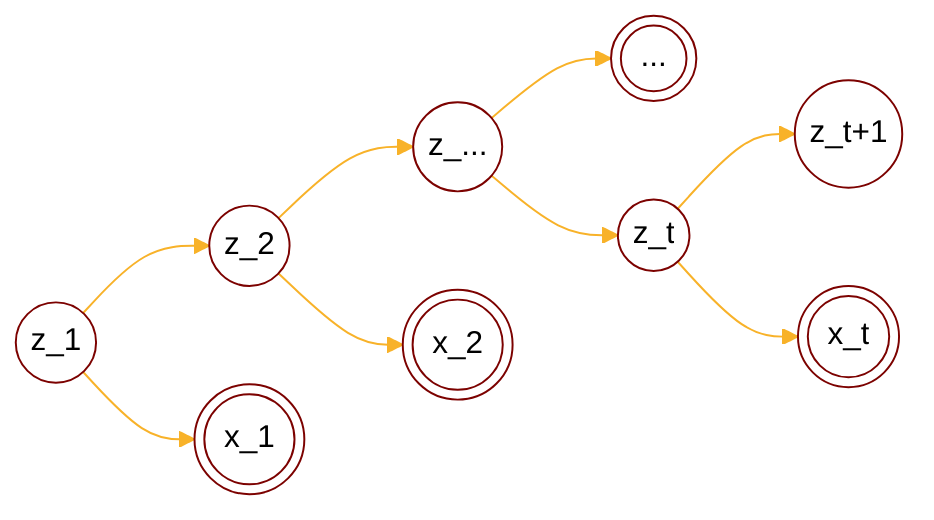

:                                                         


{{ if or .Page.Params.math .Site.Params.math }}

<link rel="stylesheet" href="https://cdn.jsdelivr.net/npm/katex@0.16.8/dist/katex.min.css" integrity="sha384-GvrOXuhMATgEsSwCs4smul74iXGOixntILdUW9XmUC6+HX0sLNAK3q71HotJqlAn" crossorigin="anonymous">

<!-- The loading of KaTeX is deferred to speed up page rendering -->

<!-- To automatically render math in text elements, include the auto-render extension: -->

{{ end }}

{{ if .Page.Store.Get "hasMermaid" }}
  
{{ end }}


## Background

### Overview of PGM

<cite>[^1]</cite>

$$
\text{PGM}: \begin{cases}
    \text{Representation} \begin{cases}
        \text{directed graph}\rarr  \text{Bayesian network} \\\
        \text{undirected graph}\rarr \text{Markov network(MRF)} \\\
        \text{continous variable}\rarr \text{Gaussian BN/Gaussian MRF} \\\
        \text{time$\rarr$} \underset{\text{$x_i$ not i.i.d.}}{\text{ Dynamic model}} \begin{cases}
            \text{discrete state$\rarr$Hidden Markov Model} \\\
            \text{continous state} \begin{cases}
                \text{Linear model$\rarr$\color{red}{Karman Filter}} \\\
                \text{Nonlinear model$\rarr$Particle Filter}
            \end{cases}
        \end{cases}
    \end{cases} \\\
    \text{Inference} \begin{cases}
        \text{MAP inference$\rarr \hat{x_A}=\argmax_{x_A}p(x_A|x_B)\propto\argmax p(x_A,x_B)$} \\\
        \text{exact inference} \begin{cases}
          \text{Variable elimination(VE)} \\\
          \text{Belief propagation(BP)$\rarr$sum-product algorithm(Tree)} \\\
          \text{Junction tree algorithm(Normal graph)}
        \end{cases} \\\
        \text{approximate inference} \begin{cases}
            \text{Loop belief propagation(Cyclic graph)} \\\
            \text{Variational inference} \\\
            \text{MCMC: importance sampling}
        \end{cases} 
    \end{cases} \\\
    \text{Learning} \begin{cases}
        \text{parameter learning} \begin{cases}
            \text{complete data: $(x,z)$} \\\
            \text{hidden variable: $z$}
        \end{cases} \\\
        \text{structure learning}
    \end{cases}
\end{cases}
$$

## Kalman Filter

### Definition

Kalman filter has similar structure compared to HMM, along with linear combination and gaussian noise:

$$
\begin{cases}
z_1 \sim \mathcal{N}(\mu_1,\Sigma_1) \\\
z_t = Az_{t-1}+B+\epsilon,\epsilon\sim \mathcal{N}(0,Q) \\\
x_t = Cz_{t}+D+\delta,\delta\sim \mathcal{N}(0,R)
\end{cases}
$$

Then we have unknown parameters:

$$
\theta = ( A,B,C,D,Q,R,\mu_1,\Sigma_1 )
$$

The conditional probability is given by:

$$
\begin{align*}
p(z_t|z_{t-1}) &= \mathcal{N}(Az_{t-1}+B, Q) \\\
p(x_t|z_{t}) &= \mathcal{N}(Cz_{t}+D, R)
\end{align*}
$$

### Filtering problem

Recall that conclusion in HMM, we can list the same problems here:

$$
\begin{cases}
\text{Proof of evidence: $p(X|\theta)$, (Forward/Backward)} \\\
\text{Decoding: $\argmax_{Z} p(Z|X,\theta)$, (Viterbi)} \\\
\text{Filtering: $p(z_t|x_1,\cdots,x_t) \rarr$(marginal posterior)} \\\
\text{Smoothing: $p(z_{t}|x_1,\cdots,x_T)$ } \\\
\text{Prediction: } \begin{cases}
  \text{$p(z_{t}|x_1,\cdots,x_{t-1})$} \\\
  \text{$p(x_{t}|x_1,\cdots,x_{t-1})$}
\end{cases}
\end{cases}
$$

For the filtering problem we have recurrence relation:

$$
\begin{align*}
p(z_t|x_1,\cdots,x_t) &= \frac{p(x_1,\cdots,x_t,z_t)}{p(x_1,\cdots,x_t)} \\\
&\propto p(x_1,\cdots,x_t,z_t) \\\
&= p(x_t|x_1,\cdots,x_{t-1},z_t)p(x_1,\cdots,x_{t-1},z_t) \\\
&\text{By observation independence assumption} \\\
&= p(x_t|z_t)p(x_1,\cdots,x_{t-1},z_t) \\\
&= p(x_t|z_t)p(z_t|x_1,\cdots,x_{t-1})p(x_1,\cdots,x_{t-1}) \\\
&\propto p(x_t|z_t)\underset{\color{red}{prediction}}{p(z_t|x_1,\cdots,x_{t-1})} \\\
&= p(x_t|z_t)\int_{z_{t-1}}p(z_t,z_{t-1}|x_1,\cdots,x_{t-1})dz_{t-1} \\\
&= p(x_t|z_t)\int_{z_{t-1}}p(z_t|z_{t-1},x_1,\cdots,x_{t-1})p(z_{t-1}|x_1,\cdots,x_{t-1})dz_{t-1} \\\
&\text{By homogenous assumption} \\\
&= p(x_t|z_t)\int_{z_{t-1}}p(z_t|z_{t-1})\underset{\color{red}{filtering}}{p(z_{t-1}|x_1,\cdots,x_{t-1})}dz_{t-1} \\\
\end{align*}
$$

Then we can give the update order:

$$
\underset{update1}{p(z_1|x_1)} \rarr \underset{prediction2}{p(z_2|x_1)} \rarr \underset{update2}{p(z_2|x_1,x_2)} \rarr \underset{prediction3}{p(z_3|x_1,x_2)} \cdots \underset{predictionT}{p(z_{T}|x_1,\cdots,x_{T-1})} \rarr \underset{updateT}{p(z_{T}|x_1,\cdots,x_{T})}
$$

### Solving filtering problem

From previous section we know filtering problem can be written as 2 steps: update, prediction:

$$
\begin{cases}
\text{Prediction: $p(z_t|x_1,\cdots,x_{t-1})=\int_{z_{t-1}}p(z_t,z_{t-1}|x_1,\cdots,x_{t-1})dz_{t-1}$} \\\
\text{Update: $p(z_t|x_1,\cdots,x_{t})\propto p(x_t|z_t)p(z_t|x_1,\cdots,x_{t-1})$}
\end{cases}
$$

Besides, we have conclusion for [Conditional Gaussian PDF](https://tirmisula.github.io/posts/marginal-and-joint-gaussian-probability/#solve-the-joint-pdf) from previous artice:

$$
x \sim \mathcal{N} (\mu, \Lambda^{-1}) \\\
y=Ax+B+\epsilon\\\
\epsilon \sim \mathcal{N}(0, L^{-1}), \epsilon \perp x \\\
\dArr \\\
\begin{cases}
y|x \sim \mathcal{N}(Ax+B, L^{-1}) \\\
y \sim \mathcal{N}(A\mu+B, A \Lambda^{-1} A^T + L^{-1}) \\\
\begin{bmatrix}
    x\\\
    y
\end{bmatrix} \sim \mathcal{N}(\begin{bmatrix}
    \mu \\\
    A\mu + B
\end{bmatrix}, \begin{bmatrix}
    \Lambda^{-1} & \Lambda^{-1} A^T\\\
    (\Lambda^{-1} A^T)^T & A \Lambda^{-1} A^T + L^{-1}
\end{bmatrix}) \\\
x|y \sim \mathcal{N}(\Sigma_{xy}\Sigma_{yy}^{-1} (x_y-\mu_{y}) + \mu_{x}, -\Sigma_{xy}\Sigma_{yy}^{-1}\Sigma_{yx}+\Sigma_{xx})
\end{cases}
$$

For the prediction part:

$$
\begin{align*}
p(z_t|x_1,\cdots,x_{t-1}) &= \int_{z_{t-1}}p(z_t,z_{t-1}|x_1,\cdots,x_{t-1})dz_{t-1} \\\
&= \int_{z_{t-1}} p(z_t|z_{t-1})p(z_{t-1}|x_1,\cdots,x_{t-1}) \\\
&= \int_{z_{t-1}} \mathcal{N}(z_{t}|Az_{t-1}+B, Q)p(z_{t-1}|x_1,\cdots,x_{t-1}) \\\
&\text{Let $p(z_t|x_1,\cdots,x_{t-1})=\mathcal{N}({\mu_{t}}^{\ast},{\Sigma_{t}}^{\ast})$} \\\
\mathcal{N}({\mu_{t}}^{\ast},{\Sigma_{t}}^{\ast}) &= \int_{z_{t-1}} \mathcal{N}(z_{t}|Az_{t-1}+B, Q)\mathcal{N}(\mu_{t-1},\Sigma_{t-1}) \\\
&\text{Consider $y|x=z_t|z_{t-1}, x=z_{t-1}$, Then $p(z_t)=p(y)$} \\\
&= \mathcal{N}(A\mu_{t-1}+B, A\Sigma_{t-1}A^T+Q)
\end{align*}
$$

$$
\begin{cases}
{\mu_{t}}^{\ast} = A\mu_{t-1}+B \\\
{\Sigma_{t}}^{\ast} = A\Sigma_{t-1}A^T+Q
\end{cases}
$$

For the update part:

$$
\begin{align*}
p(z_t|x_1,\cdots,x_{t}) &\propto p(x_t|z_t)p(z_t|x_1,\cdots,x_{t-1}) \\\
\mathcal{N}(\mu_t, \Sigma_t) &\propto \mathcal{N}(x_t|Cz_{t}+D, R) \mathcal{N}({\mu_{t}}^{\ast},{\Sigma_{t}}^{\ast}) \\\
&\text{Consider $x=z_t, y=x_{t}$, Then $p(z_t|x_t)=p(x|y)$} \\\
& \\\
&= \mathcal{N}(\Sigma_{z_tx_t}\Sigma_{x_tx_t}^{-1} (x_t-\mu_{x_t}) + \mu_{z_t}, -\Sigma_{z_tx_t}\Sigma_{x_tx_t}^{-1}\Sigma_{x_tz_t}+\Sigma_{z_tz_t})
\end{align*}
$$

$$
\begin{cases}
{\mu_{t}} = \Lambda^{-1}A^T (Cz_t+D) \\\
{\Sigma_{t}} = A\Sigma_{t-1}A^T+Q
\end{cases}
$$

## Conclusion

work in progress

## Reference

[^1]: - [video](https://www.bilibili.com/video/BV1aE411o7qd?p=82).
[^3]: From [The Matrix Cookbook](https://www.math.uwaterloo.ca/~hwolkowi/matrixcookbook.pdf).
[^5]: From [Mean field variational inference](https://mbernste.github.io/files/notes/MeanFieldVariationalInference.pdf).
[^4]: From [Ross, Sheldon M. (2019). Introduction to probability models](https://doi.org/10.1016%2FC2017-0-01324-1).
[^2]: - [Hammersley–Clifford theorem](http://www.statslab.cam.ac.uk/~grg/books/hammfest/hamm-cliff.pdf).
