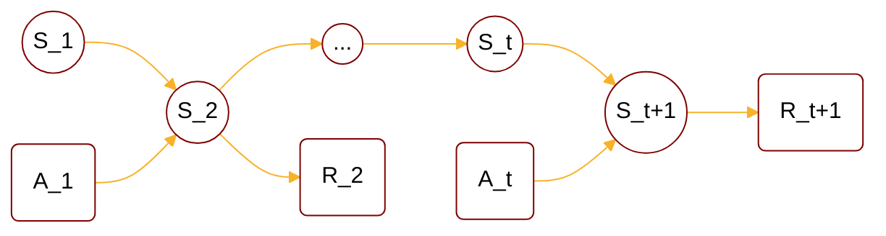

:                                                         


{{ if or .Page.Params.math .Site.Params.math }}

<link rel="stylesheet" href="https://cdn.jsdelivr.net/npm/katex@0.16.8/dist/katex.min.css" integrity="sha384-GvrOXuhMATgEsSwCs4smul74iXGOixntILdUW9XmUC6+HX0sLNAK3q71HotJqlAn" crossorigin="anonymous">

<!-- The loading of KaTeX is deferred to speed up page rendering -->

<!-- To automatically render math in text elements, include the auto-render extension: -->

{{ end }}

{{ if .Page.Store.Get "hasMermaid" }}
  
{{ end }}


## Overview of Markov

<cite>[^1]</cite>

$$
\begin{cases}
        \text{Stochastic Process} : \lbrace s_t \rbrace_{t=1\cdots\infty} \\\
        \text{Markov Chain/Process} : \text{stochastic process with property: } p(s_{t+1}|s_{1:t})=p(s_{t+1}|s_t) \\\
        \text{State Space Model} \rarr \text{HMM, Kalman filter, Particle filter} \\\
                \text{Markov Reward Process} : \text{Markov Chain + Reward} \\\
        \text{Markov Decision Process} : \text{Markov Chain + Reward + Action}
\end{cases}
$$

## MDP Definition



Markov Decision Process(MDP) contains random variable sets \( \mathcal{S},\mathcal{A},\mathcal{R} \):



$$
\begin{align*}
\mathcal{S} &: \text{state set $\lbrace S_t \rbrace$} \\\
\mathcal{A} &: \text{action set, $\lbrace A_t \rbrace$} \\\
\mathcal{R} &: \text{reward set, $\lbrace R_t \rbrace$} \\\
\end{align*}
$$

and following form:



Then we can define the state transition function space \( \mathcal{P} \):



$$
\mathcal{P} : \begin{cases}
    p(s^{'},r|s,a) &= Pr(S_{t+1}=s^{'},R_{t+1}=r | S_t=s,A_t=a) \\\
    p(s^{'}|s,a) &= \sum_{r\in \mathcal{R}} p(s^{'},r|s,a)
\end{cases}
$$



For decision policy at time t, \( A_t \), it follows a probability distirbution \( \pi \):



$$
\text{Policy }\pi : \begin{cases}
    \text{deterministic } \pi(s) &= \begin{cases}
        1 & \text{if } A_t = \text{$a^{\ast}$} \\\
        0 & \text{else}
    \end{cases} \\\
    \text{stochastic } \pi(a|s) &= Pr(A_t=a|S_t=s)
\end{cases}
$$



Another truth should be noted is that a certain decision \( A_t=a \) not only affects reward \( R_{t+1} \), but also affects the following rewards \( R_{T\rarr\infty} \). Thus we can develop a idea of gain \( G_t \):



$$
\begin{align*}
    G_t(a) &= R_{t+1}+\gamma R_{t+2}+\gamma^2 R_{t+3}+\cdots+\gamma^{T-t-1}R_T \\\
    &= \sum_{i=0}^{T-t-1} \gamma^{i} R_{t+1+i}
\end{align*} \\\
\gamma\in[0,1],\text{$\gamma$ is attenuation factor}
$$



Then we can define value function \( v_{\pi} \), which is the weighted average of \( G_t \) from different decisions:



$$
\begin{align*} 
v_{\pi}(s) &= \sum_{a \in \mathcal{A}} \pi(a|s)G_t(a) \\\
&= \mathbb{E}_{A_t\sim \pi(a|s)} [ G_t|S_t=s ]
\end{align*}
$$



We can define a new value function \( q_{\pi} \), which is the expectation of \( G_t \) after \( S_t=s,A_t=a \) is selected:



$$
\begin{align*} 
q_{\pi}(s,a) &= \mathbb{E}_{\pi(a|s)} [ G_t|S_t=s,A_t=a] \\\
&= G_t(a)
\end{align*}
$$

## Bellman Expectation Equation



Now we can list state transition process regarding \( \mathcal{S},\mathcal{A},\mathcal{R} \):



$$
\boxed{S_t=s_1} : \begin{cases}
  A_t = a_1 \\\
  A_t = a_2 \\\
  \boxed{A_t = a_3} : \begin{cases}
    R_{t+1} = r_1 \\\
    \boxed{R_{t+1} = r_2} : \begin{cases}
      S_{t+1} = s_1 \\\
      S_{t+1} = s_2 \\\
      \boxed{S_{t+1} = s_3} \\\
      \cdots
    \end{cases} \\\
    \cdots
  \end{cases} \\\
  \cdots
\end{cases}
$$

$$
(S_t=s) \rarr (A_t=a) \underset{ 
  \begin{subarray}{c}
   R_{t+1}=r \\\
   \cdots \\\
   \cdots
\end{subarray}
 }{\rarr} (S_{t+1}=s') \rarr (A_{t+1}=a')
$$



However, solving \( S_t \) requires backtracing:



$$
(S_t=s) \larr (A_t=a) \underset{ 
  \begin{subarray}{c}
   R_{t+1}=r \\\
   R_{t+1}=\cdots \\\
   \cdots
\end{subarray}
 }{\larr} (S_{t+1}=s') \larr (A_{t+1}=a') \\\
$$

Which is backtracing value function:

$$
v_{\pi}(s) \larr q_{\pi}(s,a) \underset{ 
  \begin{subarray}{c}
   R_{t+1}=r \\\
   R_{t=1}=\cdots \\\
   \cdots
\end{subarray}
 }{\larr}v_{\pi}(s') \larr q_{\pi}(s',a')
$$



For \( v_{\pi}(s) \) and \( q_{\pi}(s,a) \) we have the relation:



$$
\begin{align*} 
v_{\pi}(s) &= \sum_{a \in \mathcal{A}} \pi(a|s)G_t(a) \\\
&= \sum_{a \in \mathcal{A}} \pi(a|s)q_{\pi}(s,a) \\\
& \leq \max_a q_{\pi}(s,a)
\end{align*}
$$



For \( q_{\pi}(s,a) \) and \( v_{\pi}(s') \), if it only has one path to go:



$$
\begin{align*}
    q_{\pi}(s,a) = G_t &= R_{t+1}+\gamma R_{t+2}+\gamma^2 R_{t+3}+\cdots+\gamma^{T-t-1}R_T \\\
    &= R_{t+1} + \gamma \left( R_{t+2}+\gamma R_{t+3}+\cdots+\gamma^{T-t-2} R_T \right) \\\
    &= R_{t+1} + \gamma G_{t+1} \\\
    &= R_{t+1} + \gamma v_{\pi}(s') \\\
    &= r + \gamma v_{\pi}(s')
\end{align*}
$$



Calculate expectation as \( r \) and \( s' \) are variables, and we can get the relation between \( q_{\pi}(s,a) \) and \( v_{\pi}(s') \):



$$
\begin{align*}
    q_{\pi}(s,a) &= \sum_{r\in \mathcal{R},s'\in \mathcal{S}} p(s^{'},r|s,a)(r + \gamma v_{\pi}(s'))
\end{align*}
$$



Now we can conclude the relation between \( q_{\pi}(s,a) \) and \( q_{\pi}(s',a') \), \( v_{\pi}(s) \) and \( v_{\pi}(s') \):



$$
\begin{cases}
  v_{\pi}(s) = \sum_{a \in \mathcal{A}} \pi(a|s)q_{\pi}(s,a) \\\
  q_{\pi}(s,a) = \sum_{r\in \mathcal{R},s'\in \mathcal{S}} p(s^{'},r|s,a)(r + \gamma v_{\pi}(s'))
\end{cases} \\\
\dArr \\\
\begin{cases}
  v_{\pi}(s) = \sum_{a \in \mathcal{A}} \pi(a|s) \left(\sum_{r\in \mathcal{R},s'\in \mathcal{S}} p(s^{'},r|s,a)(r + \gamma v_{\pi}(s'))\right) \\\
  q_{\pi}(s,a) = \sum_{r\in \mathcal{R},s'\in \mathcal{S}} p(s^{'},r|s,a)\left(r + \gamma \sum_{a' \in \mathcal{A}} \pi(a'|s')q_{\pi}(s',a')\right)
\end{cases}
$$

Combine together, we get **Bellman Expectation Equation**:

$$
\begin{cases}
  v_{\pi}(s) = \sum_{a \in \mathcal{A}} \pi(a|s)q_{\pi}(s,a) \\\
  q_{\pi}(s,a) = \sum_{r\in \mathcal{R},s'\in \mathcal{S}} p(s^{'},r|s,a)(r + \gamma v_{\pi}(s')) \\\
  v_{\pi}(s) = \sum_{a \in \mathcal{A}} \pi(a|s) \left(\sum_{r\in \mathcal{R},s'\in \mathcal{S}} p(s^{'},r|s,a)(r + \gamma v_{\pi}(s'))\right) \\\
  q_{\pi}(s,a) = \sum_{r\in \mathcal{R},s'\in \mathcal{S}} p(s^{'},r|s,a)\left(r + \gamma \sum_{a' \in \mathcal{A}} \pi(a'|s')q_{\pi}(s',a')\right)
\end{cases}
$$

## Bellman Optimality Equation



Suppose there is only one optimal policy \( \pi_{\ast} \) maximizing the value function, optimal policy \( \pi_{\ast} \) and optimal value function \( v_{\ast}(s) \) can be defined as:



$$
\begin{cases}
\pi_{\ast} = \argmax_{\pi} v_{\pi}(s) \\\
v_{\ast}(s) = \max_{\pi} v_{\pi}(s)
\end{cases} \\\
\dArr \\\
v_{\ast}(s) = v_{\pi_{\ast}}(s)
$$



We can do the same thing for action value function:



$$
\begin{cases}
\pi_{\ast} = \argmax_{\pi} q_{\pi}(s,a) \\\
q_{\ast}(s,a) = \max_{\pi} q_{\pi}(s,a)
\end{cases} \\\
\dArr \\\
q_{\ast}(s,a) = q_{\pi_{\ast}}(s,a)
$$



We want to write a same form as Bellman expectation equation for \( v_{\pi_{\ast}} \) and \( q_{\pi_{\ast}} \). First, we can conclude from Bellman expectation equation:



$$
\begin{align*}
v_{\pi_{\ast}}(s) &= \sum_{a \in \mathcal{A}} \pi_{\ast}(a|s)q_{\pi_{\ast}}(s,a) \\\
&\leq \max_{a} q_{\pi_{\ast}}(s,a)
\end{align*}
$$



Next, to verify the assumption we want to prove \( v_{\pi_{\ast}}(s) = \max_{a} q_{\pi_{\ast}} \):



$$
\textbf{Proof by Contradiction: } v_{\pi_{\ast}}(s) = \max_{a} q_{\pi_{\ast}}(s,a) \\\
\begin{cases}
&\text{Assume exists $v_{\pi_{\ast}}(s) < \max_{a} q_{\pi_{\ast}}(s,a)$, we can construct a new policy $\pi_{new}$:} \\\
&\quad\quad\text{$\pi_{new} : \begin{cases}
  \pi_{new}(a|s) = \begin{cases}
    1, & if \space a = \argmax_a q_{\pi_{\ast}}(s,a) \\\
    0, & else
  \end{cases} \\\
  \pi_{new}(a|\neg s) = \pi_{\ast}(a|\neg s), \quad \neg s \in \lbrace\mathcal{S}\setminus s\rbrace
\end{cases}$} \\\
&\text{In this case $v_{\pi_{new}}(s)=1*\max_a q_{\pi_{\ast}}(s,a)>v_{\pi_{\ast}}(s)$, which is conflict with $v_{\pi_{\ast}}(s)=\max_{\pi}v_{\pi}(s)$} \\\
&\text{Therefore, our assumption must be false, and we conclude that } v_{\pi_{\ast}}(s) = \max_{a} q_{\pi_{\ast}}(s,a)
\end{cases}
$$



It gives us recurrence relation between \(v_{\ast}(s)\) and \(q_{\ast}(s,a)\), the optimal \( \pi_{\ast} \) policy is the same optimal policy for both \( v_{\pi}(s) \) and \( q_{\pi}(s,a) \):



$$
\begin{cases}
  \max_{\pi} v_{\pi}(s) = \max_{a} q_{\pi_{\ast}}(s,a) = \max_a \max_{\pi} q_{\pi}(s,a) \\\
  v_{\ast}(s) = \max_a q_{\ast}(s,a) 
\end{cases}
$$



It tells us what action to take during \( v_{\ast}(s) \rarr q_{\ast}(s,a) \) transition process by greedy stategy at each time t. On the other hands, we cannot decide what state to choose for \( q_{\ast}(s,a) \rarr v_{\ast}(s') \), <b>this transition natrually happens</b> in a Markov system, thus we can write down:



$$
\begin{cases}
  v_{\ast}(s) = \max_a q_{\ast}(s,a) \\\
  q_{\ast}(s,a) = \sum_{r\in \mathcal{R},s'\in \mathcal{S}} p(s^{'},r|s,a)(r + \gamma v_{\ast}(s'))
\end{cases} \\\
\dArr \\\
\begin{cases}
  v_{\ast}(s) = \max_a \sum_{r\in \mathcal{R},s'\in \mathcal{S}} p(s^{'},r|s,a)(r + \gamma v_{\ast}(s')) \\\
  q_{\ast}(s,a) = \sum_{r\in \mathcal{R},s'\in \mathcal{S}} p(s^{'},r|s,a)(r + \gamma q_{\ast}(s',a'))
\end{cases}
$$

Combine together, we get **Bellman Optimality Equation**:

$$
\begin{cases}
  v_{\ast}(s) = \max_a q_{\ast}(s,a) \\\
  q_{\ast}(s,a) = \sum_{r\in \mathcal{R},s'\in \mathcal{S}} p(s^{'},r|s,a)(r + \gamma v_{\ast}(s')) \\\
  v_{\ast}(s) = \max_a \sum_{r\in \mathcal{R},s'\in \mathcal{S}} p(s^{'},r|s,a)(r + \gamma v_{\ast}(s')) \\\
  q_{\ast}(s,a) = \sum_{r\in \mathcal{R},s'\in \mathcal{S}} p(s^{'},r|s,a)(r + \gamma q_{\ast}(s',a'))
\end{cases}
$$

## Reference

[^1]: - [video](https://www.bilibili.com/video/BV1RA411q7wt/?p=1).
[^4]: From [Higham, Nicholas (2002). Accuracy and Stability of Numerical Algorithms](https://archive.org/details/accuracystabilit00high_878).
[^5]: From [The Multivariate Gaussian. Michael I. Jordan](https://people.eecs.berkeley.edu/~jordan/courses/260-spring10/other-readings/chapter13.pdf).
[^3]: From [Tzon-Tzer, Lu; Sheng-Hua, Shiou (2002). "Inverses of 2 × 2 block matrices"](https://doi.org/10.1016%2FS0898-1221%2801%2900278-4).
[^2]: - [GAUSS-MARKOV MODELS, JONATHAN HUANG AND J. ANDREW BAGNELL](https://www.cs.cmu.edu/~16831-f14/notes/F14/gaussmarkov.pdf).
[^6]: - [Gaussian Processes and Gaussian Markov Random Fields](https://folk.ntnu.no/joeid/MA8702/jan16.pdf)
