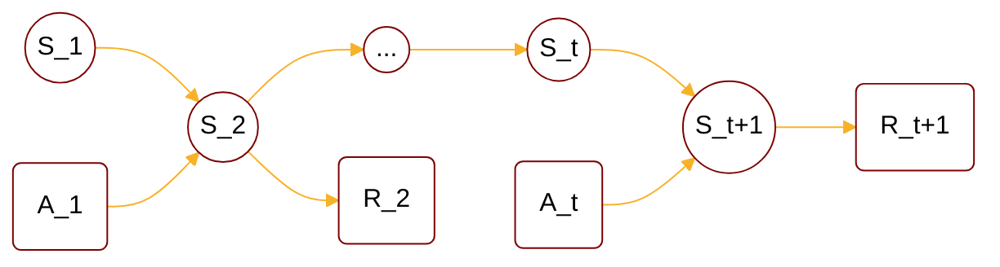

:                                                         


{{ if or .Page.Params.math .Site.Params.math }}

<link rel="stylesheet" href="https://cdn.jsdelivr.net/npm/katex@0.16.8/dist/katex.min.css" integrity="sha384-GvrOXuhMATgEsSwCs4smul74iXGOixntILdUW9XmUC6+HX0sLNAK3q71HotJqlAn" crossorigin="anonymous">

<!-- The loading of KaTeX is deferred to speed up page rendering -->

<!-- To automatically render math in text elements, include the auto-render extension: -->

{{ end }}

{{ if .Page.Store.Get "hasMermaid" }}
  
{{ end }}


## Overview of Markov

<cite>[^1]</cite>

$$
\begin{cases}
        \text{Stochastic Process} : \lbrace s_t \rbrace^{\infty}_{t=1} \\\
        \text{Markov Chain/Process} : \text{stochastic process with property: } p(s_{t+1}|s_{1:t})=p(s_{t+1}|s_t) \\\
        \text{State Space Model} \rarr \text{HMM, Kalman filter, Particle filter} \\\
                \text{Markov Reward Process} : \text{Markov Chain + Reward} \\\
        \text{Markov Decision Process} : \text{Markov Chain + Reward + Action}
\end{cases}
$$

## MDP Definition



Markov Decision Process(MDP) contains random variable sets \( \mathcal{S},\mathcal{A},\mathcal{R} \):



$$
\begin{align*}
\mathcal{S} &: \text{state set $\lbrace S_t \rbrace$} \\\
\mathcal{A} &: \text{action set, $\lbrace A_t \rbrace$} \\\
\mathcal{R} &: \text{reward set, $\lbrace R_t \rbrace$} \\\
\end{align*}
$$

and following form:



Then we can define the state transition function space \( \mathcal{P} \):



$$
\mathcal{P} : \begin{cases}
    p(s^{'},r|s,a) &= Pr(S_{t+1}=s^{'},R_{t+1}=r | S_t=s,A_t=a) \\\
    p(s^{'}|s,a) &= \sum_{r\in \mathcal{R}} p(s^{'},r|s,a)
\end{cases}
$$

## Reference

[^1]: - [video](https://www.bilibili.com/video/BV1RA411q7wt/?p=1).
[^4]: From [Higham, Nicholas (2002). Accuracy and Stability of Numerical Algorithms](https://archive.org/details/accuracystabilit00high_878).
[^5]: From [The Multivariate Gaussian. Michael I. Jordan](https://people.eecs.berkeley.edu/~jordan/courses/260-spring10/other-readings/chapter13.pdf).
[^3]: From [Tzon-Tzer, Lu; Sheng-Hua, Shiou (2002). "Inverses of 2 × 2 block matrices"](https://doi.org/10.1016%2FS0898-1221%2801%2900278-4).
[^2]: - [GAUSS-MARKOV MODELS, JONATHAN HUANG AND J. ANDREW BAGNELL](https://www.cs.cmu.edu/~16831-f14/notes/F14/gaussmarkov.pdf).
[^6]: - [Gaussian Processes and Gaussian Markov Random Fields](https://folk.ntnu.no/joeid/MA8702/jan16.pdf)
