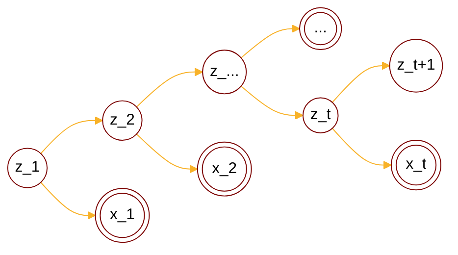

:                                                         


{{ if or .Page.Params.math .Site.Params.math }}

<link rel="stylesheet" href="https://cdn.jsdelivr.net/npm/katex@0.16.8/dist/katex.min.css" integrity="sha384-GvrOXuhMATgEsSwCs4smul74iXGOixntILdUW9XmUC6+HX0sLNAK3q71HotJqlAn" crossorigin="anonymous">

<!-- The loading of KaTeX is deferred to speed up page rendering -->

<!-- To automatically render math in text elements, include the auto-render extension: -->

{{ end }}

{{ if .Page.Store.Get "hasMermaid" }}
  
{{ end }}


## Background

### Overview of PGM

<cite>[^1]</cite>

$$
\text{PGM}: \begin{cases}
    \text{Representation} \begin{cases}
        \text{directed graph}\rarr  \text{Bayesian network} \\\
        \text{undirected graph}\rarr \text{Markov network(MRF)} \\\
        \text{continous variable}\rarr \text{Gaussian BN/Gaussian MRF} \\\
        \text{time$\rarr$} \underset{\text{$x_i$ not i.i.d.}}{\text{ Dynamic model}} \begin{cases}
            \text{discrete state$\rarr$Hidden Markov Model} \\\
            \text{continous state} \begin{cases}
                \text{Linear model$\rarr$Karman Filter} \\\
                \text{Nonlinear model$\rarr$\color{red}{Particle Filter}}
            \end{cases}
        \end{cases}
    \end{cases} \\\
    \text{Inference} \begin{cases}
        \text{MAP inference$\rarr \hat{x_A}=\argmax_{x_A}p(x_A|x_B)\propto\argmax p(x_A,x_B)$} \\\
        \text{exact inference} \begin{cases}
          \text{Variable elimination(VE)} \\\
          \text{Belief propagation(BP)$\rarr$sum-product algorithm(Tree)} \\\
          \text{Junction tree algorithm(Normal graph)}
        \end{cases} \\\
        \text{approximate inference} \begin{cases}
            \text{Loop belief propagation(Cyclic graph)} \\\
            \text{Variational inference} \\\
            \text{MCMC: importance sampling}
        \end{cases} 
    \end{cases} \\\
    \text{Learning} \begin{cases}
        \text{parameter learning} \begin{cases}
            \text{complete data: $(x,z)$} \\\
            \text{hidden variable: $z$}
        \end{cases} \\\
        \text{structure learning}
    \end{cases}
\end{cases}
$$

## Particle Filter

### Definition

Particle filter, like the Kalman filter, is a state-space model. However, it is designed to handle non-linear and non-Gaussian scenarios:

$$
\begin{cases}
z_t = g(z_{t-1}, u, \epsilon) \\\
x_t = h(z_{t}, u, \delta)
\end{cases}
$$

Then we have unknown parameters:

$$
\theta = (  )
$$

It has 2 steps for filtering:

$$
\begin{cases}
\text{Prediction: $p(z_t|x_1,\cdots,x_{t-1})=\int_{z_{t-1}}p(z_t,z_{t-1}|x_1,\cdots,x_{t-1})dz_{t-1}$} \\\
\text{Update: $p(z_t|x_1,\cdots,x_{t})\propto p(x_t|z_t)p(z_t|x_1,\cdots,x_{t-1})$}
\end{cases}
$$



Since \( h(\cdot) \) and \( g(\cdot) \) are not linear, \( \epsilon \) and \( \delta \) are not gaussian noise, we can't find a analytic expression for filtering problem like Kalman filter, sampling method is used on the other hand.



### Review Monte Carlo method

$$
\begin{align*}
p(z|x) \rarr E_{z|x\sim p(z|x)}\left[ f(z) \right] &= \int_{z}f(z)p(z|x)dz \\\
&\approx \frac{1}{N} \sum_{i=1}^N f(z^{(i)}) \\\
z^{(1)},\cdots,z^{(N)}&\text{ are randomly sampled from } p(z|x)
\end{align*}
$$

Monte Carlo method resolves difficulty in integration part, then the problem comes to how to do sampling.

#### Review importance sampling



Since posterior distribution is not easy to solve we want to find a close distribution \( q(z) \), and sampling on \( q(z) \):



$$
\begin{align*}
E_{z|x\sim p(z|x)}\left[ f(z) \right] &= \int_{z}f(z)p(z|x)dz \\\
&= \int_{z}f(z)\frac{p(z|x)}{q(z)}q(z)dz \\\
&\approx \frac{1}{N} \sum_{i=1}^N f(z^{(i)})\frac{p(z^{(i)}|x)}{q(z^{(i)})} \\\
&= \frac{1}{N} \sum_{i=1}^N f(z^{(i)})w^{(i)} \\\
&\frac{p(z^{(i)}|x)}{q(z^{(i)})}\text{ is weight $w^{(i)}$} \\\
z^{(1)},\cdots,z^{(N)}&\text{ are randomly sampled from } q(z) 
\end{align*}
$$

#### Apply importance sampling to filtering problem

Define weight at time t as:

$$
w_t^{(i)} = \frac{p(z_t^{(i)}|x_{1},\cdots,x_t)}{q(z_t^{(i)})} \\\
i=1\cdots N, \space t=1\cdots T
$$



Computing weights needs \( N\times T \) times, we can find a recurrence relation between \( w_t^{(i)} \) and \( w_{t-1}^{(i)} \) which brings us to sequential importance sampling(SIS).



### Sequential importance sampling

For convenience, denote \( x_{1},\cdots,x_t \) as \( x_{1:t} \):

$$
 x_{1},\cdots,x_t \iff x_{1:t}
$$

In any case of sequential importance sampling(SIS), we should let the proposal distribution has following attribute<cite>[^2]</cite>:

$$
q(z_t|z_{1:t-1}) = q(z_t|x_t,z_{t-1})
$$



For importance weights in sequential importance sampling(SIS) we define it as:



$$
\begin{align*}
w_t^{(i)} &= \frac{p(z_{1:t}^{(i)}| x_{1:t})}{q(z_{1:t}^{(i)})} \propto \frac{p(z_{t}^{(i)}| x_{1:t})}{q(z_{t}^{(i)})}
\end{align*}
$$



For the numerator \( p(z_{1:t}^{(i)}|x_{1:t}) \) we have:



$$
\begin{align*}
p(z_{1:t}^{(i)}|x_{1:t}) &= \frac{p(z_{1:t}^{(i)},x_{1:t})}{p(x_{1:t})} \\\
&\propto p(z_{1:t}^{(i)},x_{1:t}) \\\
&= p(x_t|z_{1:t}^{(i)},x_{1:t-1})p(z_{1:t}^{(i)},x_{1:t-1}) \\\
&= p(x_t|z_{t}^{(i)})p(z_{1:t}^{(i)},x_{1:t-1}) \\\
&= p(x_t|z_{t}^{(i)})p(z_{t}^{(i)}|z_{1:t-1}^{(i)},x_{1:t-1})p(z_{1:t-1}^{(i)},x_{1:t-1}) \\\
&= p(x_t|z_{t}^{(i)})p(z_{t}^{(i)}|z_{t-1}^{(i)})p(z_{1:t-1}^{(i)},x_{1:t-1}) \\\
&= p(x_t|z_{t}^{(i)})p(z_{t}^{(i)}|z_{t-1}^{(i)})p(z_{1:t-1}^{(i)}|x_{1:t-1})p(x_{1:t-1}) \\\
&\propto p(x_t|z_{t}^{(i)})p(z_{t}^{(i)}|z_{t-1}^{(i)})p(z_{1:t-1}^{(i)}|x_{1:t-1})
\end{align*} \\\
\dArr \\\
p(z_{1:t}^{(i)}|x_{1:t}) \propto p(z_{1:t}^{(i)},x_{1:t}) \propto p(x_t|z_{t}^{(i)})p(z_{t}^{(i)}|z_{t-1}^{(i)})p(z_{1:t-1}^{(i)}|x_{1:t-1})
$$

Thus we can update the weight equation:

$$
\begin{align*}
w_t^{(i)} &= \frac{p(z_{1:t}^{(i)}| x_{1:t})}{q(z_{1:t}^{(i)})} \\\
&\propto \frac{p(z_{1:t}^{(i)}, x_{1:t})}{q(z_{1:t}^{(i)})} \\\
&= \frac{p(z_{1:t-1}^{(i)}, x_{1:t-1})}{q(z_{1:t-1}^{(i)})} \frac{p(z_{1:t}^{(i)}, x_{1:t})}{p(z_{1:t-1}^{(i)}, x_{1:t-1}) q(z_{t}^{(i)}|z_{1:t-1}^{(i)})} \\\
&= w_{t-1}^{(i)} \frac{p(z_{1:t}^{(i)}, x_{1:t})}{p(z_{1:t-1}^{(i)}, x_{1:t-1}) q(z_{t}^{(i)}|z_{1:t-1}^{(i)})} \\\
&\propto w_{t-1}^{(i)} \frac{p(x_t|z_{t}^{(i)})p(z_{t}^{(i)}|z_{t-1}^{(i)})p(z_{1:t-1}^{(i)}|x_{1:t-1})}{p(z_{1:t-1}^{(i)}, x_{1:t-1}) q(z_{t}^{(i)}|z_{1:t-1}^{(i)})} \\\
&\propto w_{t-1}^{(i)} \frac{p(x_t|z_{t}^{(i)})p(z_{t}^{(i)}|z_{t-1}^{(i)})}{ q(z_{t}^{(i)}|z_{1:t-1}^{(i)})} \\\
&\text{By proposal disribution attribute} \\\
&= w_{t-1}^{(i)} \frac{p(x_t|z_{t}^{(i)})p(z_{t}^{(i)}|z_{t-1}^{(i)})}{ q(z_t^{(i)}|x_t,z_{t-1}^{(i)}) }
\end{align*}
$$

<!-- 

For proposal distribution \( q(z_{1:t}^{(i)}|x_{1:t}) \) we have:



$$
\begin{align*}
q(z_{1:t}^{(i)}|x_{1:t}) &= q(z_{t}^{(i)}|z_{1:t-1}^{(i)}, x_{1:t})q(z_{1:t-1}^{(i)}|x_{1:t}) \\\
&= q(z_{t}^{(i)}|z_{1:t-1}^{(i)}, x_{1:t})q(z_{1:t-1}^{(i)}|x_t,x_{1:t-1}) \\\
&= q(z_{t}^{(i)}|z_{1:t-1}^{(i)}, x_{1:t})\frac{q(x_t,z_{1:t-1}^{(i)}|x_{1:t-1})}{q(x_t|x_{1:t-1})} \\\
&= q(z_{t}^{(i)}|z_{1:t-1}^{(i)}, x_{1:t})\frac{q(x_t|z_{1:t-1}^{(i)},x_{1:t-1})q(z_{1:t-1}^{(i)}|x_{1:t-1})}{q(x_t|x_{1:t-1})} \\\
&= q(z_{t}^{(i)}|z_{1:t-1}^{(i)}, x_{1:t})\frac{q(x_t|z_{1:t-1}^{(i)},x_{1:t-1})q(z_{1:t-1}^{(i)}|x_{1:t-1})}{q(x_t,x_{1:t-1}|x_{1:t-1})} \\\
&= q(z_{t}^{(i)}|z_{1:t-1}^{(i)}, x_{1:t}) q(x_t|z_{1:t-1}^{(i)},x_{1:t-1})q(z_{1:t-1}^{(i)}|x_{1:t-1}) \frac{1}{q(x_t,x_{1:t-1})/q(x_{1:t-1})} \\\
&\because \frac{q(x_{1:t-1})}{q(x_{1:t})}=C \\\
&\propto q(z_{t}^{(i)}|z_{1:t-1}^{(i)}, x_{1:t}) q(x_t|z_{1:t-1}^{(i)},x_{1:t-1})q(z_{1:t-1}^{(i)}|x_{1:t-1})
\end{align*}
$$ -->

Finally we have the recurrence relation for importance weight:

$$
\begin{align*}
w_t^{(i)} &\propto \frac{h(z_{t}^{(i)}, u, \delta) g(z_{t-1}^{(i)}, u, \epsilon)}{ q(z_t^{(i)}|x_t,z_{t-1}^{(i)}) } w_{t-1}^{(i)} 
\end{align*} \\\
\dArr
$$

$$
\because \text{weight is normalized in importance sampling} \\\
\begin{align*}
E_{z|x\sim q(z|x)}\left[ w(z) \right] &= \int_{z}w(z)q(z)dz \\\
&= \int_{z} \frac{p(z|x)}{q(z)} q(z)dz \\\
& \approx \frac{1}{N}\sum_{i=1}^Nw(z_i) =1
\end{align*} \\\
\dArr
$$

$$
\therefore\text{normalize weights in SIS algorithm} \\\
\begin{cases}
z_{1}^{(i)}\sim q(z_{1}|x_{1}) \\\
w_1^{(i)} = \frac{p(z_{1}^{(i)}|x_{1})}{q(z_{1}^{(i)}|x_{1})} \\\
z_{t}^{(i)}\sim q(z_t^{(i)}|x_t,z_{t-1}^{(i)}) \\\
w_t^{(i)} = \frac{p(x_t|z_{t}^{(i)})p(z_{t}^{(i)}|z_{t-1}^{(i)})}{q(z_{t}^{(i)}|z_{1:t-1}^{(i)}, x_{1:t}) q(x_t|z_{1:t-1}^{(i)},x_{1:t-1})} w_{t-1}^{(i)} \\\
W_t^{(i)} = \frac{w_{t}^{(i)}}{\sum_{i=1}^N w_t^{(i)}} \\\
E_{z\sim q(z|x)}\left[ f(z) \right] = \frac{1}{N} \sum_{i=1}^N f(z^{(i)})W_{t}^{(i)}
\end{cases}
$$

## Summary

If you found any mistakes, please contact me via email.

## Reference

[^1]: - [video](https://www.bilibili.com/video/BV1aE411o7qd?p=92).
[^3]: From [The Matrix Cookbook](https://www.math.uwaterloo.ca/~hwolkowi/matrixcookbook.pdf).
[^5]: From [Mean field variational inference](https://mbernste.github.io/files/notes/MeanFieldVariationalInference.pdf).
[^4]: From [Ross, Sheldon M. (2019). Introduction to probability models](https://doi.org/10.1016%2FC2017-0-01324-1).
[^2]: - [A Tutorial on Particle Filtering and Smoothing: Fifteen years later](https://www.stats.ox.ac.uk/~doucet/doucet_johansen_tutorialPF2011.pdf).
