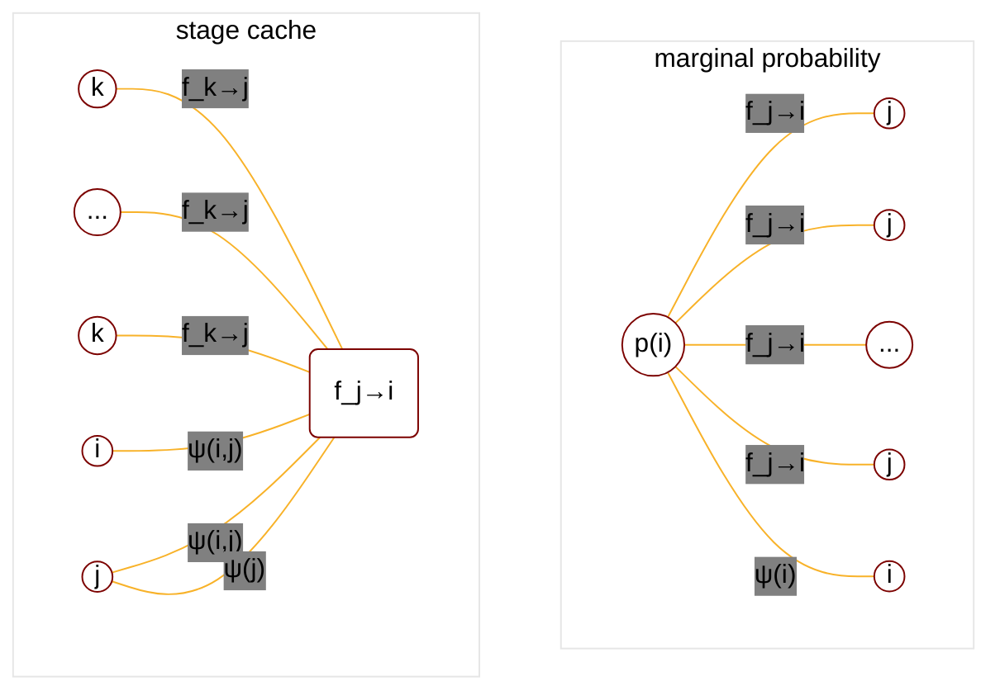
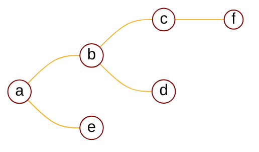
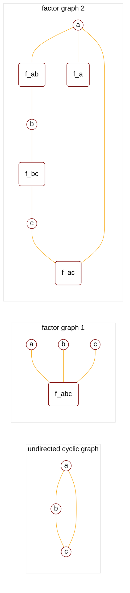
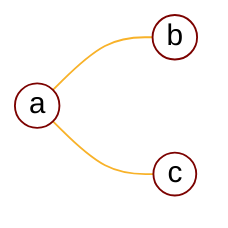
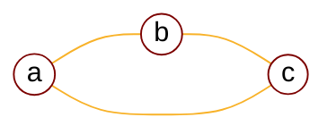
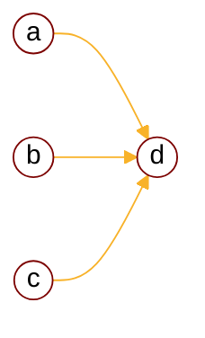

:                                                         


{{ if or .Page.Params.math .Site.Params.math }}

<link rel="stylesheet" href="https://cdn.jsdelivr.net/npm/katex@0.16.8/dist/katex.min.css" integrity="sha384-GvrOXuhMATgEsSwCs4smul74iXGOixntILdUW9XmUC6+HX0sLNAK3q71HotJqlAn" crossorigin="anonymous">

<!-- The loading of KaTeX is deferred to speed up page rendering -->
<script defer src="https://cdn.jsdelivr.net/npm/katex@0.16.8/dist/katex.min.js" integrity="sha384-cpW21h6RZv/phavutF+AuVYrr+dA8xD9zs6FwLpaCct6O9ctzYFfFr4dgmgccOTx" crossorigin="anonymous"></script>

<!-- To automatically render math in text elements, include the auto-render extension: -->
<script defer src="https://cdn.jsdelivr.net/npm/katex@0.16.8/dist/contrib/auto-render.min.js" integrity="sha384-+VBxd3r6XgURycqtZ117nYw44OOcIax56Z4dCRWbxyPt0Koah1uHoK0o4+/RRE05" crossorigin="anonymous"
    onload="renderMathInElement(document.body);"></script>
{{ end }}

{{ if .Page.Store.Get "hasMermaid" }}
  <script type="module">
    import mermaid from 'https://cdn.jsdelivr.net/npm/mermaid/dist/mermaid.esm.min.mjs';
    mermaid.initialize({ startOnLoad: true });
  </script>
{{ end }}


<style>
    /* Set the font size of all math elements to 16px */
    .katex {
        font-size: 16px !important;
    }
</style>

<style>
/* Custom CSS styles */
.graph {
    background-color: white;
  /* padding: 10px; */
  /* border-radius: 5px; */
}
.graph pre {
    background-color: white;
  /* font-family: 'Courier New', monospace;
  font-size: 14px;
  line-height: 1.5; */
}
</style>

## Background

### Overview of PGM

<cite>[^1]</cite>

$$
\text{PGM}: \begin{cases}
    \text{Representation} \begin{cases}
        \text{directed graph}\rarr  \text{Bayesian network} \\\
        \text{undirected graph}\rarr \text{Markov network(MRF)} \\\
        \text{continous variable}\rarr \text{Gaussian BN/Gaussian MRF}
    \end{cases} \\\
    \text{Inference} \begin{cases}
        \text{MAP inference$\rarr \hat{x_A}=\argmax_{x_A}p(x_A|x_B)\propto\argmax p(x_A,x_B)$} \\\
        \text{exact inference} \begin{cases}
          \text{Variable elimination(VE)} \\\
          \text{Belief propagation(BP)$\rarr$sum-product algorithm(Tree structure)} \\\
          \text{Junction tree algorithm(Normal graph)}
        \end{cases} \\\
        \text{approximate inference} \begin{cases}
            \text{Loop belief propagation(Cyclic graph)} \\\
            \text{Variational inference} \\\
            \text{MCMC: importance sampling}
        \end{cases} 
    \end{cases} \\\
    \text{Learning} \begin{cases}
        \text{parameter learning} \begin{cases}
            \text{complete data: $(x,z)$} \\\
            \text{hidden variable: $z$}
        \end{cases} \\\
        \text{structure learning}
    \end{cases}
\end{cases}
$$

### Operations for high dimensional data

$$
\begin{cases}
\text{sum rule: } p(x_1)=\int p(x_1,x_2)dx_2 \\\
\text{product rule: } p(x_1,x_2)=p(x_1)P(x_2|x_1) \\\
\text{chain rule: } p(x_1,\cdots,x_p)=p(x_1|x_2,...,x_p) \cdots p(x_{p-2}|x_{p-1},x_p)p(x_{p-1}|x_p)p(x_p) \\\
\text{bayesian rule: } p(x_2|x_1)=\frac{p(x_1,x_2)}{p(x_1)}=\frac{p(x_1,x_2)}{\int p(x_1,x_2)dx_2}=\frac{p(x_1,x_2)}{\int p(x_2)p(x_1|x_2)dx_2}
\end{cases}
$$

### Simplifications for high dimensional data

Considering high computation cost, high dimensional data can be simplified at different level:

$$
\begin{align*}
&1. \text{ Each dimension is independent} \rarr p(x|y)=\prod_{i=1}^p p(x_i|y) \text{ (Naive Bayes)} \\\
&2. \text{ Conditionally independent} \rarr x_j\perp x_{i+1}|x_i, j<i \text{(Hidden Markov)} \\\
&3. \text{ Conditionally independent in general}\rarr x_A\perp x_{B}|x_C \text{( $x_A,x_B,x_C$ are dimensions set)} \\\
&\text{e.g. }x_j\perp x_{i}|x_{i-1},x_{i-3}
\end{align*}
$$

## Bayesian network
### Definition

Undirected acyclic Bayesian network graph is generated by <b>toposort</b> following the rule below:

$$
\text{Given: } a|b \text{, the graph has partial structure: }
$$

<!-- ```goat
 .-.            .-.           
| 1 |<---  | 2 |
 '-'           '-'
``` -->

<!-- add html template to change bg color -->
<!-- ```html

<div class="graph" style="text-align: center;">

```mermaid
flowchart LR

```

</div>

``` -->

<div class="graph" style="text-align: center;">


</div>

Bayesian network has 2 attributes: **conditionally independent** and **factorization**:

$$
\begin{align*}
&1. \text{ Conditionally independent: }x_A\perp x_{B}|x_C \\\
&2. \text{ Factorization: }p(x_1,\cdots,x_p)=\prod_{i=1}^p p(x_i|x_{pa(i)}), \text{where }x_{pa(i)}\text{ is the set of $x_i$'s parents}
\end{align*}
$$

### Local features of BN

There are three partial graph structures:

#### tail to tail

<div class="graph" style="text-align: center;">


</div>

Based on factorization, we have:

$$
\begin{align*}
p(a,b,c) = p(a)p(b|a)p(c|a)
\end{align*}
$$

Based on chain rule, we have:

$$
\begin{align*}
p(a,b,c) = p(a)p(b|a)p(c|a,b)
\end{align*}
$$

So,

$$
\begin{align*}
p(a)p(b|a)p(c|a) &= p(a)p(b|a)p(c|a,b) \\\
p(c|a) &= p(c|a,b) \\\
c\perp b | a, &\text{c is not affected whether $b$ is observed}
\end{align*}
$$


<p>
So we can conclude that while \(a\) is observed, the path from \(b\) to \(c\) is blocked so \(b\) and \(c\) are mutually independent.
</p>


#### head to tail

<div class="graph" style="text-align: center;">


</div>

Based on factorization, we have:

$$
\begin{align*}
p(a,b,c) = p(a)p(b|a)p(c|b)
\end{align*}
$$

Based on chain rule, we have:

$$
\begin{align*}
p(a,b,c) = p(a)p(b|a)p(c|a,b)
\end{align*}
$$

So,

$$
\begin{align*}
p(a)p(b|a)p(c|b) &= p(a)p(b|a)p(c|a,b) \\\
p(c|b) &= p(c|a,b) \\\
c\perp a | b, &\text{c is not affected whether $a$ is observed}
\end{align*}
$$


<p>
So we can conclude that while \(b\) is observed, the path from \(a\) to \(c\) is blocked so \(a\) and \(c\) are mutually independent.
</p>


#### head to head

<div class="graph" style="text-align: center;">


</div>

Based on factorization, we have:

$$
\begin{align*}
p(a,b,c) = p(a)p(b)p(c|a,b)
\end{align*}
$$

Based on chain rule, we have:

$$
\begin{align*}
p(a,b,c) = p(a)p(b|a)p(c|a,b)
\end{align*}
$$

So,

$$
\begin{align*}
p(a)p(b)p(c|a,b) &= p(a)p(b|a)p(c|a,b) \\\
p(b) &= p(b|a) \\\
b\perp a , &\text{$b$ does not affect $a$'s happening}
\end{align*}
$$


<p>
So we can conclude that \(a\) and \(b\) are mutually independent if \(c\) is not observed, if \(c\) is observed \(a\) and \(b\) are related.
</p>



<p>
<mark>It also applies</mark> when \( c \) has child node \( d \):
</p>


$$
\begin{align*}
p(a)p(b)p(c|a,b)p(d|c) &= p(a)p(b|a)p(c|a,b)p(d|a,b,c) \\\
p(a)p(b)p(c,d|a,b) &= p(a,b,c,d) \\\
p(a)p(b)p(c,d|a,b) &= p(a,b)p(c,d|a,b) \\\
p(a)p(b) &= p(a,b) \\\
b&\perp a
\end{align*}
$$

### D-separation
#### the rules of d-separation

<p>
D-separation is a method to check whether a Bayesian network satisfies conditional independent, so that:
</p>


$$
\begin{align*}
x_A \perp x_C | x_B
\end{align*}
$$


<p>
The rules are:
</p>


$$
\begin{align*}
&1. \text{If node $\alpha \in $tail to tail(parent node), $\alpha \in x_B$}\\\
&2. \text{If node $\alpha \in $head to tail(intermediate node), $\alpha \in x_B$}\\\
&3. \text{If node $\alpha \in $head to head(child node OR descendant of child node), $\alpha \notin x_B$}\\\
\end{align*}
$$

The rule of D-separation is also called <b>global markov property</b>.

#### markov blanket

Given a conditinal probability:

$$
\begin{align*}
p(x_i|x_{\neq i}) &= \frac{p(x_i,x_{\neq i})}{p(x_{\neq i})} \\\
&= \frac{p(x)}{\int p(x)dx_i} \\\
&\because p(x) = \prod_{j=1}^p p(x_j|x_{pa(j)}) = f(x_i)g(x_{\neq i}) \\\
&\text{$p(x)$ can be separated to 2 parts: $f(x_i)$ related to $x_i$, $g(x_{\neq i})$ not related to $x_i$} \\\
&= \frac{f(x_i)g(x_{\neq i})}{g(x_{\neq i})\int f(x_i)dx_i} \\\
&= \frac{f(x_i)}{\int f(x_i)dx_i}
\end{align*}
$$


<p>
It gives us information: conditional probability of \(x_i\) is affected only by the local area of node \(x_i\), not all nodes from global, This covered area is called Markov blanket which includes:
</p>


$$
f(x_i):\begin{cases}
p(x_i|x_{pa(i)}) & \text{$x_i$'s parent nodes} \\\
p(x_{child(i)}|x_i, x_{pa(x_{child(i)})}) & \text{$x_i$'s child nodes and $x_i$'s spouse nodes}
\end{cases}
$$

<div style="text-align: center;">


</div>

### BN models

$$
\text{BN models}: \begin{cases}
    \text{Singular: Naive Bayes} \\\
    \text{Mixture: Gaussian Mixture Model} \\\
    \text{Stochastic process: } \begin{cases}
        \text{Markov chain} \\\
        \text{Gaussian process}
    \end{cases} \\\
    \text{Continous: Gaussian Bayesian Network}
\end{cases}
$$

## Markov random network
### Conditional independence of MRF

The conditional independence is shown in 3 ways:

1. global markov property

$$
x_A\perp x_C | x_B
$$

2. local markov property

$$
x\perp \lbrace \mathbb{U}-x-\lbrace\text{neighbor of $x$}\rbrace \rbrace | \text{neighbor of $x$} \\\
\text{e.g. $a\perp \lbrace d,f \rbrace | \lbrace b,c,e \rbrace$ for the following graph} \\\
\dArr
$$

<div class="graph" style="text-align: center;">


</div>

3. pairwise markov property

$$
x_i\perp x_j | x_{\neq i, \neq j}
$$

Three properties are <b>equivalent</b>:

$$
\text{global markov $\iff$ local markov $\iff$ pairwise markov}
$$


<p>
From pairwise markov, we know that if \(x_i \perp x_j\), other nodes are blocked. It means \(x_i\) and \(x_j\) are not connected, \(x_i\) and \(x_j\) destinedly belongs to different <b>max-clique</b>.
</p>


$$
\begin{align*}
\textbf{clique: }&\text{nodes in clique are fully connected} \\\
\textbf{maximum clique: }&\text{the clique that can cover maximum number of nodes}
\end{align*}
$$

### Factorization of MRF

According to **Hammersley–Clifford theorem**<cite>[^2]</cite>, factorization of undirected graph MRF can be expressed as production of potential function on maximum clique:

$$
\begin{align*}
p(x) &= \frac{1}{z} \prod_{i=1}^K \psi(x_{C_i}) \\\
C_i &: \text{i-th maximum clique} \\\
x_{C_i} &: \text{variable nodes in $C_i$} \\\
\psi(x) &: \text{potential function, $>0$} \\\
z &: \text{nomalize factor, $z=\sum_{x_1\cdots x_p}\prod_{i=1}^K \psi(x_{C_i})$}
\end{align*}
$$

To be greater than zero, potential function has exponential form:

$$
\begin{align*}
\psi(x_{C_i}) &= \exp(-E(x_{C_i})) \\\
E(x) &: \text{energy function}
\end{align*}
$$


<p>
For such pdf \( p(x) \) made up of potential functions, we call it <b>Gibbs distribution</b> or <b>Boltzman distribution</b>, Gibbs distirbution is also exponential family distribution:
</p>


$$
\begin{align*}
p(x) &= \frac{1}{z}\prod_{i=1}^K\exp(-E(x_{C_i})) \\\
&= \frac{1}{z} \exp( -\sum_{i=1}^K E(x_{C_i})) \\\
&= \frac{1}{z(\eta)}h(x)\exp( \eta^T\phi(x) )
\end{align*}
$$

Because Gibbs distribution belongs to exponential family distribution, it maximize entropy naturally, thus we can conclude:

$$
\begin{align*}
\text{MRF distribution}\iff \text{Gibbs distribution}&\iff \text{Distribution that maximize entropy} \\\ 
&\iff \text{most likely to be observed}
\end{align*}
$$

## Inference in PGM
### Inference object

Usually we split nodes in graph into 2 parts:

$$
\begin{align*}
&\lbrace X,E \rbrace \\\
&X: \text{Unknown variable nodes} \\\
&E: \text{Evidence nodes/observed data}  \\\
&E=\lbrace e_1,e_2,\cdots,e_n \rbrace
\end{align*}
$$

Inference objects include 3 parts:

1. marginal probability(likelihood)
$$
\begin{cases}
p(E) = p(e_1,\cdots,e_n) \\\
p(e_i) = \sum_{j=1\cdots n, j\neq i} p(E) \\\
p(e_A) = \sum_{j\in E\setminus{A}} p(E), \text{A is partial nodes set}
\end{cases}
$$

2. conditional probability(posterior)
$$
\begin{cases}
p(X|E) \\\
p(Y|E)=\sum_Z p(X|E), \text{for $X=(Y,Z)$}
\end{cases}
$$

3. maximum a posteriori(MAP)
$$
\begin{cases}
\hat{X} = \argmax_X p(X|E) \\\
\hat{Y} = \argmax_Y p(Y|E) = \argmax_Y \sum_Z p(X|E)
\end{cases}
$$

### Variable elimination

VE thought is based on distirbutive law:

$$
a(b+c) \text{ is better than } ab+ac \\\
\text{summation is better than multiplication}
$$

Suppose we have directed graph:

<div class="graph" style="text-align: center;">


</div>

We can compute marginal probability by:

$$
\begin{align*}
p(d) &= \sum_{a,b,c} p(a,b,c,d) \\\
&= \sum_{a,b,c} p(a)p(b|a)p(c|b)p(d|c) \\\
\end{align*}
$$


<p>
The computation complexity is \(O(4^k)\). we can turn it to:
</p>


$$
\begin{align*}
p(d) &= \sum_{a,b,c} p(a)p(b|a)p(c|b)p(d|c) \\\
&= \sum_{b,c}p(c|b)p(d|c)\sum_{a}\underset{f(a,b)}{p(a)p(b|a)} \\\
&= \sum_{c}p(d|c)\sum_{b}p(c|b)f(b) \\\
&= \sum_{c}p(d|c)f(c) \\\
&= f(d)
\end{align*}
$$


<p>
It is the same for undirected graph:
</p>


$$
\begin{align*}
p(d) &= \sum_{a,b,c} p(a,b,c,d) \\\
&= \sum_{a,b,c} \frac{1}{z}\prod_{i=1}^k \psi(x_{C_i}) \\\
&\text{the worst case is $a\in\forall x_{C}$}
\end{align*}
$$

The <b>drawbacks</b> are:

1. Only one be calculated at a time, the intermediate results are not in storage which will be calculated repeatedly.
2. Eliminate order affects computation comlexity, finding optimal eliminate order is NP-hard.

### Belief propagation
#### Example of repeat computation
Repeat computation, for example:

<div class="graph" style="text-align: center;">


</div>


<p>
We can compute \(p(e)\) and \(p(c)\);
</p>


$$
\begin{align*}
p(e) &= \sum_d p(e|d) \sum_c p(d|c) \sum_b p(c|b) \sum_a p(b|a)p(a) \\\
&\text{Elimination order is $a\rarr b\rarr c \rarr d\rarr e$} \\\
p(c) &= \sum_b p(c|b) \sum_a p(b|a)p(a) \sum_d p(d|c) \sum_e p(e|d) \\\
&\text{Elimination order is $a\rarr b\rarr c \larr d\larr e$} \\\
\end{align*}
$$


<p>
It is obvious that the repeated part is \( a\rarr b\rarr c \) which is \( \sum_b p(c|b) \sum_a p(b|a)p(a) \), we can denote this part as:
</p>


$$
\begin{align*}
f_{a\rarr b} (x_b) &= \sum_a p(b|a)p(a) \\\
f_{b\rarr c} (x_c) &= \sum_b p(c|b)f_{a\rarr b} (x_b)
\end{align*}
$$

#### Formula for nodes and edges

Suppose we have undirected graph:

<div class="graph" style="text-align: center;">


</div>

The joint probability is:

$$
p(a,b,c,d,e) = \frac{1}{z}\psi(a)\psi(b)\psi(c)\psi(d)\psi(e)\psi(a,b)\psi(b,c)\psi(b,d)\psi(a,e)
$$


<p>
The marginal probability \(p(a)\) is:
</p>


$$
\begin{cases}
p(a) = \psi(a)f_{b\rarr a}(x_a)f_{e\rarr a}(x_a) \\\
f_{b\rarr a}(x_a) = \sum_b \psi(a,b)\psi(b)f_{c\rarr b}(x_b)f_{d\rarr b}(x_b) \\\
f_{e\rarr a}(x_a) = \sum_e \psi(a,e)\psi(e)
\end{cases}
$$

We can conclude a more <b>general form</b>:

$$
\forall i \in \text{V , $G(V,E)$} \\\
\begin{cases}
p(i) = \psi(i)\prod_{j\in neighbor(i)} f_{j\rarr i}(x_i) \\\
f_{j\rarr i}(x_i) = \sum_{j} \psi(i,j)\psi(j) \prod_{k\in neighbor(j)\setminus\lbrace i \rbrace} f_{k\rarr j}(x_j)
\end{cases}
$$

Visualizing the general form:

<div class="graph" style="text-align: center;">



</div>

#### BP algorithm(Sum product algorithm)

Belief propagation algorithm is basically variable elimination without repeatedly computing edge's message. From previous section we can define **belief(j)** is information collected by node j:

$$
\text{belief}(j) = \psi(j)\prod_{k\in neighbor(j)} f_{k\rarr j}(x_j)
$$

Then node j sending information to node i is given by:

$$
f_{j\rarr i}(x_i) = \sum_j \psi(i,j)\text{belief}(j)
$$


<p>
The BP algorithm calculates all edges \( f_{i\rarr j} \) by traversing the graph:
</p>


$$
\textbf{Sequential BP algorithm} \\\
\begin{align*}
& \text{1. Initialize the messages} \\\
& \quad f_{i \to j} = 1, \quad \forall i, j \\\
& \text{2. Find a root node, $root$} \\\
& \text{3. Define recursive function CollectMsg(j,i)} \\\
& \quad \text{Function CollectMsg(j,i):} \\\
& \quad\quad \text{belief}(j) = \psi(j)\prod_{k\in neighbor(j)} \text{CollectMsg(k,j)} \\\
& \quad\quad f_{j\rarr i} = \sum_j \psi(i,j)\text{belief}(j) \\\
& \quad\quad \text{Return $f_{j\rarr i}$} \\\
& \text{4. Collect message to $root$ recursively} \\\
& \quad \text{For $j$ in neighbor($root$):} \\\
& \quad\quad \text{$f_{src=j,dst=root}=$CollectMsg($j,root$)} \\\
& \quad \text{End} \\\
& \text{5. Distribute message from $root$ recursively} \\\
& \quad \text{For $j$ in neighbor($root$):} \\\
& \quad\quad \text{$f_{src=root,dst=j}=$CollectMsg($root,j$)} \\\
& \quad \text{End} \\\
& \text{6. Calculate each node's marginal probability} \\\
& \quad \text{For $v$ in vertices:} \\\
& \quad\quad \text{$p(v) = \psi(v)\prod_{k\in neighbor(v)} f_{src=k,dst=v}$} \\\
& \quad \text{End}
\end{align*}
$$

There is a variant called parallel BP which is similar to BFS:

$$
\textbf{Parallel BP algorithm} \\\
\begin{align*}
& \text{1. Randomly select a start node, $i$} \\\
& \text{2. For j in neighbor($i$)$\setminus$}\lbrace\text{upstream-node(i)}\rbrace \\\
& \quad\quad\text{Send message $\psi(i)\rarr j$ in parallel} \\\
& \quad\text{If $\forall j, f_{j\rarr i}$ is recieved:} \\\
& \quad\quad\text{node $i$ is converged} \\\
& \text{3. Repeat }\textbf{step 2}\text{ for all nodes, until all nodes converged}
\end{align*}
$$

#### Max product algorithm

Recall that for nodes and edges we have formula:

$$
\begin{cases}
p(i) = \psi(i)\prod_{j\in neighbor(i)} f_{j\rarr i}(x_i) \\\
f_{j\rarr i}(x_i) = \sum_{j} \psi(i,j)\psi(j) \prod_{k\in neighbor(j)\setminus\lbrace i \rbrace} f_{k\rarr j}(x_j)
\end{cases}
$$


<p>
Define \( m_{j\rarr i}(x_i) \) by replacing summation with max in second equation:
</p>


$$
m_{j\rarr i}(x_i) = \max_{x_j} \psi(i,j)\psi(j) \prod_{k\in neighbor(j)\setminus\lbrace i \rbrace} m_{k\rarr j}(x_j) \\\
% \text{$m_{j\rarr i}(x_i)$ is the maximum $p(j\cup$neighbor($j$)$\setminus\lbrace i \rbrace)$}
$$


<p>
It is clear that \( f_{j\rarr i} \) is used for solving marginal probability, we can prove that \( m_{j\rarr i} \) is used for solving joint probability:
</p>


$$
\begin{align*}
\psi(i) \prod_{j\in neighbor(i)} f_{j\rarr i}(x_i) &= p(i) \\\
\psi(i)\prod_{j\in neighbor(i)}\sum_{j,\lbrace k \rbrace\in neighbor(j)} g(x_i,x_j,\lbrace x_k \rbrace) &= \sum_{\forall node \setminus \lbrace i \rbrace}p(x_1,x_2,\cdots,x_i,\cdots,x_N) \\\
&\dArr \\\
\max_{x_i}\psi(i) \prod_{j\in neighbor(i)} m_{j\rarr i}(x_i) &= \max_{x_i}\psi(i)\prod_{j\in neighbor(i)}\max_{x_j,\lbrace x_k \rbrace} g(x_i,x_j,\lbrace x_k \rbrace) \\\
&=p(x_1=x_1^{\ast},x_2=x_2^{\ast},\cdots,x_i=x_i^{\ast},\cdots,x_N=x_N^{\ast}) \\\
&= \max p(x_1,x_2,\cdots,x_i,\cdots,x_N)
\end{align*}
$$

Let's go through an example graph:

<div class="graph" style="text-align: center;">



</div>

Evidence nodes are omitted here.


<p>
We can prove that \( \psi(a) \prod_{j\in neighbor(a)} m_{j\rarr a}(x_a) \) is the maximum joint probability \( p(a,b,c,d,e,f) \):
</p>


$$
\begin{cases}
&\text{By definition, we compute $m_{i\rarr j}$ from bottom-up} \\\
m_{c\rarr b} &= \max_{x_c}\psi(c)\psi(b,c) \\\
m_{f\rarr d} &= \max_{x_f}\psi(f)\psi(d,f) \\\
m_{d\rarr b} &= \max_{x_d}\psi(d)\psi(b,d)m_{f_\rarr d} \\\
m_{b\rarr a} &= \max_{x_b}\psi(b)\psi(a,b)m_{c\rarr b}m_{d\rarr b} \\\
m_{e\rarr a} &= \max_{x_e}\psi(e)\psi(a,e)
\end{cases}
\text{Then, }
$$

$$
\begin{align*}
\max p(a,b,c,d,e,f|E) &= \max_{x_a}\psi(a) \prod_{j\in neighbor(a)} m_{j\rarr a}(x_a) \\\
&= \max_{x_a}\psi(a)m_{b\rarr a}m_{e\rarr a} \\\
&= \max_{x_a} \psi(a)\max \psi(b)\psi(a,b)\psi(c)\psi(b,c)\psi(d)\psi(b,d)\psi(f)\psi(d,f)\psi(e)\psi(a,e) \\\
&= \max\psi(a) \psi(b)\psi(a,b)\psi(c)\psi(b,c)\psi(d)\psi(b,d)\psi(f)\psi(d,f)\psi(e)\psi(a,e)
\end{align*}
$$


<p>
Finally we get not only the maximum posteriori but also the optimal path from each node:
</p>


$$
(x_a^{\ast},x_b^{\ast},x_c^{\ast},x_d^{\ast},x_e^{\ast},x_f^{\ast}) = \argmax_{x_a,x_b,x_c,x_d,x_e,x_f}p(a,b,c,d,e,f|E)
$$

#### BP's restriction

BP only works for tree-structure graph

## Factor graph

Factor graph has following form:

$$
\begin{align*}
p(x) &= \prod_{i=1}^k f_i(x_{C_i}) \\\
f_i &: \text{function of factor $i$} \\\
C_i &: \text{subset of nodes correspond to factor $i$} \\\
\end{align*}
$$

Example:

<div class="graph" style="text-align: center;">



</div>

For original graph we have:

$$
p(x) = \frac{1}{z}\psi(a,b,c)
$$

For factor graph 1 we have:

$$
p(x) = f_{abc}(a,b,c)
$$

So factorization of undirected graph corresponds to a special case of factor graph.

For factor graph 2 we have:

$$
p(x) = f_{ab}(a,b)f_{bc}(b,c)f_{ac}(a,c)f_{a}(a)
$$

We see nodes are always partitioned by factors, so factor graph is bipartite graph.

## Moral graph

Moral graph is used for converting directed graph to undirected graph, procedures are:

1. $\forall x_i\in G$ , connect every 2 nodes in $parent(x_i)$.
2. remove edges direction in $G$.

It targets at <b>head to head structure</b>, examples are below:

1. Tail to tail:

<div class="graph" style="text-align: center;">


</div>

$$
\begin{align*}
p(a,b,c) &= \underset{\psi(a,b)}{p(a)p(b|a)} \underset{\psi(a,c)}{p(c|a)} \\\
&= \psi(a,b)\psi(a,c)
\end{align*}
$$

<div class="graph" style="text-align: center;">



</div>

2. head to tail 

<div class="graph" style="text-align: center;">


</div>

$$
\begin{align*}
p(a,b,c) &= \underset{\psi(a,b)}{p(a)p(b|a)} \underset{\psi(b,c)}{p(c|b)} \\\
&= \psi(a,b)\psi(b,c)
\end{align*}
$$

<div class="graph" style="text-align: center;">



</div>

```mermaid
%%{
  init: {
    'theme': 'base',
    "htmlLabels": true,
    "securityLevel": "loose",
    'themeVariables': {
      'primaryColor': 'white',
      'primaryTextColor': '#000',
      'primaryBorderColor': '#7C0200',
      'lineColor': '#F8B229',
      'secondaryColor': 'grey',
      'tertiaryColor': '#fff'
    }
  }
}%%
flowchart LR
    id1((a)) --- id2((b))
    id2((b)) --- id3((c))
```

3. head to head

<div class="graph" style="text-align: center;">


</div>

$$
\begin{align*}
p(a,b,c) &= \underset{\psi(a,b,c)}{p(a)p(b) p(c|a,b)} \\\
&= \psi(a,b,c) \\\
&\text{original graph $G(a,b,c)$ is not a max clique} \\\
&\therefore \text{connect $(a,b)$}
\end{align*}
$$

<div class="graph" style="text-align: center;">



</div>

4. a more generalized head to head

<div class="graph" style="text-align: center;">



</div>

$$
\begin{align*}
p(a,b,c,d) &= \underset{\psi(a,b,c,d)}{p(a)p(b)p(c) p(d|a,b,c)} \\\
&= \psi(a,b,c,d)
\end{align*}
$$

<div class="graph" style="text-align: center;">

```mermaid
%%{
  init: {
    'theme': 'base',
    "htmlLabels": true,
    "securityLevel": "loose",
    'themeVariables': {
      'primaryColor': 'white',
      'primaryTextColor': '#000',
      'primaryBorderColor': '#7C0200',
      'lineColor': '#F8B229',
      'secondaryColor': 'grey',
      'tertiaryColor': '#fff'
    }
  }
}%%
flowchart LR
    id1((a)) --- id4((d))
    id2((b)) --- id4((d))
    id3((c)) ---id4((d))
    id1((a)) --- id2((b))
    id2((b)) --- id3((c))
    id1((a)) --- id3((c))
```

</div>

## Conclusion


## Reference

[^1]: From [video](https://www.bilibili.com/video/BV1aE411o7qd?p=46).
[^3]: From [The Matrix Cookbook](https://www.math.uwaterloo.ca/~hwolkowi/matrixcookbook.pdf).
[^5]: From [Mean field variational inference](https://mbernste.github.io/files/notes/MeanFieldVariationalInference.pdf).
[^4]: From [Ross, Sheldon M. (2019). Introduction to probability models](https://doi.org/10.1016%2FC2017-0-01324-1).
[^2]: From [Hammersley–Clifford theorem](http://www.statslab.cam.ac.uk/~grg/books/hammfest/hamm-cliff.pdf).
