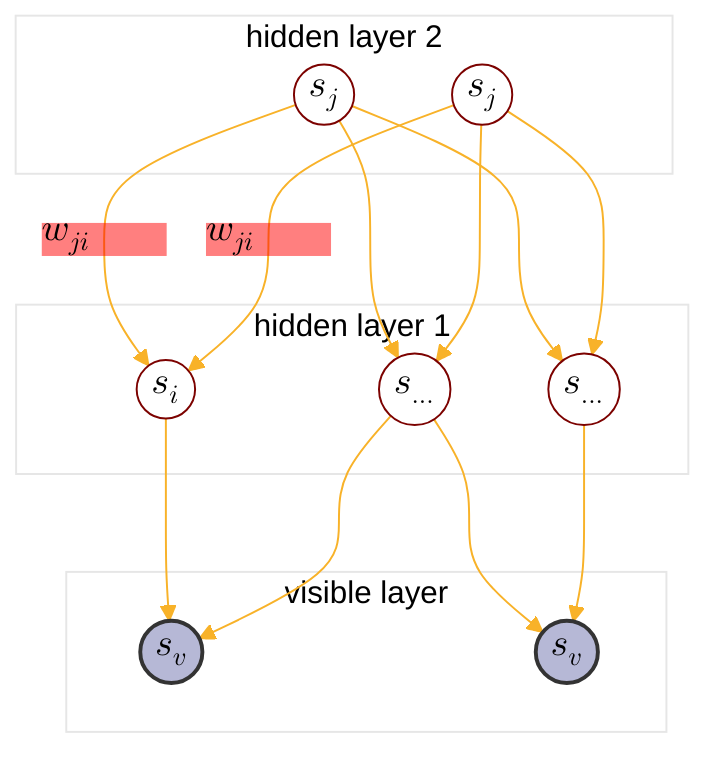
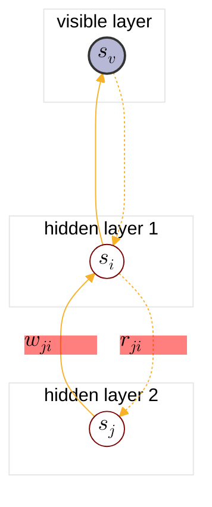

:                                                         


{{ if or .Page.Params.math .Site.Params.math }}

<link rel="stylesheet" href="https://cdn.jsdelivr.net/npm/katex@0.16.8/dist/katex.min.css" integrity="sha384-GvrOXuhMATgEsSwCs4smul74iXGOixntILdUW9XmUC6+HX0sLNAK3q71HotJqlAn" crossorigin="anonymous">

<!-- The loading of KaTeX is deferred to speed up page rendering -->

<!-- To automatically render math in text elements, include the auto-render extension: -->

{{ end }}

{{ if .Page.Store.Get "hasMermaid" }}
  
{{ end }}


## Overview of PGM

<cite>[^1]</cite>

$$
\text{PGM}: \begin{cases}
    \text{Representation} \begin{cases}
        \text{directed graph}\rarr \begin{cases} 
            \text{Naive Bayes:} \begin{cases}
            p(x_i|y) = \prod_{j=1}^p p(x_i^j|y) \\\
            \argmax \prod_{i=1}^N \left(\prod_{j=1}^p p(x_i^j|y_i)\right) p(y_i)
            \end{cases} \\\
            \text{Gaussian Mixture} \\\
            {\text{MEMM: }} \begin{cases}
                p(y_t|y_{t-1}) \\\
                p(y_t|x_{1:T},x_t)
            \end{cases} \\\
            \text{\color{red}{Sigmoid Belief Network}} : \text{BM}+\text{directed graph} \\\
            \text{Bayesian network} 
        \end{cases} \\\
        \text{undirected graph}\rarr \begin{cases}
            \text{CRF}\rarr\text{Linear Chain CRF: } \begin{cases}
                p(y_t|y_{t-1}) \\\
                p(y_{t-1}|y_t) \\\
                p(y_t|x_{1:T},x_t)
            \end{cases} \\\
            \text{Boltzman Machine(BM): } \begin{cases}
                \text{visible nodes} \\\
                \text{hidden nodes}
            \end{cases} \\\
            \text{{Restricted Boltzman Machine(RBM)}} : \text{Bipartite BM} \\\
            \text{Markov network(MRF)}
        \end{cases} \\\
        \text{continous variable}\rarr \text{{Gaussian BN/Gaussian MRF}} \\\
        \text{time$\rarr$} \underset{\text{$x_i$ not i.i.d.}}{\text{ Dynamic model}} \begin{cases}
            \text{discrete state$\rarr$Hidden Markov Model} \\\
            \text{continous state} \begin{cases}
                \text{Linear model$\rarr$Karman Filter} \\\
                \text{Nonlinear model$\rarr$Particle Filter}
            \end{cases}
        \end{cases}
    \end{cases} \\\
    \text{Inference} \begin{cases}
        \text{MAP inference$\rarr \hat{x_A}=\argmax_{x_A}p(x_A|x_B)\propto\argmax p(x_A,x_B)$} \\\
        \text{exact inference} \begin{cases}
          \text{Variable elimination(VE)} \\\
          \text{Belief propagation(BP)$\rarr$sum-product algorithm(Tree)} \\\
          \text{Junction tree algorithm(Normal graph)}
        \end{cases} \\\
        \text{approximate inference} \begin{cases}
            \text{Loop belief propagation(Cyclic graph)} \\\
            \text{Variational inference} \\\
            \text{MCMC: importance sampling}
        \end{cases} 
    \end{cases} \\\
    \text{Learning} \begin{cases}
        \text{parameter learning} \begin{cases}
            \text{complete data: $(x,z)$} \\\
            \text{hidden variable: $z$}
        \end{cases} \\\
        \text{structure learning}
    \end{cases}
\end{cases}
$$

## Sigmoid Belief Network Definition

Sigmoid Belief Network(SBN) is a directed probalistic graphical model with multiple hidden layers and a visible layer:

$$
\begin{align*}
s &: \text{nodes in SBN}, s \sim \text{Bernoulli}
\\\
s &= \begin{bmatrix}
    s_1 \\\
    \vdots \\\
    s_p
\end{bmatrix}=\begin{bmatrix}
    h \\\
    v
\end{bmatrix} \\\
w_{ji} &: \text{the weight of edge $s_j\rarr s_i$} \\\
s_j &\in \text{parents}(s_i)
\end{align*}
$$

The SBN structure looks like:



For hidden node \( s_i \) in SBN, the conditional probability is a sigmoid activate function:



$$
\text{Let } \sigma(x)=\frac{1}{1+\exp(-x)} \\\
\begin{cases}
p(s_i=1 | \lbrace s_j \rbrace\in\text{parents}(x_i)) &= \sigma(\sum_jw_{ji}s_j) \\\
\\\
p(s_i=0 | \lbrace s_j \rbrace\in\text{parents}(x_i)) &= 1-\sigma(\sum_jw_{ji}s_j) \\\
&= \sigma(-\sum_jw_{ji}s_j)
\end{cases} \\\
\dArr \\\
p(s_i | \lbrace s_j \rbrace\in\text{parents}(x_i)) = \sigma((2s_i-1)\sum_jw_{ji}s_j) \\\
$$

So we have joint distribution of SBN:

$$
p(s) = \prod_{i\in\text{SBN}} p(s_i | \lbrace s_j \rbrace\in\text{parents}(x_i)) = p(v,h)
$$



When inference posterier \( p(h|v) \), different hidden nodes are mutually dependent because of <a href="https://tirmisula.github.io/posts/probabilistic-graphical-model/#head-to-head">head to head structure</a>. So finding posterier directly is hard, we find the log-likelihood instead.



## The Log-likelihood Gradient of SBN



Let \(V,H\) be the set of visible and hidden nodes:



$$
V,H \in P_{\text{data}} \\\
|V|,|H| = N
$$

The average log-likelihood is given by:

$$
\begin{align*}
\mathcal{L}(\theta) &= \frac{1}{N}\sum_{i=1}^N \log p(v^{(i)}|\theta) \\\
&= \frac{1}{N}\sum_{i=1}^N\log\sum_hp(v^{(i)},h|\theta) \\\
&\text{Let $V,H$ be the set of visible and hidden nodes}  \\\
&|V|,|H| = N \\\
&= \frac{1}{N}\sum_{v\in V}\log\sum_hp(v,h|\theta)
\end{align*}
$$



For each item \( \log\sum_hp(v^{(i)},h|\theta) \):



$$
\text{Let } \Delta=\log\sum_hp(v^{(i)},h|\theta) \\\
\text{Let } v = v^{(i)} \\\
\begin{align*}
\frac{\partial}{\partial w_{ji}}\Delta &= \frac{1}{p(v|\theta)}\frac{\partial}{\partial w_{ji}}\sum_{h}p(v,h|\theta) \\\
&\because\text{Leibniz intergral rule} \\\
&= \frac{1}{p(v|\theta)}\sum_{h}\frac{\partial}{\partial w_{ji}}p(v,h|\theta) \\\
&= \sum_{h}\frac{1}{p(v|\theta)}\frac{\partial}{\partial w_{ji}}p(v,h|\theta) \\\
&= \sum_{h}\frac{p(h|v,\theta)}{p(v,h|\theta)}\frac{\partial}{\partial w_{ji}}p(v,h|\theta) \\\
&= \sum_{h}p(h|v,\theta)\frac{1}{p(s)}\frac{\partial}{\partial w_{ji}}p(s) \\\
&\text{Let } \lbrace s^{\ast}\_{j} \rbrace \triangleq \lbrace s_j \rbrace\in\text{parents}(x_i) \\\
&= \sum_{h}p(h|v,\theta)\frac{1}{p(s_i|\lbrace s^{\ast}\_{j} \rbrace)\prod_{ k \neq i} p(s_k | \lbrace s^{\ast}\_{j} \rbrace)}\frac{\partial}{\partial w_{ji}}p(s_i|\lbrace s^{\ast}\_{j} \rbrace)\prod_{ k \neq i} p(s_k | \lbrace s^{\ast}\_{j} \rbrace) \\\
&= \sum_{h}p(h|v,\theta)\frac{\prod_{ k \neq i} p(s_k | \lbrace s^{\ast}\_{j} \rbrace)}{p(s_i|\lbrace s^{\ast}\_{j} \rbrace)\prod_{ k \neq i} p(s_k | \lbrace s^{\ast}\_{j} \rbrace)}\frac{\partial}{\partial w_{ji}}p(s_i|\lbrace s^{\ast}\_{j} \rbrace) \\\
&= \sum_{h}p(h|v,\theta)\frac{1}{p(s_i|\lbrace s^{\ast}\_{j} \rbrace)}\frac{\partial}{\partial w_{ji}}p(s_i|\lbrace s^{\ast}\_{j} \rbrace) \\\
&= \sum_{h}p(h|v,\theta)\frac{1}{p(s_i|\lbrace s^{\ast}\_{j} \rbrace)}\frac{\partial}{\partial w_{ji}}\sigma((2s_i-1)\sum_lw_{li}s_l) \\\
&\because \sigma^{'}(x) = \frac{\exp(-x)}{(1+\exp(-x))^2} = \sigma(x)\sigma(-x) \\\
&\because \frac{\partial}{\partial w_{ji}}\sigma((2s_i-1)\sum_lw_{li}s_l) = (2s_i-1)s_{j} \\\
&= \sum_{h}p(h|v,\theta)\frac{1}{p(s_i|\lbrace s^{\ast}\_{j} \rbrace)}\sigma\left((2s_i-1)\sum_lw_{li}s_l\right)\sigma\left((1-2s_i)\sum_lw_{li}s_l\right)(2s_i-1)s_j \\\
&= \sum_{h}p(h|v,\theta)\sigma\left((1-2s_i)\sum_lw_{li}s_l\right)(2s_i-1)s_j \\\
&\because p(h|v,\theta) = p(h,v|v,\theta) = p(s|v,\theta) \\\
&= \sum_{s}p(s|v,\theta)\sigma\left((1-2s_i)\sum_lw_{li}s_l\right)(2s_i-1)s_j \\\
\end{align*}
$$

The log-likelihood gradient is:

$$
\begin{align*}
\frac{\partial}{\partial w_{ji}}\mathcal{L} &= \frac{1}{N}\sum_{v\in V}\sum_{s}p(s|v,\theta)\sigma\left((1-2s_i)\sum_lw_{li}s_l\right)(2s_i-1)s_j
\end{align*}
$$

Since posterier p(s|v) is difficult to factorize, Neal <cite>[^2]<cite> proposed MCMC method to approximate result:

$$
\begin{align*}
\sum_{s}p(s|v,\theta)f(s) &= \mathbb{E}\_{s\sim p(s|v,\theta)}[f(s)] \\\
\frac{1}{N}\sum_{v\in V} g(v) &= \mathbb{E}\_{v\sim P_{\text{data}}}[g(v)]
\end{align*}
$$

So we have:

$$
\begin{align*}
\frac{\partial}{\partial w_{ji}}\mathcal{L} &= \frac{1}{N}\sum_{v\in V}\mathbb{E}\_{s\sim p(s|v,\theta)}\left[\sigma\left((1-2s_i)\sum_lw_{li}s_l\right)(2s_i-1)s_j\right] \\\
&\approx \mathbb{E}\_{\begin{subarray}{c}
    v\sim P_{\text{data}} \\\
    s\sim p(s|v,\theta) \\\
\end{subarray}}\left[\sigma\left((1-2s_i)\sum_lw_{li}s_l\right)(2s_i-1)s_j\right]
\end{align*}
$$

It is efficient when it has small number of nodes.

## Wake Sleep Algorithm
### Algorithm intro

Wake Sleep Algorithm is a heuristic alogrithm proposed by Hinton<cite>[^3]</cite>, which uses q(h|v) to approximate p(h|v). The new graph added reversed edges between connected nodes as recognition connection, it looks like:



There are 2 routes, top-down and bottom-up which represents \(q(h|v)\) and \(p(h|v)\) respectively:


<!-- 
$$
\begin{cases}
\theta &= w \\\
\Phi &= r
\end{cases}
$$ -->

$$
\begin{cases}
\text{Generative model} &: p(v,h|\theta), \theta= \lbrace w_{ji} \rbrace \\\
\text{Recognition model} &: q(h|v,\phi), \phi= \lbrace r_{ji} \rbrace
\end{cases}
$$

The algorithm contains two phases:

1. Wake Phase

    + initialize visible nodes
    + sampling each node in bottom-up manner
        $$
        v \rarr h^{(1)} \rarr h^{(2)} \rarr \cdots \rarr h^{(\text{top})} \\\
        h \sim \sigma(\pm\sum_jr_{ji}s_j), r_{ji} \text{ is initialized}
        $$
    + learning generative model
        $$
        p(v,h|\hat{\theta})
        $$

2. Sleep Phase

    + sampling each node in top-down manner (fantasy samples)
        $$
        h^{(\text{top})} \rarr \cdots \rarr h^{(1)} \rarr v \\\
        h \sim \sigma(\pm\sum_jw_{ji}s_j), w_{ji} \in \hat{\theta}
        $$
    + learning recognition model
        $$
        q(h|v,\hat{\phi})
        $$

Formulate the algorithm in mathmatical way:

1. Wake Phase

    $$
    \theta^{(t)} = \argmax_{\theta} \mathbb{E}\_{h\sim q(h|v,\phi^{(t)})}\left[ \log p(v,h|\theta) \right]
    $$

2. Sleep Phase

    $$
    \phi^{(t+1)} = \argmax_{\phi} \mathbb{E}\_{h,v\sim p(v,h|\theta^{(t)})}\left[ \log q(h|v,\phi) \right]
    $$

### How Wake Sleep is related to EM and KL divergence
#### Review general EM, ELBO and KL divergence

In [EM algorithm chapter](https://tirmisula.github.io/posts/expectation-maximization/#generalized-em-algorithm), we introduced that log-likelihood can be expressed as ELBO+KL-divergence:

$$
\begin{align*}
\log p(x|\theta) &= \int_{z}q(z)\log\frac{p(x,z|\theta)}{q(z)}\space dz - \int_{z}q(z)\log\frac{p(z|x,\theta)}{q(z)}\space dz \\\
&= \text{ELBO} + KL(q||p)
\end{align*}
$$

$$
\begin{cases}
\text{ELBO} &= \int_{z}q(z)\log\frac{p(x,z|\theta)}{q(z)}\space dz \\\
&= E_{z\sim q(z)}[\log p(x,z|\theta)] - E_{z\sim q(z)}[\log q(z)] \\\
&= E_{z\sim q(z)}[\log p(x,z|\theta)] + \underset{\color{red}{entropy}}{H_{q(z)}[q(z)]} \\\
KL(q||p) &= \int_{z}q(z)\log\frac{q(z)}{p(z|x,\theta)}\space dz
\end{cases}
$$



Rewrite it with \( h \) and \( v \):



$$
\begin{align*}
\log p(v|\theta) &= \int_{h}q(h|v)\log\frac{p(v,h|\theta)}{q(h|v)}\space dh - \int_{h}q(h|v)\log\frac{p(h|v,\theta)}{q(h|v)}\space dh \\\
&= E_{h\sim q(h|v)}[\log p(v,h|\theta)] - E_{h\sim q(h|v)}[\log q(h|v)] + \int_{h}q(h|v)\log\frac{q(h|v)}{p(h|v,\theta)}\space dz\\\
&= E_{h\sim q(h|v)}[\log p(v,h|\theta)] + {H[q]} + \int_{h}q(h|v)\log\frac{q(h|v)}{p(h|v,\theta)}\space dh\\\
&= \text{ELBO} + \text{KL}(q||p) \\\
\\\
\text{ELBO}(v,h,q) &= E_{h\sim q(h|v)}[\log p(v,h|\theta)] + {H[q]} \\\
\text{KL}(q||p) &= \int_{h}q(h|v)\log\frac{q(h|v)}{p(h|v,\theta)}\space dz
\end{align*}
$$

We have concluded [Generalized EM algorithm](https://tirmisula.github.io/posts/expectation-maximization/#generalized-em-algorithm) before:

$$
\begin{align*}
\text{E-step} &: \text{Fix } \theta, q^{(t+1)}=\argmin_{q}KL(q||p)=\argmax_{q}L(q,\theta^{(t)}) \\\
\text{M-step} &: \text{Fix } q, \theta^{(t+1)}=\argmin_{p}KL(q||p)=\argmax_{\theta} L(q^{(t+1)},\theta)
\end{align*}
$$

#### Conclusion

Based on the conclusion from [previous section](#review-general-em-elbo-and-kl-divergence), we can express wake phase and sleep phase with KL divergence:

1. Wake Phase

    $$
    \begin{align*}
    \theta &= \argmax_{\theta} \mathbb{E}\_{h\sim q(h|v,\phi)}\left[ \log p(v,h|\theta) \right] \\\
    &\because \phi \text{ fixed}, H[q]=0 \\\
    &=  \argmax\_{\theta}E_{h\sim q(h|v)}[\log p(v,h|\theta)] + {H[q]} \\\
    &= \argmax_{\theta}\text{ELBO}(q,\theta) \\\
    &= \argmin_{\theta}\int_{h}q(h|v)\log\frac{q(h|v)}{p(h|v,\theta)}\space dh \\\
    &= \argmin_{\theta} \text{KL}(q(h|v,\phi)||p(h|v,\theta)) \\\
    &\rArr \text{M-step}
    \end{align*}
    $$

2. Sleep Phase

    $$
    \begin{align*}
    \phi &= \argmax_{\phi} \mathbb{E}\_{h,v\sim p(v,h|\theta)}\left[ \log q(h|v,\phi) \right] \\\
    &= \argmax\_{\phi} \int p(h|v,\theta)p(v|\theta)\log q(h|v,\phi) dh \\\
    &= \argmax_{\phi} \int p(h|v,\theta)\log q(h|v,\phi) dh \\\
    &= \argmax_{\phi} \int p(h|v,\theta)\log\left(\frac{q(h|v,\phi)}{p(h|v,\theta)}p(h|v,\theta)\right)  dh \\\
    &= \argmax_{\phi} \int p(h|v,\theta)\log\frac{q(h|v,\phi)}{p(h|v,\theta)} dh \\\
    &= \argmax_{\phi} -\text{KL}(p||q) \\\
    &= \argmin_{\phi} \text{KL}(p(h|v,\theta)||q(h|v,\phi)) \\\
    &\rArr \text{the oppposite of E-step}, \argmin \text{KL}(q||p)
    \end{align*}
    $$

## Reference

[^1]: - [video](https://www.bilibili.com/video/BV1aE411o7qd?p=140).
[^4]: From [Higham, Nicholas (2002). Accuracy and Stability of Numerical Algorithms](https://archive.org/details/accuracystabilit00high_878).
[^5]: From [The Multivariate Gaussian. Michael I. Jordan](https://people.eecs.berkeley.edu/~jordan/courses/260-spring10/other-readings/chapter13.pdf).
[^3]: - [The wake-sleep algorithm for unsupervised neural networks. Geoffrey E Hinton, Peter Dayan, Brendan J Frey, Radford M Neal](https://www.cs.toronto.edu/~hinton/absps/ws.pdf).
[^7]: - [GAUSS-MARKOV MODELS, JONATHAN HUANG AND J. ANDREW BAGNELL](https://www.cs.cmu.edu/~16831-f14/notes/F14/gaussmarkov.pdf).
[^6]: - [Gaussian Processes and Gaussian Markov Random Fields](https://folk.ntnu.no/joeid/MA8702/jan16.pdf)
[^2]: - [Connectionist learning of belief networks. Radford M. Neal](http://www.cs.toronto.edu/~bonner/courses/2016s/csc321/readings/Connectionist%20learning%20of%20belief%20networks.pdf).
