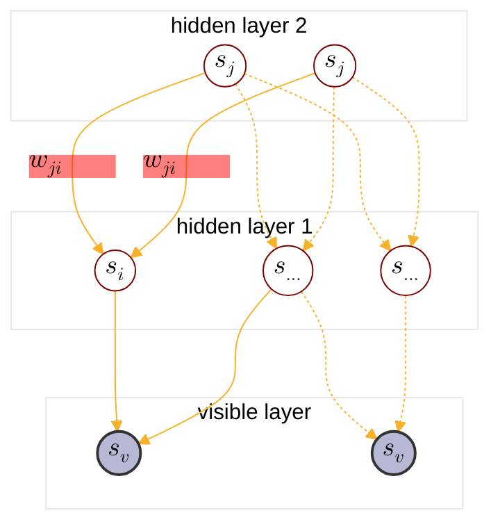

:                                                         


{{ if or .Page.Params.math .Site.Params.math }}

<link rel="stylesheet" href="https://cdn.jsdelivr.net/npm/katex@0.16.8/dist/katex.min.css" integrity="sha384-GvrOXuhMATgEsSwCs4smul74iXGOixntILdUW9XmUC6+HX0sLNAK3q71HotJqlAn" crossorigin="anonymous">

<!-- The loading of KaTeX is deferred to speed up page rendering -->

<!-- To automatically render math in text elements, include the auto-render extension: -->

{{ end }}

{{ if .Page.Store.Get "hasMermaid" }}
  
{{ end }}


## Overview of PGM

<cite>[^1]</cite>

$$
\text{PGM}: \begin{cases}
    \text{Representation} \begin{cases}
        \text{directed graph}\rarr \begin{cases} 
            \text{Naive Bayes:} \begin{cases}
            p(x_i|y) = \prod_{j=1}^p p(x_i^j|y) \\\
            \argmax \prod_{i=1}^N \left(\prod_{j=1}^p p(x_i^j|y_i)\right) p(y_i)
            \end{cases} \\\
            \text{Gaussian Mixture} \\\
            {\text{MEMM: }} \begin{cases}
                p(y_t|y_{t-1}) \\\
                p(y_t|x_{1:T},x_t)
            \end{cases} \\\
            \text{\color{red}{Sigmoid Belief Network}} : \text{BM}+\text{directed graph} \\\
            \text{Bayesian network} 
        \end{cases} \\\
        \text{undirected graph}\rarr \begin{cases}
            \text{CRF}\rarr\text{Linear Chain CRF: } \begin{cases}
                p(y_t|y_{t-1}) \\\
                p(y_{t-1}|y_t) \\\
                p(y_t|x_{1:T},x_t)
            \end{cases} \\\
            \text{Boltzman Machine(BM): } \begin{cases}
                \text{visible nodes} \\\
                \text{hidden nodes}
            \end{cases} \\\
            \text{{Restricted Boltzman Machine(RBM)}} : \text{Bipartite BM} \\\
            \text{Markov network(MRF)}
        \end{cases} \\\
        \text{continous variable}\rarr \text{{Gaussian BN/Gaussian MRF}} \\\
        \text{time$\rarr$} \underset{\text{$x_i$ not i.i.d.}}{\text{ Dynamic model}} \begin{cases}
            \text{discrete state$\rarr$Hidden Markov Model} \\\
            \text{continous state} \begin{cases}
                \text{Linear model$\rarr$Karman Filter} \\\
                \text{Nonlinear model$\rarr$Particle Filter}
            \end{cases}
        \end{cases}
    \end{cases} \\\
    \text{Inference} \begin{cases}
        \text{MAP inference$\rarr \hat{x_A}=\argmax_{x_A}p(x_A|x_B)\propto\argmax p(x_A,x_B)$} \\\
        \text{exact inference} \begin{cases}
          \text{Variable elimination(VE)} \\\
          \text{Belief propagation(BP)$\rarr$sum-product algorithm(Tree)} \\\
          \text{Junction tree algorithm(Normal graph)}
        \end{cases} \\\
        \text{approximate inference} \begin{cases}
            \text{Loop belief propagation(Cyclic graph)} \\\
            \text{Variational inference} \\\
            \text{MCMC: importance sampling}
        \end{cases} 
    \end{cases} \\\
    \text{Learning} \begin{cases}
        \text{parameter learning} \begin{cases}
            \text{complete data: $(x,z)$} \\\
            \text{hidden variable: $z$}
        \end{cases} \\\
        \text{structure learning}
    \end{cases}
\end{cases}
$$

## Review Markov Random Field

Markov Random Field or Markov Random Network is a kind of undirected probalistic graphical model. The key content is [factorization of MRF](https://tirmisula.github.io/posts/probabilistic-graphical-model/#factorization-of-mrf), which shows MRF can be expressed with potential functions(Hammersley Clifford theorem<cite>[^2]</cite>):

$$
\begin{align*}
p(x) &= \frac{1}{z} \prod_{i=1}^K \psi(x_{C_i})=\frac{1}{z}\prod_{i=1}^K\exp(-E(x_{C_i})) \\\
C_i &: \text{i-th maximum clique} \\\
x_{C_i} &: \text{variable nodes in $C_i$} \\\
\psi &: \text{potential function, $\psi>0$} \\\
\psi(x_{C_i}) &= \exp(-E(x_{C_i})) \\\
E(x) &: \text{energy function} \\\
z &: \text{nomalize factor, $z=\sum_{x_1\cdots x_p}\prod_{i=1}^K \psi(x_{C_i})$} 
\end{align*}
$$



MRF probability model \( p(x) \) belongs to exponential family distribution, we call it Gibbs distribution or Boltzman distribution:



$$
\begin{align*}
p(x) &= \frac{1}{z} \exp( -\sum_{i=1}^K E(x_{C_i})) \\\
&\triangleq \frac{1}{z} \exp( -\mathrm{E}(x)) \\\
&= \frac{1}{z(\eta)}h(x)\exp( \eta^T\phi(x) )
\end{align*}
$$

**Boltzman machine** named after the Boltzman distribution which is equivalent to MRF + hidden nodes.

## Sigmoid Belief Network Definition

Sigmoid Belief Network(SBN) is a directed probalistic graphical model with multiple hidden layers and a visible layer:

$$
\begin{align*}
s &: \text{nodes in SBN}, s \sim \text{Bernoulli}
\\\
s &= \begin{bmatrix}
    s_1 \\\
    \vdots \\\
    s_p
\end{bmatrix}=\begin{bmatrix}
    h \\\
    v
\end{bmatrix} \\\
w_{ji} &: \text{the weight of edge $s_j\rarr s_i$} \\\
s_j &\in \text{parents}(s_i)
\end{align*}
$$

The SBN structure looks like:

### Inference trouble in Boltzman machine
Based on the statement above, nodes in Boltzman machine have 2 classes:

$$
\text{Nodes }x : \begin{cases}
    \text{observed } r.v. & o \\\
    \text{hidden } r.v. & h
\end{cases}
$$

We have:

$$
x = \begin{bmatrix}
    x_1 \\\
    \vdots \\\
    x_p
\end{bmatrix}=\begin{bmatrix}
    h \\\
    o
\end{bmatrix}, h = \begin{bmatrix}
    h_1 \\\
    \vdots \\\
    h_m
\end{bmatrix}, o = \begin{bmatrix}
    o_1 \\\
    \vdots \\\
    o_n
\end{bmatrix} \\\
p = m+n
$$

Inference problem in PGM is finding posterier, and we have introduced exact inference and approximate inference in previous chapter::
$$
p(h|o) : \begin{cases}
    \text{exact inference} &: \text{variable elimination} \\\
    \text{approximate inference} &: \begin{cases}
            \text{variational method} \\\
            \text{MCMC}
        \end{cases}
\end{cases}
$$

However exact inference is intractable because the overall complexity [elimination algorithm](https://tirmisula.github.io/posts/probabilistic-graphical-model/#variable-elimination) is determined by the number of largest
elimination clique[3] and finding optimal elimination order is NP-hard.

[Variational inference](https://tirmisula.github.io/posts/variational-inference/#mean-field-vi-derivation) face the same problem when integrating:

$$
\int_{q_1\cdots q_N}q_1\cdots q_N\log p(o,h)dq_1\cdots dq_N
$$

[MCMC](https://tirmisula.github.io/posts/markov-chain-monte-carlo/) method takes long time to converge which requires more computation resource.

### RBM model definition

To resolve the inference trouble in Boltzman machine, restricted boltzman machine(RBM) has been proposed, it used a bipartite graph which simplified the graph structure:


From this graph, nodes inside \( \lbrace h \rbrace \) and \( \lbrace o \rbrace \) are mutually independent by <a href="https://tirmisula.github.io/posts/probabilistic-graphical-model/#conditional-independence-of-mrf">local markov property</a>.



From [factor graph](https://tirmisula.github.io/posts/probabilistic-graphical-model/#factor-graph) perspective, we have RBM like:

Combining factors above, we can model the joint pdf of RBM:

$$
\text{Given: }
x = \begin{bmatrix}
    x_1 \\\
    \vdots \\\
    x_p
\end{bmatrix}=\begin{bmatrix}
    h \\\
    o
\end{bmatrix}, h = \begin{bmatrix}
    h_1 \\\
    \vdots \\\
    h_m
\end{bmatrix}, o = \begin{bmatrix}
    o_1 \\\
    \vdots \\\
    o_n
\end{bmatrix} \\\
$$

$$
\text{Let } \begin{cases}
    f(o) = \exp(\alpha^T o) \\\
    f(h) = \exp(\beta^T h) \\\
    f(o,w,h) = \exp(h^Two) \\\
    p(x) = \frac{1}{z}f(o)f(h)f(o,w,h)
\end{cases},\text{We have }
$$

$$
\begin{align*}
p(x)=p(o,h) &= \frac{1}{z} \prod_{i=1}^K \psi(x_{C_i}) \\\
&= \frac{1}{z}\prod_{i=1}^K\exp(-E(x_{C_i})) \\\
&= \frac{1}{z}\exp(-E(o,h)) \\\
&= \frac{1}{z}\exp(h^Two+\alpha^To+\beta^Th) \\\
&= \frac{1}{z}\exp(h^Two)\exp(\alpha^To)\exp(\beta^Th) \\\
\because &h^Two = \sum_{i=1}^m\sum_{j=1}^n h_iw_{ij}o_j, \space\text{we have } \\\
&= \frac{1}{z} \prod_{i=1}^m\prod_{j=1}^n\exp(h_iw_{ij}o_j) \prod_{i=1}^m\exp(\beta_i h_i) \prod_{j=1}^n\exp(\alpha_j o_j)
\end{align*}
$$

### Posterier inference
By local markov property, we have conditional independence:

$$
h_1 \perp \begin{matrix}
    h_2 \\\
    \cdots \\\
    h_m
\end{matrix} | o
$$

So we can write the posterier as:

$$
p(h|o) = \prod_{i=1}^m p(h_i|o)
$$



In original RBM model, hidden states are Bernoulli, having two value options \( h\in\lbrace 0,1 \rbrace \). For a individual node \( h_k \) we have:



$$
\begin{align*}
p(h_k|o) &= p(h_k|h_{\neg k},o) \\\
&= \frac{p(h_k,h_{\neg k},o)}{p(h_{\neg k},o)} \\\
&= \frac{p(h_k,h_{\neg k},o)}{p(h_k=1,h_{\neg k},o)+p(h_k=0,h_{\neg k},o)} \\\
\\\
p(h_k=1|o) &= \frac{p(h_k=1,h_{\neg k},o)}{p(h_k=1,h_{\neg k},o)+p(h_k=0,h_{\neg k},o)} \\\
&= \frac{1}{1+\frac{p(h_k=0,h_{\neg k},o)}{p(h_k=1,h_{\neg k},o)}} \\\
\\\
p(h_k=0|o) &= \frac{p(h_k=0,h_{\neg k},o)}{p(h_k=1,h_{\neg k},o)+p(h_k=0,h_{\neg k},o)} \\\
&= \frac{1}{1+\frac{p(h_k=1,h_{\neg k},o)}{p(h_k=0,h_{\neg k},o)}} \\\
\\\
&\text{For numerator $p(h_k,h_{\neg k}, o)$},\text{we have}\\\
p(h_k,h_{\neg k},o) &= p(h,o) \\\
&= \frac{1}{z} \prod_{i=1}^m\prod_{j=1}^n\exp(h_iw_{ij}o_j) \prod_{i=1}^m\exp(\beta_i h_i) \prod_{j=1}^n\exp(\alpha_j o_j) \\\
&= \frac{1}{z} \exp(\sum_{i=1}^m\sum_{j=1}^nh_iw_{ij}o_j+\sum_{i=1}^m\beta_ih_i+\sum_{j=1}^n\alpha_jo_j) \\\
&= \frac{1}{z} \exp(\sum_{\begin{subarray}{c}
   i=1 \\\
   i\neq k
\end{subarray}}^m\sum_{j=1}^nh_iw_{ij}o_j+\sum_{\begin{subarray}{c}
   i=1 \\\
   i\neq k
\end{subarray}}^m\beta_ih_i+\sum_{j=1}^n\alpha_jo_j+\sum_{j=1}^nh_kw_{kj}o_j+\beta_kh_k) \\\
&\text{Let } A(\neg k,o)=\sum_{\begin{subarray}{c}
   i=1 \\\
   i\neq k
\end{subarray}}^m\sum_{j=1}^nh_iw_{ij}o_j+\sum_{\begin{subarray}{c}
   i=1 \\\
   i\neq k
\end{subarray}}^m\beta_ih_i+\sum_{j=1}^n\alpha_jo_j \\\
&=\frac{1}{z} \exp\left(A(\neg k, o)+h_k(\sum_{j=1}^nw_{kj}o_j+\beta_k)\right) \\\
\\\
&\text{So the ratio $\frac{p(h_k=0,h_{\neg k},o)}{p(h_k=1,h_{\neg k},o)}$ is }\\\
\frac{p(h_k=0,h_{\neg k},o)}{p(h_k=1,h_{\neg k},o)} &= \frac{\frac{1}{z}\exp\left(A(\neg k, o)\right)}{\frac{1}{z}\exp\left(A(\neg k, o)+(\sum_{j=1}^nw_{kj}o_j+\beta_k)\right)} \\\
&= \exp\left( A(\neg k,o)-\sum_{j=1}^nw_{kj}o_j-\beta_k-A(\neg k,o) \right) \\\
&= \exp\left( -(\sum_{j=1}^nw_{kj}o_j+\beta_k) \right) \\\
&\dArr \\\
p(h_k=1|o) &= \frac{1}{1+\frac{p(h_k=0,h_{\neg k},o)}{p(h_k=1,h_{\neg k},o)}} \\\
&= \frac{1}{1+\exp\left( -(\sum_{j=1}^nw_{kj}o_j+\beta_k) \right)} \\\
&= \text{sigmoid}(\sum_{j=1}^nw_{kj}o_j+\beta_k) \\\
&= \sigma(\sum_{j=1}^nw_{kj}o_j+\beta_k) \\\
p(h_k=0|o) &= 1-\sigma(\sum_{j=1}^nw_{kj}o_j+\beta_k)
\end{align*}
$$



\( \sigma(\cdot) \) is sigmoid function or logistic function. Similarly, we have \( p(o_k|h) \):



$$
\begin{align*}
p(o_k=1|h) &= \sigma(\sum_{i=1}^mh_iw_{ik}+\alpha_k) \\\
p(o_k=0|h) &= 1-\sigma(\sum_{i=1}^mh_iw_{ik}+\alpha_k) \\\
\end{align*}
$$

### Marginal probability inference

$$
\begin{align*}
p(o) &= \sum_h p(h,o) \\\
&= \sum_h\frac{1}{z} \prod_{i=1}^m\prod_{j=1}^n\exp(h_iw_{ij}o_j) \prod_{i=1}^m\exp(\beta_i h_i) \prod_{j=1}^n\exp(\alpha_j o_j) \\\
&= \frac{1}{z}\exp(\alpha^To)\sum_{h_1}\cdots\sum_{h_m}\exp(\sum_{i=1}^m\sum_{j=1}^nh_iw_{ij}o_j)\exp(\sum_{i=1}^m\beta_ih_i) \\\
&= \frac{1}{z}\exp(\alpha^To)\sum_{h_1}\cdots\sum_{h_m}\exp(\sum_{i=1}^mh_i\sum_{j=1}^nw_{ij}o_j + \sum_{i=1}^m\beta_ih_i) \\\
&\text{Let } w_i = \begin{bmatrix} w_{i1}\cdots w_{in} \end{bmatrix}^T \\\
&= \frac{1}{z}\exp(\alpha^To)\sum_{h_1}\cdots\sum_{h_m}\exp(\sum_{i=1}^mh_iw_{i}^To + \sum_{i=1}^m\beta_ih_i) \\\
&= \frac{1}{z}\exp(\alpha^To)\sum_{h_1}\cdots\sum_{h_m}\exp\left(\sum_{i=1}^m(h_iw_{i}^To + \beta_ih_i)\right) \\\
&= \frac{1}{z}\exp(\alpha^To)\sum_{h_1}\cdots\sum_{h_m}\prod_{i=1}^m\exp\left(h_iw_{i}^To + \beta_ih_i\right) \\\
&= \frac{1}{z}\exp(\alpha^To)\sum_{h_1}\exp(h_1w_1^To+\beta_1h_1)\cdots\sum_{h_m}\exp\left(h_mw_{m}^To + \beta_mh_m\right) \\\
&\because h\in\lbrace 0,1 \rbrace \\\
&\therefore \sum_{h_1}\exp(h_1w_1^To+\beta_1h_1) = \exp(0)+\exp(w_1^To+\beta_1) \\\
&= \frac{1}{z}\exp(\alpha^To)\prod_{i=1}^m\left(1+\exp(w_i^To+\beta_i\right) \\\
&= \frac{1}{z}\exp(\alpha^To)\exp\left(\log\left(\prod_{i=1}^m\left(1+\exp(w_i^To+\beta_i\right)\right)\right) \\\
&= \frac{1}{z}\exp(\alpha^To)\exp\left(\sum_{i=1}^m\log\left(1+\exp(w_i^To+\beta_i\right)\right) \\\
&= \frac{1}{z}\exp\left(\alpha^To+\sum_{i=1}^m\log\left(1+\exp(w_i^To+\beta_i\right)\right)
\end{align*}
$$



Since \( \log(1+\mathrm{e}^x) \) is a Softplus(SmoothReLU) function we have:



$$
p(o) = \frac{1}{z}\exp\left(\alpha^To+\sum_{i=1}^m\text{softplus}(w_i^To+\beta_i)\right)
$$

### RBM Learning
See [Confronting the Partition Function](https://tirmisula.github.io/posts/partition-function/#rbm-learning) chapter.

## Reference

[^1]: - [video](https://www.bilibili.com/video/BV1aE411o7qd?p=117).
[^4]: From [Higham, Nicholas (2002). Accuracy and Stability of Numerical Algorithms](https://archive.org/details/accuracystabilit00high_878).
[^5]: From [The Multivariate Gaussian. Michael I. Jordan](https://people.eecs.berkeley.edu/~jordan/courses/260-spring10/other-readings/chapter13.pdf).
[^3]: From [Probabilistic Graphical Models (II) Inference & Leaning. Jun Zhu](https://ml.cs.tsinghua.edu.cn/~jun/courses/statml-fall2015/8-PGM-Inference.pdf).
[^7]: - [GAUSS-MARKOV MODELS, JONATHAN HUANG AND J. ANDREW BAGNELL](https://www.cs.cmu.edu/~16831-f14/notes/F14/gaussmarkov.pdf).
[^6]: - [Gaussian Processes and Gaussian Markov Random Fields](https://folk.ntnu.no/joeid/MA8702/jan16.pdf)
[^2]: - [Hammersley–Clifford theorem](http://www.statslab.cam.ac.uk/~grg/books/hammfest/hamm-cliff.pdf).
